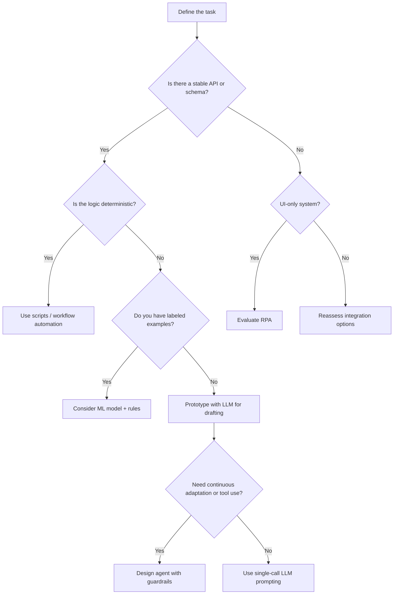
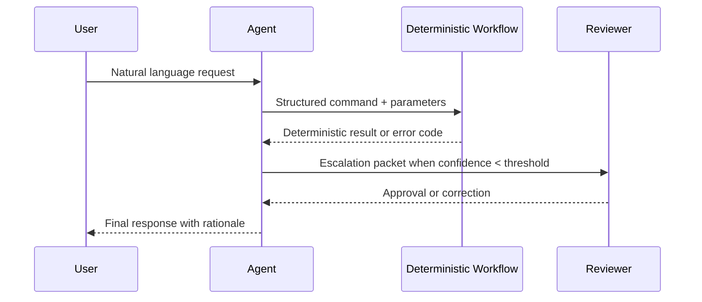

## Why compare agents and classic automation?
Agentic systems can plan, call tools, and react to feedback, but they introduce probabilistic behavior, higher latency, and more complex failure modes than scripted automation. This page helps you decide when to embrace agentic flexibility and when to stick with deterministic workflows.

### You’ll learn
- A checklist for choosing between deterministic automation, RPA, and LLM-powered agents
- How cost, latency, and risk profiles change across approaches
- Patterns for hybrid workflows that blend scripts, APIs, and agents
- Guardrails that keep agentic systems reliable in production
- References and further reading to continue evaluating automation options

## Snapshot comparison

| Attribute | Classic scripts & APIs | Robotic process automation (RPA) | LLM agents |
| --- | --- | --- | --- |
| **Execution model** | Deterministic, code-driven | UI-driven macros and connectors | Probabilistic planning with tool calls |
| **Best for** | Stable APIs, structured data, rule-based decisions | Legacy apps without APIs, repetitive UI tasks | Ambiguous inputs, multi-step reasoning, natural language orchestration |
| **Latency** | Milliseconds to seconds | Seconds to minutes (UI interactions) | Seconds to tens of seconds (model + tools) |
| **Cost drivers** | Engineering time + compute | Bot licenses + maintenance | Model tokens + orchestration infrastructure |
| **Failure modes** | API/schema drift | UI changes, missing selectors | Hallucinations, mis-plans, tool misuse |
| **Governance** | Strong audit/logging patterns | Centralized bot management | Requires new observability, evals, safety reviews |

## Decision tree
Start with the outcome you need and the constraints you face. Use the following flow as a lightweight preflight check.

## Cost and latency checkpoints

- **Token consumption dominates agent cost.** Even small misplans can multiply tool calls. Instrument requests and set hard ceilings per interaction. Use cheaper models for exploratory steps and promote only high-value actions to premium models. 【F:docs/concepts/token-costs-latency.md†L38-L47】
- **Automation excels when latency budgets are tight.** If downstream systems require sub-second responses, favor deterministic code or pre-computed caches. Agents that reason over several steps will likely breach strict SLAs.
- **RPA costs scale with surface change.** UI modifications or new selectors can trigger maintenance storms. Prefer APIs or database access where available to minimize brittle UI automation. 【F:docs/concepts/structured-outputs.md†L91-L106】

## Hybrid orchestration patterns

1. **Automation first, agent as escalation.** Let scripts handle known happy paths. When inputs fall outside predefined rules, hand context to an LLM agent to triage or gather missing details before routing to humans.
2. **Agent as planner, automation as executor.** Use the agent to interpret ambiguous requests, then call deterministic microservices for critical steps (payments, compliance checks) to guarantee correctness.
3. **RPA wrapper with LLM validation.** Pair an RPA bot with an LLM that reviews captured screenshots or logs for anomalies before final submission.

## Governance and risk mitigation

- **Instrument agents like services.** Capture traces (prompt, tool calls, outputs), redacting PII. Use eval suites to quantify regression risk before deployments. 【F:docs/concepts/genai-vs-agentic.md†L102-L134】
- **Set explicit guardrails.** Define allowed tools, input schemas, retry limits, and what happens on failure (fallback answers, manual review).
- **Stage rollouts.** Gate new agent behaviors behind feature flags and expand traffic gradually while monitoring qualitative feedback.
- **Train ops teams.** Document triage playbooks so support engineers can diagnose agent failures as easily as they handle API outages.

## Checklist before shipping an agent

- [ ] Outcome tolerates probabilistic output and occasional deferrals.
- [ ] Latency and cost ceilings account for multi-step planning.
- [ ] Sensitive operations remain deterministic or require human approval.
- [ ] Observability, logging, and eval tooling are ready.
- [ ] Fallback workflows exist for outages or policy refusals.

## Where to learn more

- `/docs/concepts/genai-vs-agentic.md` — deeper look at single-shot vs agentic systems.
- `/docs/concepts/token-costs-latency.md` — estimating runtime budgets.
- `/docs/concepts/spec-vs-vibe-coding.md` — keeping agents grounded with clear specs.
- UiPath. “What is robotic process automation (RPA)?” (2024). <https://www.uipath.com/rpa/robotic-process-automation>
- Microsoft. “Automation vs AI: choose the right solution.” (2023). <https://learn.microsoft.com/industry-blog/business-solutions/automation-or-ai/>
- Forrester. “Align automation and AI to business outcomes.” (2024). <https://www.forrester.com/blogs/align-automation-and-ai-to-business-outcomes/>
