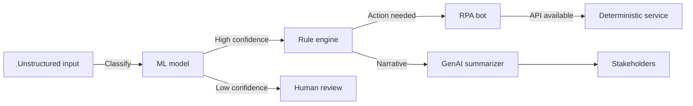

## Overview
The automation landscape spans deterministic rules, statistical machine learning, robotic process automation (RPA), and modern generative AI. Understanding where each shines prevents over-relying on trendy technology and helps you compose layered solutions that meet reliability, compliance, and cost targets.

### You’ll learn
- The defining traits of expert systems, classical ML, RPA, and GenAI
- Strengths, limits, and governance considerations for each approach
- How to map problem statements to the right automation family
- Patterns for combining approaches without increasing operational risk
- Key references to validate your strategy with stakeholders

## Automation families at a glance

| Capability | Expert systems | Machine learning | Robotic process automation | Generative AI |
| --- | --- | --- | --- | --- |
| **Core idea** | Hand-authored rules and knowledge bases | Statistical models trained on labeled data | UI-level scripting of user actions | Large models that generate content or plans |
| **Input type** | Structured facts | Structured or semi-structured features | Screen elements, keyboard/mouse events | Natural language, code, multimodal prompts |
| **Output style** | Deterministic, explainable | Probabilistic predictions | Deterministic UI actions | Probabilistic text, code, or media |
| **Data needs** | Domain expertise, ontology maintenance | Historical labeled datasets | Stable UI layouts | Prompt engineering, retrieval data |
| **Change management** | Update rules manually | Retrain models periodically | Maintain selectors, bot scripts | Update prompts, guardrails, evaluations |
| **Common use** | Compliance checks, underwriting, configuration | Forecasting, anomaly detection, personalization | Legacy back-office tasks, form entry | Drafting, summarization, conversational flows |
| **Key risk** | Rule explosion, brittle to edge cases | Data drift, bias | Fragile to UI changes | Hallucinations, policy violations |

## Mapping problems to approaches

1. **Codify policy or regulation?** Prefer expert systems: explicit rules, auditable decisions, and deterministic outputs. Layer ML to suggest rule updates when new data patterns emerge.
2. **Need numeric predictions at scale?** Use classical ML models (regression, gradient boosting, neural nets) that output calibrated probabilities you can evaluate with standard metrics. Pair with GenAI for explanation if stakeholders need narratives. 【F:docs/concepts/what-is-genai.md†L61-L95】
3. **Stuck with legacy UI workflows?** RPA fills the gap while you modernize the backend. Add GenAI to interpret unstructured inputs (emails, PDFs) before handing structured instructions to bots. 【F:docs/concepts/agents-vs-automation.md†L35-L89】
4. **Require creative or conversational experiences?** Generative AI excels when outcomes allow variation. Use single-shot prompts for narrow tasks or agentic orchestration when multiple tools must be coordinated. 【F:docs/concepts/genai-vs-agentic.md†L52-L99】

## Layered architectures

Complex processes rarely fit a single tool. Consider layered designs where each technology handles the part it does best.

- **Rules guardrails.** Keep a deterministic layer that enforces policy thresholds before downstream actions fire.
- **ML triage.** Statistical models can score items (fraud risk, churn probability) to prioritize work.
- **RPA bridging.** Use bots temporarily while migrating to API-first architectures, but budget for maintenance.
- **GenAI explanation.** Generate summaries, emails, or knowledge base updates so humans stay informed without reading raw data dumps.

## Governance implications

- **Expert systems** provide traceable decisions but can lag when business logic changes quickly. Maintain a change log and peer review process. 【F:docs/concepts/structured-outputs.md†L42-L70】
- **Classical ML** demands dataset versioning, bias monitoring, and model cards for transparency. Tooling like MLflow or Vertex AI Model Registry helps manage lifecycle.
- **RPA** requires bot inventories, credential management, and contingency plans when interfaces change overnight. Align with IT change management calendars to schedule selector updates.
- **GenAI** adds prompt/response logging, evaluation harnesses, and safety testing (jailbreak, toxicity, data leakage). Pair with red-teaming and automated evals before production rollouts.

## Choosing a modernization path

Use the table below to spark roadmap conversations.

| Starting point | Immediate leverage | Long-term evolution |
| --- | --- | --- |
| Heavy manual process | Document steps; codify rules; pilot RPA for volume | Replace with APIs; add GenAI summaries for stakeholders |
| Mature ML pipeline | Expose models through deterministic services | Layer GenAI agents for contextual explanation or orchestration |
| RPA-heavy organization | Measure bot failure rates; prioritize API builds | Retire brittle bots, keep GenAI for intent parsing and exception handling |
| Early GenAI experiments | Capture prompts, outcomes, failures | Introduce specs, evals, and automation where behavior stabilizes |

## Checklist for portfolio reviews

- [ ] Every process has an owner who can articulate current failure modes.
- [ ] You track maintenance cost per approach (rules, models, bots, agents).
- [ ] High-risk steps (payments, compliance) remain deterministic or supervised.
- [ ] Retraining, rules updates, and prompt reviews are scheduled like releases.
- [ ] Sunset criteria exist for bots or models when systems evolve.

## References

- IBM. “What is RPA?” (2024). <https://www.ibm.com/topics/rpa>
- Gartner. “Market Guide for Process Mining and Automation.” (2023).
- Microsoft. “Machine learning vs rules: choosing the right AI approach.” (2024). <https://learn.microsoft.com/azure/architecture/guide/ai/approach>
- NIST. “AI Risk Management Framework.” (2023). <https://www.nist.gov/itl/ai-risk-management-framework>
- UiPath. “Automation program best practices.” (2024). <https://www.uipath.com/resources/automation-guides>
