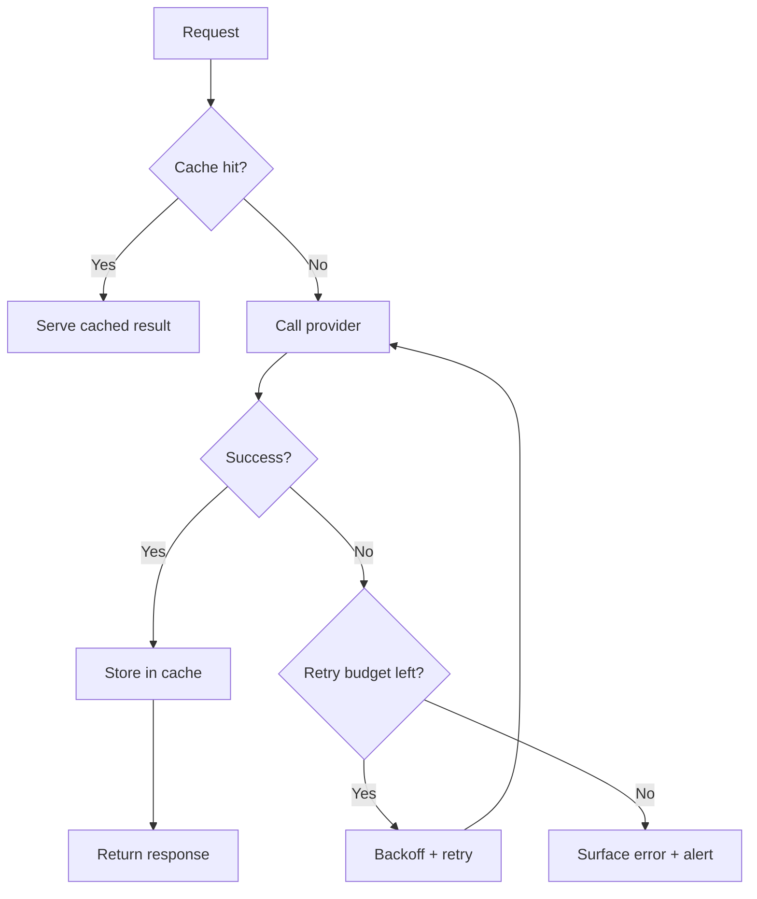

## Summary
Every call to a foundation model consumes tokens, time, and quota. Intelligent caching prevents you from recomputing answers for identical prompts, while resilient retry logic shields users from transient provider errors. Pair both with rigorous observability so you can distinguish between user mistakes, upstream throttling, and actual outages.

### You’ll learn
- When to apply response, embedding, or feature caching to reduce token spend
- How to design retry policies that respect provider rate limits and idempotency
- How to implement memoization in Node.js and Python with structured cache keys
- How to instrument retries with metrics, logging, and alerts
- How to align caching strategies with safety, privacy, and evaluation practices

## Why caching and retries matter

- **Providers enforce rate limits.** Burst traffic or background jobs can trigger HTTP 429 or 500 errors; provider docs recommend exponential backoff and jitter to recover gracefully.
- **Token costs add up.** Re-issuing the same prompt multiplies spend. Cached responses can cut billable tokens by 30–70% in high-volume workloads. 【F:docs/concepts/token-costs-latency.md†L14-L47】
- **Determinism is low.** Retries without guardrails may produce different outputs; caching helps maintain consistency for evaluation sets.

## Caching strategies

| Layer | Best for | TTL guidance | Notes |
| --- | --- | --- | --- |
| **Response cache** | Deterministic prompts (e.g., FAQ answers, policy lookups) | Hours to days | Hash prompt + model + system instructions + retrieval snapshot ID. Invalidate when knowledge base changes. |
| **Embedding cache** | Vector representations of documents or user queries | Weeks to months | Store versioned embeddings; rebuild only when switching models or chunking parameters. |
| **Feature cache** | Intermediate outputs such as extracted entities or classification labels | Minutes to hours | Use when downstream tasks can operate on structured data rather than full text. |
| **Eval cache** | Golden prompts and expected outputs | Permanent | Guarantees comparability across model versions. |

> **Never cache personally identifiable information (PII) without encryption and retention policies.** Map cache keys to anonymized identifiers.

## Retry patterns

1. **Identify retryable errors.** Providers list specific HTTP statuses or error codes that are safe to retry (e.g., `429`, `500`, `503`).
2. **Use exponential backoff with jitter.** Start with 250–500 ms, double on each attempt, and add random jitter to avoid thundering herds.
3. **Cap attempts.** Limit to 3–5 tries; beyond that, surface a friendly error and trigger an alert.
4. **Preserve idempotency.** Pass a stable `request_id` or `metadata` value so the provider can deduplicate work.
5. **Log attempts.** Record attempt counts, wait durations, and error payloads for audit.



## Implementation: memoized caption service

### Node.js (TypeScript)
```ts
import crypto from "node:crypto";
import LRU from "lru-cache";
import OpenAI from "openai";

const client = new OpenAI({ apiKey: process.env.OPENAI_API_KEY });
const cache = new LRU<string, string>({ max: 5000, ttl: 1000 * 60 * 60 });

function cacheKey(payload: unknown) {
  return crypto.createHash("sha256").update(JSON.stringify(payload)).digest("hex");
}

async function callWithRetry(payload: Parameters<typeof client.chat.completions.create>[0]) {
  const key = cacheKey(payload);
  const cached = cache.get(key);
  if (cached) return cached;

  const maxAttempts = 4;
  let attempt = 0;
  let delayMs = 400;

  while (attempt < maxAttempts) {
    try {
      const response = await client.chat.completions.create(payload);
      const content = response.choices[0].message.content ?? "";
      cache.set(key, content);
      return content;
    } catch (error: any) {
      attempt += 1;
      const status = error?.status ?? error?.response?.status;
      if (attempt >= maxAttempts || ![429, 500, 502, 503].includes(status)) {
        throw error;
      }
      await new Promise((resolve) => setTimeout(resolve, delayMs + Math.random() * 200));
      delayMs *= 2;
    }
  }
  throw new Error("Unreachable");
}
```

### Python
```python
import hashlib
import json
import random
import time
from typing import Any, Dict

from cachetools import TTLCache
from openai import OpenAI

client = OpenAI()
cache: TTLCache[str, str] = TTLCache(maxsize=5000, ttl=60 * 60)


def cache_key(payload: Dict[str, Any]) -> str:
    serialized = json.dumps(payload, sort_keys=True, separators=(",", ":"))
    return hashlib.sha256(serialized.encode("utf-8")).hexdigest()


def call_with_retry(payload: Dict[str, Any]) -> str:
    key = cache_key(payload)
    if key in cache:
        return cache[key]

    max_attempts = 4
    delay = 0.4

    for attempt in range(1, max_attempts + 1):
        try:
            response = client.chat.completions.create(**payload)
            content = response.choices[0].message.content or ""
            cache[key] = content
            return content
        except Exception as err:
            status = getattr(err, "status", None) or getattr(getattr(err, "response", None), "status", None)
            if attempt == max_attempts or status not in {429, 500, 502, 503}:
                raise
            jitter = random.uniform(0, 0.2)
            time.sleep(delay + jitter)
            delay *= 2

    raise RuntimeError("Retry loop exhausted")
```

Both snippets:

- Generate deterministic cache keys from the full payload (model, prompt, retrieval IDs).
- Use TTL caches to avoid unbounded memory growth.
- Retry only on transient errors the providers document as safe.

## Observability and ops checklist

- **Dashboards.** Track cache hit rate, retry counts, success latency, and token savings.
- **Alerts.** Page the on-call team when retries exceed thresholds or cache hit rate plummets (indicating knowledge base drift).
- **Trace metadata.** Attach `request_id`, `cache_status`, and `attempt` fields to logs for incident reviews.
- **Warm caches intentionally.** Pre-populate FAQ answers or embeddings during deployment to avoid thundering herds at launch.
- **Review privacy.** Ensure caches respect data retention rules documented in `/docs/concepts/safety-basics.md`.

## Related playbooks

- `/docs/patterns/cost-controls.md` — budgeting tokens, quotas, and streaming.
- `/docs/patterns/observability-context.md` — logging and tracing guidance.
- `/docs/concepts/structured-outputs.md` — schema validation that can be layered before caching results.

## References

- OpenAI. “Rate limits and error codes.” (2024). <https://platform.openai.com/docs/guides/rate-limits/error-codes>
- Anthropic. “Claude API rate limits.” (2024). <https://docs.anthropic.com/en/api/rate-limits>
- Microsoft. “Azure OpenAI Service error codes and retry guidance.” (2024). <https://learn.microsoft.com/azure/ai-services/openai/how-to/error-codes>
