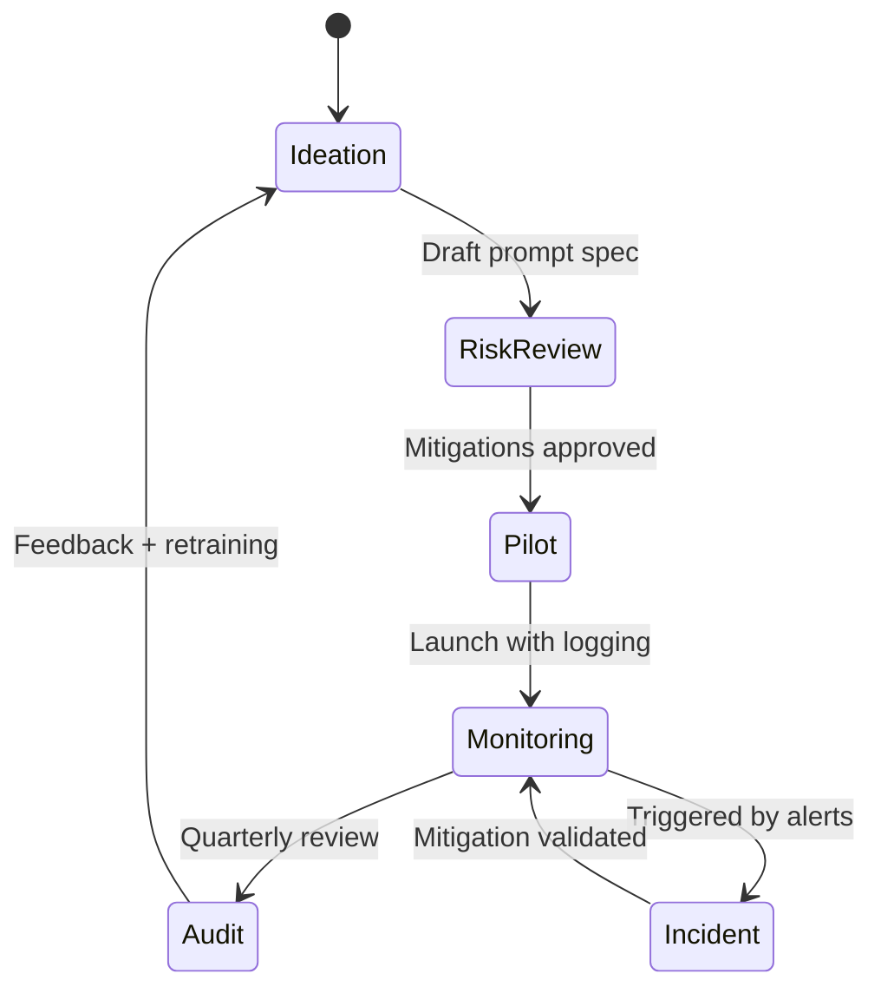

## Why responsible AI matters
Responsible AI is the difference between a prototype that dazzles in a demo and a product that stands up to regulators, customers, and internal audit. Addressing bias, transparency, and escalation pathways early protects users and your organization from harm and reputational risk.

### You’ll learn
- Core principles that guide responsible AI programs across industries.
- How to design oversight loops and documentation that auditors trust.
- Practical mitigations for bias, privacy leakage, and misuse.
- How to align evaluations, logging, and incident response with policy.

## Responsible AI principles
1. **Human oversight**: Keep humans in the loop for consequential decisions; require dual review for high-risk outputs (finance approvals, healthcare triage).
2. **Transparency**: Document data sources, model versions, and limitations. Provide user-facing disclosures when AI is involved.
3. **Fairness and bias mitigation**: Measure disparities across demographic cohorts; remediate with rebalanced datasets or post-processing.
4. **Privacy and security**: Limit personal data collection; enforce retention policies; run privacy reviews for new features.
5. **Accountability**: Define owners for prompts, datasets, and monitoring dashboards. Escalate incidents within defined SLAs.
6. **Safety and robustness**: Stress-test for jailbreaks, adversarial inputs, and degraded contexts. Implement kill-switches.

These pillars align with frameworks from the EU AI Act, NIST AI Risk Management Framework, and company policies like Microsoft’s Responsible AI Standard.【F:docs/concepts/ethics-responsible-ai.md†L33-L35】

## Governance checklist
- Publish an AI use policy covering acceptable use, data retention, and prohibited content.
- Maintain a model registry with version history, evaluation metrics, and approval status.
- Run a Responsible AI review before launch, capturing risk assessment, mitigations, and owner sign-offs.
- Establish an incident response runbook (triage, containment, user notification).
- Require training for builders and reviewers on bias, accessibility, and inclusive design.

## Operating model

### Roles and responsibilities
- **Product leads**: Define use cases, coordinate risk reviews, and own user communications.
- **Data scientists / ML engineers**: Document training data provenance, evaluation results, and model limitations.
- **Legal & compliance**: Interpret regulations (GDPR, EU AI Act, state privacy laws) and approve data usage.
- **Security**: Validate access controls, retention policies, and logging integrity.
- **Human reviewers**: Provide feedback on edge cases, track false positives/negatives, and escalate incidents.

## Bias mitigation tactics
- Collect representative datasets; partner with domain experts to identify missing cohorts.
- Use fairness metrics such as demographic parity difference, equal opportunity difference, or subgroup accuracy.
- Apply post-processing (threshold adjustments, reject option classification) when retraining is infeasible.
- Incorporate adversarial prompts that probe for stereotypes, toxicity, or exclusionary language.
- Document mitigations, open questions, and residual risks in the model card.

## Privacy and security controls
- Prefer privacy-preserving architectures: mask PII before sending to providers, store secrets in managed vaults, and avoid logging raw personal data.
- Use data minimization: send only the fields required for the task; strip attachments of unnecessary columns.
- Set data retention windows (e.g., auto-delete transcripts after 30 days) and enforce them via policy automation.
- Run regular access reviews for API keys, storage buckets, and vector databases.
- For bring-your-own-model deployments, ensure infrastructure is patched and segmented; monitor for exfiltration.

## Oversight and documentation
- Produce a model card summarizing purpose, training data, intended users, and known limitations (see [Google’s model card guidance](https://ai.google.dev/responsible/model-cards)).
- Maintain a decision log capturing key design choices, risk trade-offs, and approvals.
- Provide user-facing disclosures: show when users interact with AI, how to opt out, and where to appeal decisions.
- Track evaluation metrics in dashboards; alert when drift or bias thresholds are exceeded.
- Schedule quarterly audits to review logs, incidents, and policy updates.

## Evaluation and monitoring
1. Build evaluation suites that include fairness metrics (by cohort), toxicity scores, and prompt-injection resilience.
2. Integrate evaluations into CI pipelines; block deploys when scores fall below defined thresholds.
3. Monitor production with automated alerts on anomalous tokens, tool calls, or access patterns.
4. Capture human feedback loops (thumbs up/down, reviewer corrections) and feed them into retraining datasets.
5. Run red-team exercises at least twice a year to probe misuse scenarios.

## Incident response plan
- **Detection**: Alerts from monitoring, user reports, or automated anomaly detectors.
- **Triage**: Assign severity, identify impacted systems, notify responsible AI leads.
- **Containment**: Disable affected features, revoke keys, or roll back model versions.
- **Communication**: Provide timely updates to stakeholders, legal, and—when required—users and regulators.
- **Post-incident review**: Document root cause, remediation, and preventive actions. Update prompts, policies, and training materials.

## References
- [NIST AI Risk Management Framework](https://www.nist.gov/itl/ai-risk-management-framework) — U.S. guidance on AI governance and controls.【F:docs/concepts/ethics-responsible-ai.md†L124-L125】
- [EU AI Act](https://artificialintelligenceact.eu) — regulatory obligations by risk tier.【F:docs/concepts/ethics-responsible-ai.md†L125-L126】
- [Microsoft Responsible AI Standard](https://www.microsoft.com/en-us/ai/responsible-ai) — example corporate policy and tooling patterns.【F:docs/concepts/ethics-responsible-ai.md†L126-L127】
- [Google Model Cards](https://ai.google.dev/responsible/model-cards) — documentation template for transparency.【F:docs/concepts/ethics-responsible-ai.md†L127-L128】
- [OECD AI Principles](https://oecd.ai/en/ai-principles) — internationally recognized responsible AI pillars.【F:docs/concepts/ethics-responsible-ai.md†L128-L129】

## Cross-links
- Safety fundamentals: [/docs/concepts/safety-basics.md](/docs/concepts/safety-basics.md)
- Structured outputs for control: [/docs/concepts/structured-outputs.md](/docs/concepts/structured-outputs.md)
- Evaluation patterns: [/docs/evaluations/tool-use-evals.md](/docs/evaluations/tool-use-evals.md)
- Prompt specs: [/docs/examples/data-quality-qa.md](/docs/examples/data-quality-qa.md)
