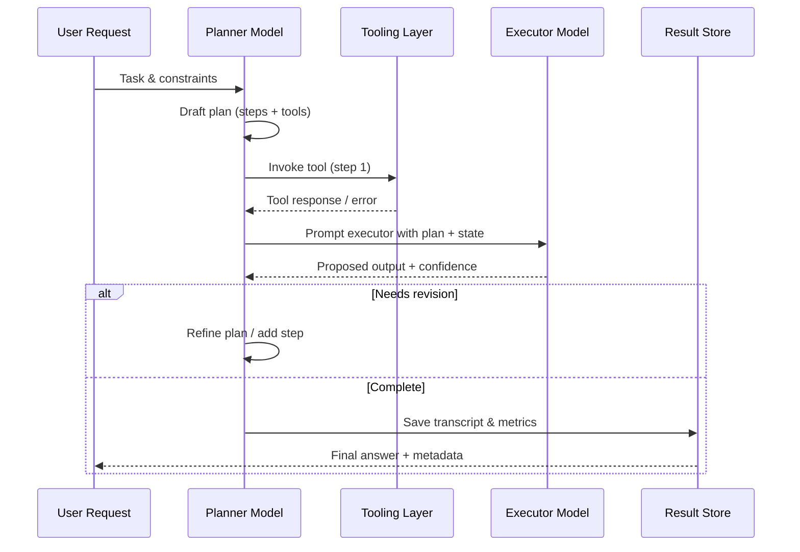

## Introduction
Most teams start with single-shot prompts that call a model once. As requirements grow—grounded answers, tool use, multi-turn planning—they explore agentic systems: orchestrations of prompts, policies, and tools working together. This guide helps you decide when to stay simple and when to invest in agents.

### You’ll learn
- How single-shot prompting differs from agentic workflows across accuracy, latency, and controllability
- A comparison matrix you can reuse in design reviews
- Decision checkpoints for adding planning, memory, or tools
- A lightweight sequence diagram showing a planner–executor loop
- Governance tips to keep multi-step systems observable and safe

## Side-by-side comparison

| Dimension | Single-shot prompting | Agentic systems |
| --- | --- | --- |
| **Structure** | One request with instruction + context | Orchestration across prompts, tools, memory stores |
| **Setup cost** | Minutes: craft prompt, call API | Days–weeks: design roles, tool schemas, state management |
| **Latency** | Low; one network round-trip | Higher; multiple model/tool calls |
| **Reliability** | Dependent on prompt clarity; limited introspection | Higher when paired with planning, retries, eval hooks; risk of cascading failures |
| **Control** | Hard to enforce step-by-step constraints | Can encode policies, guardrails, intermediate validation |
| **Cost** | Lowest tokens | Higher cumulative tokens and infra spend |
| **Best for** | Summaries, classification, drafting, Q&A with tight prompts | Complex workflows, integrations, data lookups, procedural tasks |

## Decision checklist

1. **Clarify the task outcome.** If a single natural-language answer suffices, start with single-shot prompts.
2. **Evaluate external dependencies.** Need database lookups, API calls, or approvals? Introduce tools or planner/worker roles.
3. **Assess complexity vs. benefit.** If human reviewers can easily course-correct a single prompt, agentic overhead may not pay off.
4. **Plan observability.** Can you log intermediate states, tool inputs, and errors without capturing sensitive data? If not, defer agentic flows.
5. **Pilot with evals.** Run regression tests (e.g., rubric scoring, golden prompts) on both approaches to compare accuracy and latency before rollout.

## Common upgrade path

1. **Prompt hardening:** Improve instructions, add examples, set output schemas.
2. **Retrieval augmentation:** Add embeddings search or vector databases to ground answers.
3. **Single tool call:** Let the model call a calculator, CRM lookup, or workflow engine.
4. **Planner–executor agent:** Introduce a high-level planner model that decomposes tasks and dispatches them to specialized executors.
5. **Autonomous loops with guardrails:** Allow iterative planning with stop conditions, budgets, and human escalation.

Use the smallest step that solves today’s problem, and add complexity only when metrics justify it.

## Planner–executor sequence

This loop provides hooks for logging, quality checks, and human oversight before returning results.

## Observability and safeguards

- **Set budgets.** Enforce maximum tool invocations, token usage, and wall-clock time per task to avoid runaway loops.
- **Record intermediate state.** Capture prompt IDs, tool payload metadata, and evaluator scores (no raw customer data) for audits.
- **Define stop conditions.** Require confidence thresholds or rubric scores before an agent can finalize work.
- **Escalate early.** Route ambiguous or policy-sensitive tasks to humans when the planner requests help or fails N times.

## When to prefer classic automation

Stay with deterministic automation (scripts, BPM workflows) when:

- **Requirements are stable and rules-based.** Fixed transformations, compliance checks, or policy enforcement.
- **Latency must be ultra-low.** Sub-100 ms responses are easier with cached or rule-based logic.
- **Auditability is strict.** If you must reproduce outputs exactly, LLM variability complicates compliance.

Hybrid strategies work well: deterministic steps gather context, then a single prompt produces narrative output.

## Related design docs

- **Planner/executor implementation:** `/docs/patterns/agentic/planner-executor.md`
- **Router agents that pick tools dynamically:** `/docs/patterns/agentic/router-multi-tool.md`
- **Logging and privacy guidelines:** `/docs/patterns/observability-context.md`
- **Single-shot prompting fundamentals:** `/docs/concepts/prompting-styles.md`

## References

- Anthropic. “Build with Claude agentic workflows.” (2024). <https://docs.anthropic.com/en/docs/build-with-claude/agentic-workflows>
- OpenAI. “Function calling and tool use.” (2024). <https://platform.openai.com/docs/guides/function-calling>
- Microsoft. “Evaluate generative AI systems with responsible AI controls.” (2024). <https://learn.microsoft.com/azure/ai-services/openai/how-to/responsible-use-guidelines>
- LangChain. “Planner-executor agents.” (2023). <https://python.langchain.com/docs/modules/agents/agent_types/plan_and_execute>
