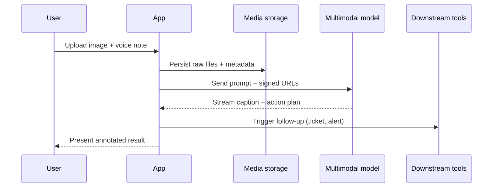

## Summary
Multimodal models accept combinations of text, images, audio, and video so they can reason over richer context than text-only LLMs. They unlock workflows such as document intelligence, UI automation, and voice assistants, but they also introduce new constraints around latency, pricing, privacy, and evaluation. Use this guide to understand the core building blocks, system design patterns, and safety considerations before you ship multimodal features.

### You’ll learn
- Which modalities mainstream providers (OpenAI, Anthropic, Google) support today and where the limits are
- How to architect ingestion, prompt construction, and tool use for multimodal requests
- How to prototype a captioning workflow with Node.js and Python clients
- How to evaluate quality, latency, and safety for image- and audio-rich experiences
- How to choose between single-call prompts, retrieval-augmented pipelines, and agents when modalities mix

## Modalities at a glance

| Provider | Current flagship models | Supported inputs | Native outputs | Context window |
| --- | --- | --- | --- | --- |
| OpenAI | GPT-4o, GPT-4o mini | Text, images, audio (streaming + file), video frames | Text, audio, JSON | Up to 128K tokens (text) with separate audio limits |
| Anthropic | Claude 3 Opus, Sonnet, Haiku | Text, images | Text, JSON | Up to 200K tokens, image resolution ≤ 5 MB |
| Google | Gemini 1.5 Pro, Gemini 1.5 Flash | Text, images, audio, video, code files | Text, structured data (function call) | Up to 1M tokens (Pro) in streaming contexts |

> **Check pricing and limits frequently.** Model capabilities change quickly; verify quotas and modality support in provider release notes before relying on them. 【F:docs/concepts/token-costs-latency.md†L35-L47】

## Architecture building blocks

Multimodal systems break down into the following stages:

1. **Acquisition.** Collect raw inputs from uploads, cameras, microphones, or APIs. Normalize media types (resize images, extract audio to PCM/WAV) and scrub PII.
2. **Preprocessing.** Generate thumbnails, extract text with OCR, transcribe audio, or downsample video frames. Store artifacts in object storage with metadata for reproducibility.
3. **Prompt assembly.** Convert each modality into model-compatible payloads. For example, base64-encode inline images or provide signed URLs. Summaries from preprocessing can keep prompts within context limits.
4. **Model invocation.** Call the provider API with tuned parameters (`temperature`, `max_output_tokens`, streaming toggles). Decide whether to run single-shot or agentic flows.
5. **Post-processing.** Validate structured outputs, align transcripts with timestamps, and redact sensitive details. Feed results into downstream tools (ticketing, analytics, dashboards).



## Design checklist

Use this checklist when you scope a multimodal feature:

- **Clarify the intent.** Is the model describing visuals, grounding instructions, or making decisions? Document the expected output schema and evaluation rubric before building.
- **Budget tokens and bandwidth.** Large images and audio transcriptions inflate token counts. Compress where possible and set per-user quotas. 【F:docs/concepts/token-costs-latency.md†L14-L33】
- **Plan for fallbacks.** Provide deterministic alternatives (manual input forms, existing OCR) for accessibility or when the model fails.
- **Handle privacy.** Store media in encrypted buckets, apply retention policies, and warn users before uploading sensitive content. Reference `/docs/concepts/safety-basics.md` for baseline guardrails.
- **Instrument quality.** Capture model confidences, evaluator scores, and human review outcomes per modality to monitor drift.

## Implementation example: describe a chart from an image

### Node.js (TypeScript)
```ts
import OpenAI from "openai";

const client = new OpenAI({ apiKey: process.env.OPENAI_API_KEY });

async function captionChart() {
  const completion = await client.chat.completions.create({
    model: "gpt-4o-mini",
    temperature: 0.2,
    messages: [
      {
        role: "user",
        content: [
          { type: "text", text: "Summarize the main insight from this chart in 3 bullet points." },
          {
            type: "image_url",
            image_url: {
              url: "https://example-bucket.s3.amazonaws.com/revenue-trend.png",
              detail: "high"
            }
          }
        ]
      }
    ],
    response_format: { type: "json_schema", json_schema: {
      name: "chart_summary",
      schema: {
        type: "object",
        properties: {
          key_points: { type: "array", items: { type: "string" }, minItems: 3, maxItems: 3 },
          confidence: { type: "number", minimum: 0, maximum: 1 }
        },
        required: ["key_points", "confidence"]
      }
    }}
  });

  console.log(completion.choices[0].message.content);
}

captionChart().catch((error) => {
  console.error("Captioning failed", error);
  process.exitCode = 1;
});
```

### Python
```python
from openai import OpenAI

client = OpenAI()

schema = {
    "name": "chart_summary",
    "schema": {
        "type": "object",
        "properties": {
            "key_points": {
                "type": "array",
                "items": {"type": "string"},
                "minItems": 3,
                "maxItems": 3,
            },
            "confidence": {"type": "number", "minimum": 0, "maximum": 1},
        },
        "required": ["key_points", "confidence"],
    },
}

response = client.chat.completions.create(
    model="gpt-4o-mini",
    temperature=0.2,
    messages=[
        {
            "role": "user",
            "content": [
                {"type": "text", "text": "Summarize the main insight from this chart in 3 bullet points."},
                {
                    "type": "image_url",
                    "image_url": {
                        "url": "https://example-bucket.s3.amazonaws.com/revenue-trend.png",
                        "detail": "high",
                    },
                },
            ],
        }
    ],
    response_format={"type": "json_schema", "json_schema": schema},
)

print(response.choices[0].message.content)
```

Both snippets enforce structured outputs so downstream analytics systems can ingest the summary reliably. Replace the example URL with a signed or public link to your image.

## Evaluation and safety considerations

- **Bias and representation.** Test with diverse imagery and accents. Document any systematic failures and feed them into `/docs/concepts/ethics-responsible-ai.md` risk reviews.
- **Accessibility.** Provide alternative text for screen readers and transcripts for audio. Offer controls to opt out of audio capture.
- **Safety filters.** Leverage provider content filters for images and audio. Layer custom checks (e.g., NSFW detection) when policy requires.
- **Human-in-the-loop.** Route uncertain outputs (e.g., `confidence < 0.6`) to reviewers, and log overrides to improve prompts.
- **Evals.** Create golden datasets with reference captions or transcripts. Automate scoring with BLEU/ROUGE for captions and WER for transcripts, supplemented with human ratings.

## Related patterns

- `/docs/patterns/prompting/recipes.md` — prompt structures that mix text and images.
- `/docs/patterns/rag/basics.md` — combine retrieved documents with screenshots or diagrams for grounded answers.
- `/docs/patterns/specs/prompt-spec-template.md` — document multimodal prompt contracts for review.

## References

- OpenAI. “Introducing GPT-4o.” (2024). <https://openai.com/index/introducing-gpt-4o/>
- Anthropic. “Claude 3 model card.” (2024). <https://www.anthropic.com/news/claude-3-models>
- Google DeepMind. “Gemini 1.5 technical report.” (2024). <https://deepmind.google/discover/blog/google-gemini-next-generation-ai-for-everyone/>
