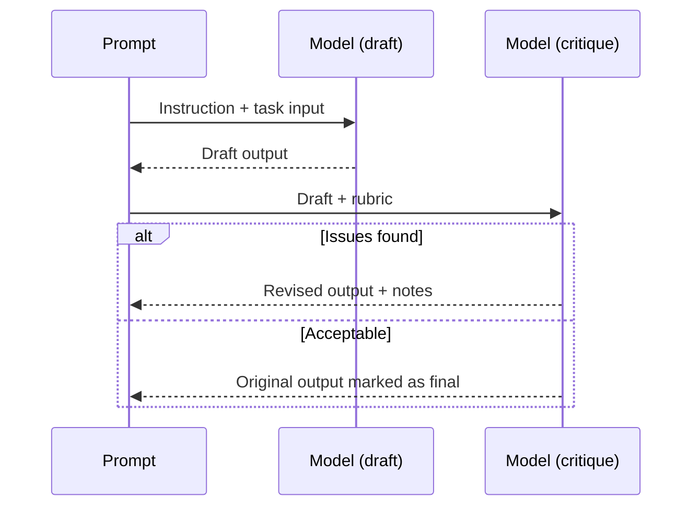

## Introduction
Prompt design shapes how reliably a model responds. This page surveys core prompting styles, shows how to implement each in Node.js and Python, and highlights when to switch styles or combine them.

### You’ll learn
- The purpose, strengths, and pitfalls of the five most common prompting styles
- How to translate each style into a runnable server-side request
- Techniques to evaluate and iterate on prompts without guesswork
- How to combine styles into agentic or tool-using workflows
- References to official provider guidance you can cite in reviews

## Picking a style

| Style | Best for | Key advantages | Watch-outs |
| --- | --- | --- | --- |
| **Instruction** | Straightforward tasks with clear instructions | Fast to author, minimal tokens | Ambiguity leads to inconsistent outputs |
| **Few-shot** | Tasks where examples teach structure or tone | Demonstrates desired pattern explicitly | Examples consume context; may overfit |
| **Chain-of-thought (CoT)** | Reasoning, math, multi-step logic | Encourages intermediate reasoning | Longer latency and risk of hallucinated steps |
| **Critique & repair** | Quality assurance, code review, red-teaming | Creates self-check loop | Doubles token usage; needs stop conditions |
| **Plan & execute** | Complex tasks with subtasks/tools | Modular, extensible | Requires orchestration and guardrails |

Move gradually: start with instruction prompts and add layers only when evaluation data shows you need them.

## Instruction prompts
Instruction prompts tell the model what to do, any constraints, and the desired output format.

```js
// Node.js (Express route)
import express from 'express';
import OpenAI from 'openai';

const router = express.Router();
const client = new OpenAI({ apiKey: process.env.OPENAI_API_KEY });

router.post('/summaries', async (req, res) => {
  const { text } = req.body;
  try {
    const response = await client.responses.create({
      model: 'gpt-4o-mini',
      input: [
        {
          role: 'user',
          content: `Summarize the following text in three bullet points. Limit each bullet to 15 words.\n\n${text}`
        }
      ],
      temperature: 0.3
    });
    res.json({ bullets: response.output_text.trim().split('\n').filter(Boolean) });
  } catch (error) {
    res.status(502).json({ error: 'summary_failed', detail: error.message });
  }
});
export default router;
```

```python
# Python (FastAPI endpoint)
from fastapi import APIRouter, HTTPException
from pydantic import BaseModel
from openai import OpenAI

router = APIRouter()
client = OpenAI()

class SummaryRequest(BaseModel):
    text: str

@router.post("/summaries")
async def summarize(payload: SummaryRequest):
    try:
        result = client.responses.create(
            model="gpt-4o-mini",
            input=[
                {
                    "role": "user",
                    "content": f"Summarize the following text in three bullet points. Limit each bullet to 15 words.\n\n{payload.text}"
                }
            ],
            temperature=0.3,
        )
        bullets = [line.strip("- ") for line in result.output_text.splitlines() if line.strip()]
        return {"bullets": bullets[:3]}
    except Exception as exc:  # noqa: BLE001
        raise HTTPException(status_code=502, detail={"error": "summary_failed", "message": str(exc)}) from exc
```

**Evaluation tips:** Create 10–20 representative inputs with expected bullet summaries. Compare outputs automatically (e.g., cosine similarity on embeddings) and sample manually.

## Few-shot prompts
Few-shot prompts prepend representative examples so the model can infer format, tone, or labeling schemes.

```text
You are tagging support tickets with intent labels.

Example 1
Ticket: "Cannot reset password after following instructions."
Label: account_access

Example 2
Ticket: "Billing invoice shows duplicate charges."
Label: billing_issue

Now classify the ticket below.
Ticket: "The mobile app keeps logging me out when I switch tabs."
Label:
```

When examples are long, consider storing them in a retrieval system and inserting only the closest matches. Track context window usage—few-shot payloads can quickly exceed low-latency models.

## Chain-of-thought prompts
CoT prompts ask the model to explain its reasoning before producing a final answer. Use them when you need transparency or better accuracy on math/logic tasks.

```text
Solve the problem step by step. Provide a short explanation for each step, then give the final answer on a new line starting with "Answer:".

Problem: A meeting lasts 1 hour and 45 minutes. It starts at 13:20. What time does it end?
```

CoT increases latency and may invent reasoning. Pair it with evaluation rubrics or an automated checker that validates the final answer.

## Critique-and-repair prompts
Critique-and-repair uses two passes: one model (or the same model twice) produces an initial answer, then critiques and fixes it.



Example rubric prompt:

```text
You are reviewing the draft below for factual accuracy and tone. If issues exist, revise the draft. If it is acceptable, respond with "ACCEPTED" and explain why.

Draft:
{{draft}}

Checklist:
1. Are all statements supported by the provided context? If not, fix or remove them.
2. Does the tone stay professional and neutral?
3. Are structured fields populated in valid JSON?
```

Instrument critique loops carefully—cap them at one or two iterations and log both drafts to support audits.

## Plan-and-execute prompts
When a single prompt cannot handle all steps, split work into planning and execution prompts. A planner outlines steps; executors handle each subtask, possibly calling tools.

```python
planner_prompt = """
Decompose the user request into 2-4 ordered steps. For each step, specify the action, required inputs, and expected output.
Return JSON with fields: steps (array of {id, description, tool_hint}).
"""
```

```js
const executorPrompt = ({ step, context }) => `You are executing step ${step.id}: ${step.description}.
Use the context provided:
${JSON.stringify(context)}
Return a JSON object with fields { "status": "ok" | "needs_help", "output": string }.`;
```

Store planner output, enforce execution budgets, and fall back to human review when any step returns `needs_help`.

## Combining styles
- **Instruction + schema:** Add JSON schema validation to keep responses structured.
- **Few-shot + CoT:** Provide exemplars that demonstrate thinking steps for math-heavy tasks.
- **CoT + critique:** Ask the model to reason aloud, then have a second pass confirm each reasoning step against source material.
- **Plan + tools:** Let the planner decide which tool to call (search, calculator, CRM) and feed tool outputs back into later steps.

## Evaluation checklist

1. **Define success metrics.** Accuracy, tone, completeness, latency, cost.
2. **Build a golden set.** Curate inputs and desired outputs for regression tests.
3. **Automate scoring.** Use embeddings similarity, string match, or rule-based validators.
4. **Sample manually.** Human review catches subtle tone or safety issues.
5. **Track drift.** Re-run evaluations after prompt edits, model upgrades, or context changes.

## References

- OpenAI. “Prompt engineering best practices.” (2024). <https://platform.openai.com/docs/guides/prompt-engineering>
- Anthropic. “Prompt engineering for Claude.” (2024). <https://docs.anthropic.com/en/docs/build-with-claude/prompt-engineering>
- Google. “Chain-of-thought prompting elicits reasoning.” (Wei et al., 2022). <https://arxiv.org/abs/2201.11903>
- Microsoft. “Evaluate generative AI prompts.” (2024). <https://learn.microsoft.com/azure/ai-services/openai/how-to/evaluations>
