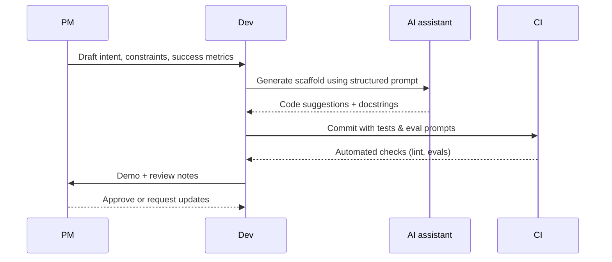

## Why specs still matter
Large language models can generate code from high-level instructions, but “vibe coding” — improvising prompts without clear requirements — often leads to brittle solutions, missing edge cases, and rework. Pairing AI tooling with lightweight specs keeps teams aligned on intent, constraints, and success metrics.

### You’ll learn
- Warning signs that vibe-based coding is derailing your project
- Spec formats that work well with AI assistants and agents
- How to iterate from spec to prompt packs and evaluation suites
- Collaboration patterns for PMs, developers, and reviewers
- Tooling recommendations for keeping AI-assisted delivery auditable

## Spotting vibe coding in the wild

| Smell | What you observe | Resulting risk |
| --- | --- | --- |
| Undefined requirements | Prompts reference “make it better” without acceptance criteria | Rework, scope creep |
| No traceability | Diff merges lack linked decisions or tickets | Hard to audit or explain behavior |
| Prompt sprawl | Multiple ad-hoc prompts stored in chat history | Lost knowledge, inconsistent outputs |
| Eval gaps | No automated tests or rubrics to verify LLM output | Undetected regressions |
| Tool misuse | Agents call destructive APIs without safeguards | Production incidents |

## Minimum viable spec kit

A spec does not need to be heavyweight. Aim for a single page (or issue template) covering:

- **Intent statement.** Describe the user problem, stakeholders, and desired outcome.
- **Inputs/outputs.** Define data shapes, schemas, or API contracts. Include JSON schema where possible.
- **Constraints.** Note latency limits, security policies, dependencies, and rollout plans.
- **Eval hooks.** Outline test datasets, metrics, or human review checklists.
- **Risks & mitigations.** Document known failure modes and fallback behaviors.

Link the spec to source control via README snippets, ADRs, or issue references so reviewers can trace decisions. 【F:docs/quickstarts/js-server-route.md†L23-L73】

## From spec to prompts and tests

1. **Translate spec into a system prompt.** Include persona, required APIs, and error handling expectations.
2. **Generate scaffolding** in ChatGPT Canvas or your IDE, but keep prompts version-controlled (e.g., `prompt.md` in repo).
3. **Write automated tests first** (unit, contract, eval prompts). Use assertion libraries plus AI-based regression tests where applicable.
4. **Review diffs with context.** Attach the spec link and prompt versions in pull requests so reviewers understand intent.
5. **Log learnings.** Capture what worked, what failed, and update the spec for future contributors.

## Collaboration patterns

- **PM + developer pairing.** PMs maintain the problem framing and acceptance criteria; developers own implementation details and guardrails.
- **Design reviews.** Walk through the spec, architecture diagram, and eval plan before heavy prompting begins. This catches ambiguous requirements early.
- **Evaluation cadences.** Schedule automated evals (e.g., nightly) plus manual spot checks during rollout. Update prompts when metrics regress. 【F:docs/concepts/genai-vs-agentic.md†L102-L134】
- **Knowledge capture.** Store final prompts, test datasets, and failure cases in a shared repository so future agents inherit context.

## Tools that reinforce spec-driven workflows

| Need | Recommended tooling |
| --- | --- |
| Prompt versioning | Markdown prompt packs in Git, Anthropic Prompt Library, OpenAI Prompt Management beta |
| Shared specs | Lightweight RFCs, Notion docs synced to repo, GitHub Issues templates |
| Eval automation | pytest + golden files, OpenAI Evals, Ragas for retrieval QA |
| Guardrails | Pydantic schemas, Zod, jsonschema, Azure Content Filters |
| Collaboration | VS Code Live Share, GitHub Discussions, Linear issues |

## Checklist before merging AI-assisted code

- [ ] Spec, prompts, and eval plan live alongside code in the repo.
- [ ] Automated tests cover the critical path; eval prompts run in CI or nightly jobs.
- [ ] Model/tool access is scoped (no client-side keys, least privilege credentials). 【F:docs/quickstarts/python-fastapi.md†L69-L122】
- [ ] Deployment plan includes rollback and observability steps.
- [ ] Lessons learned are fed back into the spec for future iterations.

## References

- GitHub. “Best practices for using GitHub Copilot securely.” (2024). <https://docs.github.com/en/copilot/enterprise/copilot-enterprise-guides/best-practices-for-copilot>
- OpenAI. “System and developer prompt guidelines.” (2024). <https://platform.openai.com/docs/guides/prompt-engineering>
- Microsoft. “Plan your prompt engineering workflow.” (2024). <https://learn.microsoft.com/azure/ai-services/openai/concepts/prompt-engineering>
- Thoughtworks. “Lightweight architecture decision records.” (2023). <https://www.thoughtworks.com/insights/blog/lightweight-architecture-decision-records>
