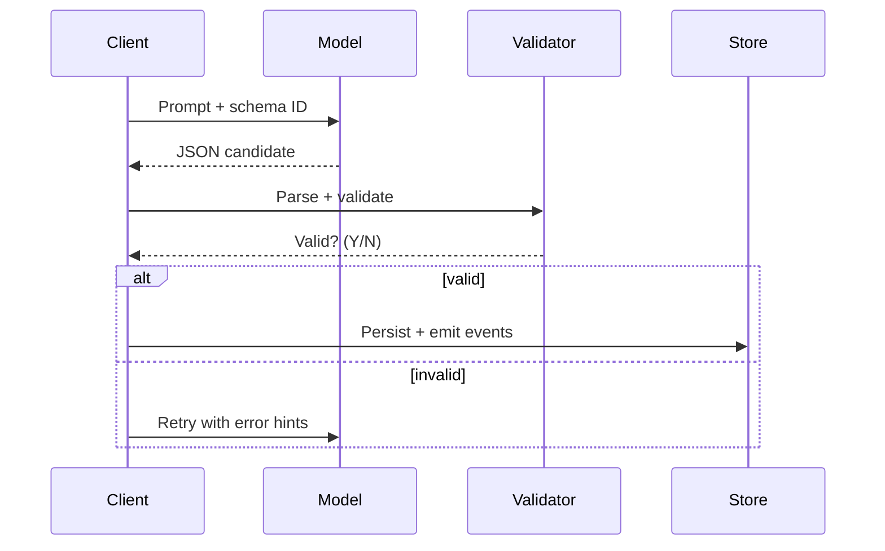

## Structured outputs overview
Structured outputs keep language models honest by forcing them to respect a schema you control. They transform free-form generations into predictable JSON or XML that downstream systems can parse, validate, and monitor. In teams, that predictability shrinks integration effort and blocks many classes of prompt injection.

### You’ll learn
- When structured outputs reduce risk versus free-form text.
- How major providers support schemas, function calling, and tool results.
- Techniques to design prompts, validators, and retries for reliable JSON.
- Ways to measure quality and cost impacts of structured output pipelines.

## When structure pays off
Use structured outputs when downstream systems expect machine-readable data, when you must enforce guardrails (like enumerations or numeric ranges), or when you need to log, evaluate, and diff generations at scale. Free-form responses can work for exploratory drafting, but as soon as a response feeds automation—ticket creation, finance workflows, analytics ingestion—structure is safer.

Key trade-offs:

- **Reliability**: JSON schemas catch missing fields early; however, overly strict schemas may cause repeated retries and higher latency.
- **Latency and cost**: Validating and retrying adds tokens and time. Favor streaming-free responses, as you must receive the entire payload before parsing.
- **Flexibility**: Constrained outputs can limit creative phrasing. Offer text fields for narrative content while locking down control fields.

## Provider capabilities at a glance

| Provider | Feature | Notes |
| --- | --- | --- |
| OpenAI | JSON mode, function calling | Native JSON schema support on GPT-4o Mini and GPT-4.1; use `response_format: { type: "json_schema" }` for strict validation.【F:docs/concepts/structured-outputs.md†L38-L41】 |
| Anthropic | Structured Outputs, tool use | Claude 3 models support tool schemas and `response_format` definitions; enforce with `max_output_tokens` to prevent truncation.【F:docs/concepts/structured-outputs.md†L41-L44】 |
| Google Gemini | Function calling | Returns typed `arguments`; you must validate and coerce to your schema in code.【F:docs/concepts/structured-outputs.md†L44-L46】 |
| Azure OpenAI | Mirrors OpenAI | Same SDK shape as OpenAI; enterprise logging and content filters help monitor deviations.【F:docs/concepts/structured-outputs.md†L46-L48】 |
| Cohere | JSON connectors | Provides tool-calling style responses; requires manual schema checking in application layer.【F:docs/concepts/structured-outputs.md†L48-L50】 |

> Tip: Always include versioned schema IDs so you can roll changes safely across prompts and validators.

## Sequence for structured generation



## Designing prompts and schemas
1. **Name the schema**: Reference a stable identifier (e.g., `invoice.v2`) so logs map generations to expectations.
2. **Explain constraints in natural language**: Describe each field with examples and allowed ranges. The model uses this metadata even if you also send a machine schema.
3. **Provide canonical examples**: Include a single exemplar JSON body. Avoid multiple contradictory examples.
4. **State error handling policy**: Tell the model to produce `"errors"` arrays when unsure, rather than hallucinating.
5. **Cap list lengths**: Without limits, models may create excessively long arrays that inflate tokens.

### Sample JSON schema

```json
{
  "$schema": "https://json-schema.org/draft/2020-12/schema",
  "$id": "https://schemas.example.com/meeting-summary.v1",
  "type": "object",
  "required": ["summary", "actions"],
  "properties": {
    "summary": { "type": "string", "maxLength": 800 },
    "confidence": { "type": "number", "minimum": 0, "maximum": 1 },
    "actions": {
      "type": "array",
      "maxItems": 5,
      "items": {
        "type": "object",
        "required": ["owner", "task", "due"],
        "properties": {
          "owner": { "type": "string", "minLength": 1 },
          "task": { "type": "string", "minLength": 5 },
          "due": { "type": "string", "pattern": "^\\d{4}-\\d{2}-\\d{2}$" }
        }
      }
    }
  }
}
```

## Node.js implementation
The following example uses the OpenAI client with JSON schema enforcement plus Zod validation as a second line of defense.

```ts
import OpenAI from "openai";
import { z } from "zod";

const client = new OpenAI({ apiKey: process.env.OPENAI_API_KEY! });

const meetingSchema = z.object({
  summary: z.string().max(800),
  confidence: z.number().min(0).max(1).default(0.6),
  actions: z
    .array(
      z.object({
        owner: z.string().min(1),
        task: z.string().min(5),
        due: z.string().regex(/\d{4}-\d{2}-\d{2}/)
      })
    )
    .max(5)
});

export async function summarizeTranscript(transcript: string) {
  const response = await client.responses.create({
    model: "gpt-4.1-mini",
    input: [
      {
        role: "system",
        content: "Produce meeting summaries as JSON. Unknown data goes to errors."
      },
      {
        role: "user",
        content: `Summarize the following transcript. ${transcript}`
      }
    ],
    response_format: {
      type: "json_schema",
      json_schema: {
        name: "meeting_summary",
        schema: meetingSchema.toJSON()
      }
    },
    temperature: 0.2,
    max_output_tokens: 800
  });

  const parsed = meetingSchema.safeParse(JSON.parse(response.output_text));
  if (!parsed.success) {
    throw new Error(`Invalid model output: ${parsed.error.message}`);
  }
  return parsed.data;
}
```

**Retry strategy**

```ts
for (let attempt = 1; attempt <= 3; attempt++) {
  try {
    return await summarizeTranscript(transcript);
  } catch (error) {
    if (attempt === 3) throw error;
    await new Promise((resolve) => setTimeout(resolve, 250 * attempt));
  }
}
```

## Python implementation

```python
from typing import TypedDict, List
from openai import OpenAI
from pydantic import BaseModel, Field, ValidationError

client = OpenAI()

class Action(BaseModel):
    owner: str = Field(min_length=1)
    task: str = Field(min_length=5)
    due: str = Field(pattern=r"^\d{4}-\d{2}-\d{2}$")

class MeetingSummary(BaseModel):
    summary: str = Field(max_length=800)
    confidence: float = Field(ge=0, le=1, default=0.6)
    actions: List[Action] = Field(max_items=5)

SYSTEM_PROMPT = (
    "You convert meetings into JSON. Use nulls when data is missing."
)


def summarize_transcript(transcript: str) -> MeetingSummary:
    response = client.responses.create(
        model="gpt-4.1-mini",
        input=[
            {"role": "system", "content": SYSTEM_PROMPT},
            {"role": "user", "content": f"Summarize this transcript: {transcript}"},
        ],
        response_format={
            "type": "json_schema",
            "json_schema": {
                "name": "meeting_summary",
                "schema": MeetingSummary.model_json_schema(),
            },
        },
        temperature=0.2,
        max_output_tokens=800,
    )

    payload = response.output[0].content[0].text
    try:
        return MeetingSummary.model_validate_json(payload)
    except ValidationError as exc:
        raise ValueError(f"Invalid model output: {exc}")
```

Add exponential backoff on retries and capture the raw payload for observability before raising exceptions.

## Validation and monitoring
- **Syntactic validation**: Use JSON schema or typed models to fail fast.
- **Semantic checks**: Write rules (e.g., due date must be ≥ today) that run after parsing.
- **Observability**: Log schema version, tokens consumed, retries, and validation errors. Forward to metrics dashboards.
- **Human review**: Sample 5–10% of outputs for manual audits, especially after schema changes.

## Evaluation hooks
1. Construct a labeled dataset of inputs with gold JSON outputs.
2. Run automated diff checks comparing model outputs to gold data. Score field-level precision/recall.
3. Stress-test with adversarial inputs (missing sections, contradictory instructions) to ensure the model emits explicit errors.

## Related reading
- [OpenAI: Structured Outputs](https://platform.openai.com/docs/guides/structured-outputs) — native JSON schema enforcement and tips for retries.【F:docs/concepts/structured-outputs.md†L226-L227】
- [Anthropic: Build with Claude — Structured Outputs](https://docs.anthropic.com/en/docs/build-with-claude/structured-outputs) — tool calling and schema guidance for Claude 3.【F:docs/concepts/structured-outputs.md†L227-L228】
- [JSON Schema Validation](https://json-schema.org/understanding-json-schema) — canonical reference for Draft 2020-12 semantics.【F:docs/concepts/structured-outputs.md†L228-L229】
- [OpenAI Function Calling](https://platform.openai.com/docs/guides/function-calling) — mapping tool invocations to external logic.【F:docs/concepts/structured-outputs.md†L229-L230】

## Cross-links
- Deep dive on tool orchestration: [/docs/patterns/tools/function-calling.md](/docs/patterns/tools/function-calling.md)
- Meeting summary implementation: [/docs/examples/meeting-summarizer.md](/docs/examples/meeting-summarizer.md)
- Safety considerations for structured agents: [/docs/concepts/safety-basics.md](/docs/concepts/safety-basics.md)
- Evaluating JSON accuracy: [/docs/evaluations/tool-use-evals.md](/docs/evaluations/tool-use-evals.md)
