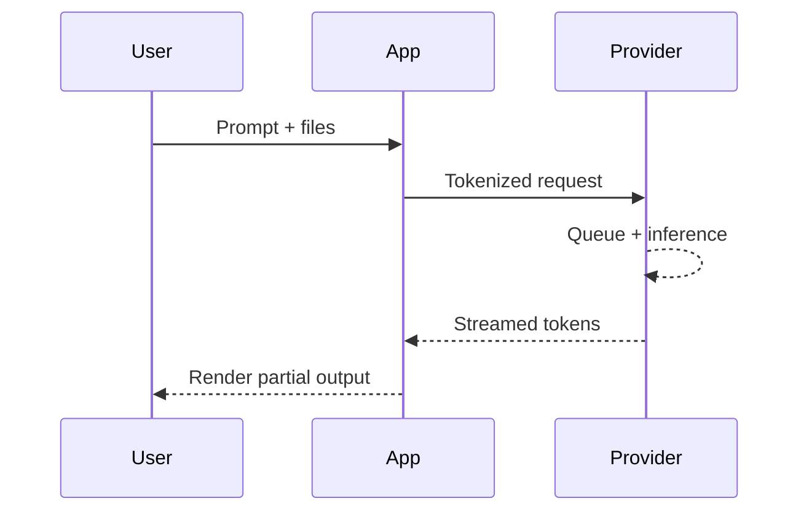

## Summary
Tokens measure how much text a model must process; the more you send or request, the more you pay and the longer you wait. Context windows cap how many tokens fit into a single exchange, forcing tradeoffs between completeness, speed, and quality. Streaming and budget controls help you balance user experience against cost.

### You'll learn
- How to reason about token counts, context limits, and pricing tiers.
- How to estimate end-to-end latency for generation and streaming scenarios.
- How to budget for multi-turn conversations and large attachments.
- How to instrument applications to log and control token usage.
- How to set guardrails that prevent runaway costs.

## Token fundamentals
Tokens are sub-word fragments; English averages ~3–4 characters per token and ~750 words per 1,000 tokens. Providers price both input (prompt) and output (completion) tokens. Pricing varies by model family and tier—for example, OpenAI lists GPT-4o mini at $0.00015 per 1K input tokens and $0.00060 per 1K output tokens, while GPT-4o is $0.005 and $0.015 respectively as of March 2025.<sup>1</sup>

| Model | Max context window | Input cost (per 1K tokens) | Output cost (per 1K tokens) |
| --- | --- | --- | --- |
| OpenAI GPT-4o | 128,000 | $0.005 | $0.015 |
| OpenAI GPT-4o mini | 128,000 | $0.00015 | $0.00060 |
| Anthropic Claude 3 Opus | 200,000 | $0.015 | $0.075 |
| Anthropic Claude 3 Haiku | 200,000 | $0.00025 | $0.00125 |

> Always verify current pricing; providers update rates frequently.

### Estimating tokens quickly
- Multiply words by 4/3 to approximate tokens (e.g., 500 words ≈ 670 tokens).
- Compress structured data (JSON, CSV) with `json.dumps(..., separators=(",", ":"))` or column pruning before sending.
- Cache embeddings or summaries to avoid re-sending large documents.

## Latency levers
Total latency = network overhead + provider queue time + model inference time + client rendering. For a refresher on how LLMs work end to end, review [/docs/concepts/what-is-genai.md](/docs/concepts/what-is-genai.md).

- **Network overhead**: includes TLS handshake and data transfer—minimize request size and reuse HTTP clients.
- **Provider queue time**: spikes during high demand; premium tiers (e.g., Azure OpenAI provisioned throughput) reduce variance.<sup>2</sup>
- **Model inference time**: grows with prompt length, requested tokens, and temperature; larger models respond slower.
- **Client rendering**: streaming partial tokens can cut perceived latency by 30–60% for chat UIs.



## Cost and latency budgeting worksheet
Use the following checklist when planning a workflow:

1. **Inventory inputs**: count tokens for system prompts, instructions, and attachments. Store counts per document.
2. **Estimate max completion**: cap `max_tokens` based on UI real estate and evaluation requirements.
3. **Apply pricing**: multiply total input/output tokens by published rates.
4. **Add buffer**: multiply by 1.2–1.5 to cover retries and variance.
5. **Convert to latency**: 
   - `prompt_tokens / throughput` for encoding.
   - `completion_tokens / tokens_per_second` for generation.
6. **Decide on streaming**: stream if perceived latency savings outweigh incremental implementation cost.
7. **Set budgets**: enforce per-user, per-conversation, and per-day token caps.

## Instrumentation example
The snippets below log usage and compute cost per request. Replace the API keys with environment variables before running.

```ts title="Node.js (TypeScript)"
import OpenAI from "openai";

const client = new OpenAI({ apiKey: process.env.OPENAI_API_KEY });

async function callModel() {
  const response = await client.responses.create({
    model: "gpt-4o-mini",
    input: "Summarize the main updates from our release notes in 5 bullet points.",
    max_output_tokens: 256,
    temperature: 0.2,
    metadata: { feature: "release-summary" }
  });

  const usage = response.usage;
  if (!usage) throw new Error("Usage metadata unavailable");

  const cost = (usage.input_tokens / 1000) * 0.00015 +
               (usage.output_tokens / 1000) * 0.00060;

  console.log({
    latencyMs: response.timings?.total, // Requires beta flag for timestamps.
    tokens: usage,
    costUSD: Number(cost.toFixed(6)),
  });
}

callModel().catch((error) => {
  console.error("Model call failed", error);
  process.exitCode = 1;
});
```

```python title="Python"
from datetime import datetime
from openai import OpenAI

client = OpenAI()

INPUT_PRICE = 0.00015 / 1000
OUTPUT_PRICE = 0.00060 / 1000

def summarize(text: str) -> None:
    start = datetime.utcnow()
    response = client.responses.create(
        model="gpt-4o-mini",
        input=text,
        max_output_tokens=256,
        temperature=0.2,
        metadata={"feature": "release-summary"},
    )
    elapsed = (datetime.utcnow() - start).total_seconds() * 1000

    usage = response.usage or {}
    input_tokens = usage.get("input_tokens", 0)
    output_tokens = usage.get("output_tokens", 0)
    cost = input_tokens * INPUT_PRICE + output_tokens * OUTPUT_PRICE

    print(
        {
            "latency_ms": round(elapsed, 2),
            "input_tokens": input_tokens,
            "output_tokens": output_tokens,
            "cost_usd": round(cost, 6),
        }
    )

if __name__ == "__main__":
    summarize("Summarize the main updates from our release notes in 5 bullet points.")
```

> These examples log raw token usage; integrate with centralized observability (Datadog, New Relic) to trend cost over time.

## Streaming versus batch requests
Streaming reduces perceived latency but adds implementation complexity. Pair these strategies with the prompt and schema tips in [/docs/concepts/structured-outputs.md](/docs/concepts/structured-outputs.md) when your workflow expects machine-readable results.

| Scenario | Recommendation | Notes |
| --- | --- | --- |
| Customer support chat | **Stream** | Improves CSAT; combine with server-sent events and typing indicators. |
| Automated report generation | **Batch** | Background job can wait; simpler retry logic. |
| Voice assistants | **Stream** | Needed for natural conversations and barge-in. |
| Batch scoring (e.g., email drafts) | **Batch** | Use concurrency + rate limits. |

When streaming, send smaller chunked prompts and flush tokens to clients as soon as they arrive. Monitor final output for truncation because streaming outputs still obey `max_tokens`.

For deeper cost guardrails, combine these ideas with the checklist in [/docs/patterns/cost-controls.md](/docs/patterns/cost-controls.md).

## Guardrails for runaway costs
- **Budget policies**: enforce per-user token quotas via Redis counters.
- **Prompt compaction**: automatically drop conversation history that falls outside quality thresholds; keep evaluation data.
- **Retry strategy**: prefer exponential backoff with capped retries; log retries separately.
- **Fallback models**: drop to a cheaper tier when latency or cost budgets trigger.
- **Batch audits**: run nightly jobs to flag conversations exceeding cost thresholds for review.

## Try it: estimate a conversation budget
1. Collect three real conversations with similar scope.
2. Count input/output tokens with `tiktoken` (Python) or `js-tiktoken`.
3. Multiply by current pricing for your chosen provider.
4. Simulate streaming by dividing output tokens by 5 tokens/second for small models and 15 for large ones.
5. Compare total cost to your budget; adjust prompts or context retention accordingly.

## References
1. OpenAI. “Pricing.” Accessed March 15, 2025. https://openai.com/pricing
2. Microsoft Learn. “Provisioned throughput in Azure OpenAI Service.” Accessed March 15, 2025. https://learn.microsoft.com/azure/ai-services/openai/how-to/provisioned-throughput
3. Anthropic. “Claude 3 Model Card.” Accessed March 15, 2025. https://www.anthropic.com/news/claude-3-models

