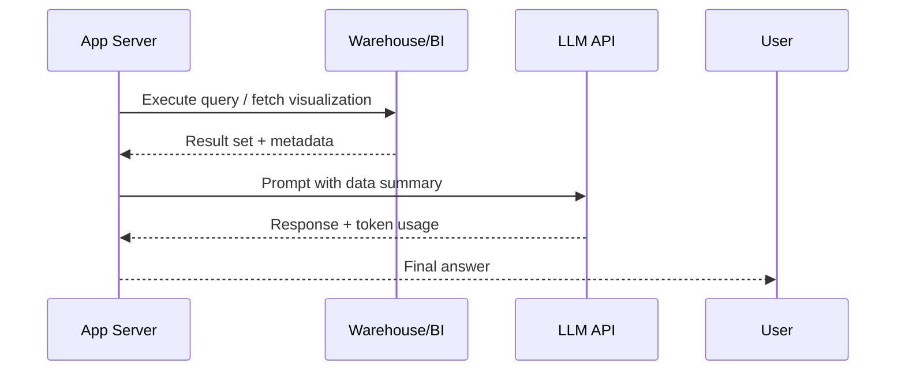

## Treat data-platform access as part of the eval

Generative AI workflows that read from warehouses or BI tools carry latency, concurrency, and cost profiles beyond the model call. Benchmarking those end-to-end paths protects SLAs and budgets. This guide explains how to design reproducible benchmarks for Microsoft Fabric, Snowflake, Databricks, and Qlik Cloud.

### You’ll learn
- How to scope representative workloads and concurrency levels
- How to capture granular timings from retrieval through model response
- How to compare warehouse configurations and optimize spend
- How to report findings that influence capacity planning and safety reviews
- References to provider performance and optimization guidance

## Select benchmark scenarios

Pick scenarios that mirror user-critical workflows:

1. **Ad-hoc Q&A:** Small result sets with high concurrency (executive dashboards).
2. **Operational summaries:** Medium result sets, scheduled hourly (support queue digest).
3. **Heavy analytics:** Large joins or aggregations triggered daily (financial rollups).

For each, note data source, query complexity, expected row counts, and downstream risk classification from `/docs/safety/overview.md`.

## Prepare benchmark fixtures

- **Static datasets:** Snapshot source tables to avoid drifting baselines. Use database cloning or time-travel features (Snowflake Time Travel, Fabric Lakehouse snapshots).
- **Query library:** Store SQL (or dataset IDs for Qlik) in version control with descriptive metadata.
- **Prompt templates:** Define how model prompts reference the query results (summaries, bullet lists, anomalies).
- **Configuration matrix:** Document warehouse sizes, serverless vs. provisioned options, regions, and caching modes.

## Instrument the pipeline

Capture timings for each stage:

Log the following per run:

- Warehouse query latency (queued, execution, fetch)
- Warehouse cost metrics (credits, DTUs, Fabric Capacity Units)
- Result payload size (rows, bytes)
- Model latency and tokens
- Total wall-clock time and cost per request

## Run controlled experiments

1. Warm caches by running each query once; record both cold and warm results.
2. Execute benchmarks at different concurrency levels (1, 5, 20 simultaneous requests) to evaluate queueing behavior.
3. Rotate through warehouse configurations (e.g., Snowflake `X-Small` vs. `Medium`, Databricks photon on/off).
4. For Qlik Cloud, test both live app connections and cached datasets to quantify reload delays.

Use repeatable scripts (Python, dbt, or Fabric notebooks) and store raw logs for auditing.

## Analyze and report

Produce a summary table like:

| Scenario | Platform | Config | Avg latency (s) | Cost / run (USD) | Notes |
| --- | --- | --- | --- | --- | --- |
| Ad-hoc Q&A | Snowflake | X-Small, warm | 2.1 | 0.05 | Meets SLA | 
| Ad-hoc Q&A | Snowflake | X-Small, cold | 6.8 | 0.05 | Cache warming needed |
| Operational summary | Fabric | F64 capacity | 4.5 | 0.03 | Stable at 10 concurrent |
| Heavy analytics | Databricks | 2-worker, Photon | 8.2 | 0.12 | Increase workers for P95 < 10 s |
| Visualization | Qlik Cloud | Direct Query | 5.9 | 0.02 | Reload adds 90s when stale |

Highlight:

- Optimal configurations per workload
- Cost vs. latency curves
- Failure or throttling events requiring policy changes or safety mitigations (e.g., rate limits, backoff)

## Feed findings back into design

- Adjust routing logic in `/docs/patterns/cost-controls.md` to pick the cheapest platform configuration that meets SLAs.
- Update human escalation guidelines when benchmarks show unstable latency at high concurrency.
- Share insights with data platform owners to schedule capacity increases before peak seasons.

## References

- Microsoft. “Optimize performance for Fabric Lakehouse and Warehouse.” 2024. <https://learn.microsoft.com/fabric/data-warehouse/performance-best-practices>
- Snowflake. “Performance best practices.” 2024. <https://docs.snowflake.com/en/user-guide/performance-tips-intro>
- Databricks. “Best practices for lakehouse performance.” 2024. <https://docs.databricks.com/en/best-practices/performance/index.html>
- Qlik. “Manage app performance in Qlik Cloud.” 2024. <https://help.qlik.com/en-US/cloud-services/Subsystems/Hub/Content/Sense_Hub/Administration/monitor-app-performance.htm>
