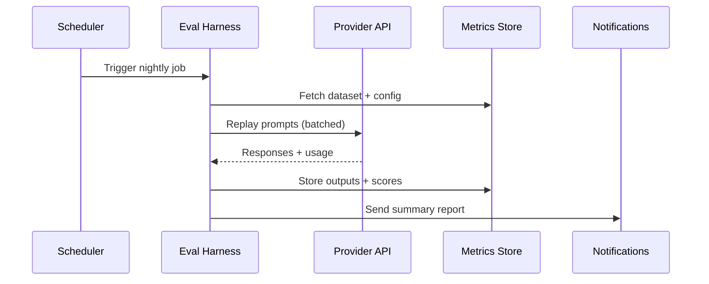

## Turn evaluations into an automated habit

Offline batch evaluations replay curated datasets on a schedule, produce diff reports, and notify owners before regressions reach production. This guide outlines the architecture, tooling, and operational patterns needed to keep model and prompt changes honest.

### You’ll learn
- How to structure datasets, configs, and logs for reproducible evaluation runs
- How to orchestrate jobs with CI, schedulers, or workflow engines
- How to store and visualize scores, tokens, and latency metrics over time
- How to integrate human review when automated checks flag issues
- References to platforms and best practices for running continuous evals

## Design the directory structure

Keep evaluation assets versioned in your repo or evaluation platform.

```
/evals
  /datasets
    faq.jsonl
    jailbreaks.jsonl
  /prompts
    rubric-faithfulness.md
    rubric-tone.md
  /configs
    nightly.yaml
  /runs
    2025-03-15T0200Z.json
  report.md
```

- **Datasets:** JSONL with `{id, input, reference, tags}`.
- **Prompts:** Rubric prompt definitions shared across jobs.
- **Configs:** Model name, temperature, max tokens, evaluator settings, thresholds.
- **Runs:** Raw outputs plus metadata for each execution.

## Orchestrate the batch

Use your preferred scheduler (GitHub Actions, Airflow, Dagster, Jenkins). A typical workflow:



For large runs, use provider batch endpoints or asynchronous job APIs to stay within rate limits.

## Implement the harness

A minimal Python harness might:

1. Load dataset and config (model, temperature, thresholds).
2. Call the model with retries and exponential backoff.
3. Apply deterministic checks and rubric prompts.
4. Write per-example results and aggregate metrics to storage.
5. Generate a Markdown or HTML report for humans.

Store metadata such as commit SHA, model version, and retrieval index hash for reproducibility.

## Report diff-friendly outputs

Create summary tables with previous vs. current scores.

| Metric | Prev | Current | Delta |
| --- | --- | --- | --- |
| Correctness avg | 4.3 | 4.0 | -0.3 |
| Faithfulness avg | 4.6 | 4.5 | -0.1 |
| Safety violations | 0 | 2 | +2 |
| P95 latency (s) | 2.5 | 2.9 | +0.4 |

Highlight failing thresholds in red and link to raw outputs for quick triage. Attach the report to chat notifications or PR comments.

## Integrate humans in the loop

- Auto-create review tasks for examples with severe regressions or conflicting evaluator scores.
- Provide reviewers with prompt, response, reference, and evaluator rationale. Capture their decisions to improve datasets and rubrics.
- Feed human annotations back into `/docs/evaluations/rubric-prompts.md` for calibration updates.

## Operational tips

- **Warm caches:** Preload embeddings or retrieval indexes before nightly runs to reduce noise.
- **Cost controls:** Track total tokens per run; stop the job if spend exceeds a configured budget.
- **Retention:** Keep detailed run logs for 30–90 days, then aggregate metrics for long-term trends.
- **Incident response:** Document playbooks for when evaluations fail (provider outage, schema change) so the on-call rotation reacts quickly.

## References

- OpenAI. “Automate quality checks with evals.” 2024. <https://platform.openai.com/docs/guides/evals>
- LangSmith. “Schedule automated evaluations.” 2024. <https://docs.smith.langchain.com/docs/evaluation/automation>
- Microsoft Learn. “Add regression testing to generative AI workflows.” 2024. <https://learn.microsoft.com/azure/ai-services/openai/how-to/evaluations>
