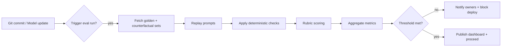

## Build an evaluation practice that scales

High-quality GenAI systems rely on deliberate evaluation loops, not intuition. An evaluation practice defines what “good” looks like, curates representative datasets, automates scoring, and routes insights back to product teams. This overview maps the lifecycle so you can stand up trustworthy guardrails for any model stack.

### You’ll learn
- How to align evaluation goals with business outcomes and risk appetite
- Ways to curate golden datasets that capture real-world diversity
- Techniques for combining rubric prompts, automatic checks, and human review
- How to operationalize evaluations through CI, dashboards, and incident response
- Reference tooling you can adopt or adapt for your stack

## Frame the objective and success metrics

Start each initiative with a one-page brief that documents why the evaluation exists and what you expect to learn.

| Question | Considerations | Example outputs |
| --- | --- | --- |
| What decision will the evaluation inform? | Release gating, provider migration, prompt update, tool rollout | “Block launch unless correctness ≥ 4.2/5 on onboarding FAQ set.” |
| Who owns accuracy and safety? | Product, applied science, policy | Named DRI, reviewer rotation, escalation chat |
| Which metrics matter? | Correctness, helpfulness, groundedness, tone, cost, latency | Weighted composite score, percentile latency, rate of policy violations |

Document risk appetite early. A customer-facing assistant should set a higher bar (e.g., minimum correctness, zero critical safety violations) than an internal brainstorming helper. Tie these standards to `/docs/safety/overview.md` so policy owners understand the downstream implications.

## Assemble the right test assets

Curate datasets that reflect your user journeys and failure modes.

1. **Golden sets** — 20–200 prompts with expected answers or scoring rubrics. Sample from production logs (with consent), user research transcripts, and policy stress cases. Tag each example with scenario, user persona, and risk level for filtering.
2. **Counterfactuals** — Adversarial or edge prompts that mimic jailbreak attempts, ambiguous requests, or out-of-domain inputs. Use prompts from `/docs/safety/prompt-safety.md` and red-team playbooks.
3. **Telemetry hooks** — Capture metadata (prompt ID, feature flag, provider, model version) during evaluation runs to support trend analysis.

Version datasets in Git or an evaluation platform. Store them as JSONL with schema `{id, input, reference, tags}` so they integrate cleanly with toolchains like OpenAI Evals, Anthropic’s Model Context Protocol (MCP) evaluators, or custom harnesses.【F:docs/evaluations/offline-batch-evals.md†L79-L112】

## Choose scoring strategies

Blend deterministic checks, rubric prompts, and human review to balance coverage and confidence.

### Deterministic and programmatic checks

Use regular expressions, schema validators, or domain-specific rules when tasks have clear pass/fail criteria. Examples include JSON schema validation, SQL parsers, or unit conversions. Programmatic checks act as fast filters before involving models or humans.

### Rubric prompts and model-graded scores

When tasks require nuanced judgment (tone, helpfulness), design rubric prompts that instruct an evaluator model to grade the response on calibrated scales. Include score definitions, refusal handling, and expected output JSON as shown in `/docs/evaluations/rubric-prompts.md`. Run multiple evaluator models or majority voting to reduce variance.【F:docs/evaluations/rubric-prompts.md†L76-L143】

### Human review

Reserve human evaluation for high-risk scenarios (policy compliance, financial or legal outputs), calibration of rubric wording, and sampling drift. Track inter-rater agreement and adjust rubrics when reviewers disagree frequently.

## Operationalize evaluation runs

Build automation so evaluations run consistently.

- **Pre-merge checks:** Run slim suites (5–20 prompts) on every PR to catch obvious regressions quickly.
- **Nightly or weekly batches:** Execute the full suite, log metrics to a warehouse (BigQuery, Snowflake), and publish diff reports to dashboards or chat channels.【F:docs/evaluations/offline-batch-evals.md†L44-L76】
- **Release gating:** Treat failing thresholds as deployment blockers. Integrate with CI/CD so model or prompt changes cannot ship until scores recover.

## Analyze and act on results

Use structured reports to turn evaluation signals into action.

- Highlight top regressions with prompt IDs, predicted vs. expected output, and failing criteria.
- Compare metrics across models, prompt versions, and time periods. Visualize cost and latency alongside quality (e.g., scatter plots of correctness vs. latency) to balance tradeoffs.【F:docs/evaluations/latency-cost-tradeoffs.md†L64-L111】
- Feed insights into backlog grooming: prioritize prompt rewrites, retrieval tuning, or tool hardening based on failure clusters.
- Close the loop with human reviewers. If manual audits find issues not caught automatically, expand golden sets or add new deterministic checks.

## Tooling landscape

| Tooling | Strengths | Considerations |
| --- | --- | --- |
| OpenAI Evals | Hosted datasets, rubric prompts, batch jobs | Requires OpenAI account; plan for evaluator bias adjustments | 
| Anthropic eval templates | Built for Claude with MCP integration | Early-stage APIs; supplement with custom logging | 
| LangSmith / LangFuse | Trace capture, eval storage, visual diffing | Vendor lock-in; ensure data residency compliance | 
| Custom harness (Python/Node) | Full control, integrates with existing CI | Requires ongoing maintenance and scaling |

Adopt whichever aligns with your data residency and privacy needs. Always keep raw metrics in your own storage for auditing.

## Keep the practice evolving

Evaluations are living systems. Revisit scopes quarterly, rotate reviewers, and retire stale prompts. Monitor production telemetry for drift indicators (e.g., rising refusal rates, token spikes) and feed them back into new test cases.

## References

- OpenAI. “Evaluate models with the Evals library.” 2024. <https://platform.openai.com/docs/guides/evals>
- Anthropic. “Evaluation and monitoring best practices.” 2024. <https://docs.anthropic.com/en/docs/build-with-claude/evaluation-and-monitoring>
- Microsoft Learn. “Evaluate generative AI applications.” 2024. <https://learn.microsoft.com/azure/ai-services/openai/how-to/evaluations>
- LangChain. “Evaluating LLM applications.” 2024. <https://python.langchain.com/docs/guides/evaluation>
