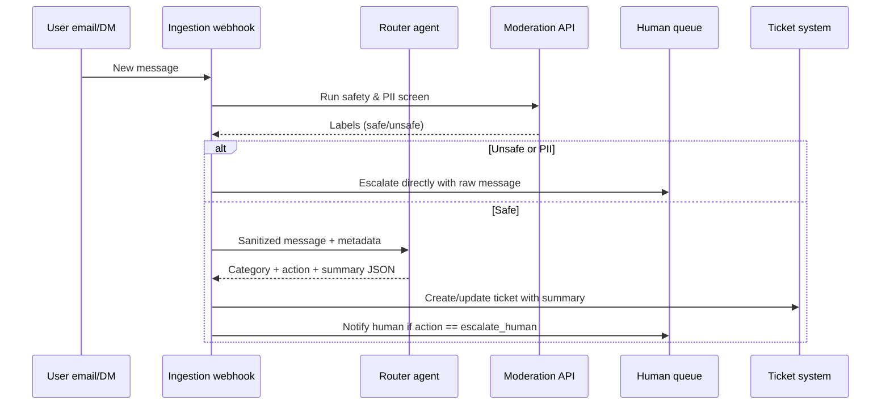

## Summary
Route incoming customer messages with a lightweight agent that classifies intent, drafts an internal handoff note, and enforces escalation rules. The design keeps provider keys server-side, validates structured outputs, and logs every decision for audit.

### You’ll learn
- How to model a triage workflow with routing, summarization, and human escalation checkpoints
- How to define prompt, tool, and eval specs for a router agent
- How to implement the workflow in Node.js and Python using streaming-friendly APIs
- How to enforce safety guardrails such as PII redaction and abuse filtering
- How to measure accuracy and operational metrics before scaling

## Use case
Support teams receive mixed messages: bugs, billing issues, feature requests, and abuse reports. Manual triage slows response times. We build an agentic service that:

1. Classifies each message into four categories (`bug`, `billing`, `feature`, `abuse`).
2. Suggests a next action (`reply`, `create_ticket`, `escalate_human`).
3. Drafts an internal summary with sentiment and customer priority.
4. Redacts obvious PII before writing to the CRM.

## Workflow overview



## Prompt and tool spec

| Component | Details |
| --- | --- |
| **Prompt intent** | “Classify and summarize a customer support message. Return structured JSON with category, action, redacted summary, sentiment, and confidence.” |
| **Inputs** | Sanitized message body, channel, prior ticket ID, customer tier, recent product incidents. |
| **Outputs** | JSON schema (below) with reasoning trace optionally stored in logs. |
| **Tools** | Moderation API (pre-step), CRM REST API for ticket creation, notification webhook. |
| **Risks** | PII leakage, incorrect escalations, toxic content in summary, hallucinated refunds. |
| **Mitigations** | Regex-based redaction, `confidence` threshold for auto actions, human review queue, `/docs/concepts/caching-and-retries.md` backed retries. |

### JSON schema

```json
{
  "$schema": "http://json-schema.org/draft-07/schema#",
  "title": "support_triage",
  "type": "object",
  "required": ["category", "action", "summary", "sentiment", "confidence"],
  "properties": {
    "category": {"type": "string", "enum": ["bug", "billing", "feature", "abuse"]},
    "action": {"type": "string", "enum": ["reply", "create_ticket", "escalate_human"]},
    "summary": {"type": "string", "maxLength": 600},
    "sentiment": {"type": "string", "enum": ["negative", "neutral", "positive"]},
    "confidence": {"type": "number", "minimum": 0, "maximum": 1},
    "redacted_fields": {"type": "array", "items": {"type": "string"}}
  }
}
```

## Implementation

### Node.js (TypeScript)
```ts
import OpenAI from "openai";
import { z } from "zod";

const client = new OpenAI({ apiKey: process.env.OPENAI_API_KEY });

const schema = {
  name: "support_triage",
  schema: {
    type: "object",
    properties: {
      category: { type: "string", enum: ["bug", "billing", "feature", "abuse"] },
      action: { type: "string", enum: ["reply", "create_ticket", "escalate_human"] },
      summary: { type: "string" },
      sentiment: { type: "string", enum: ["negative", "neutral", "positive"] },
      confidence: { type: "number", minimum: 0, maximum: 1 },
      redacted_fields: { type: "array", items: { type: "string" } }
    },
    required: ["category", "action", "summary", "sentiment", "confidence"]
  }
};

const ResponseValidator = z.object({
  category: z.enum(["bug", "billing", "feature", "abuse"]),
  action: z.enum(["reply", "create_ticket", "escalate_human"]),
  summary: z.string().max(600),
  sentiment: z.enum(["negative", "neutral", "positive"]),
  confidence: z.number().min(0).max(1),
  redacted_fields: z.array(z.string()).default([])
});

export async function triageTicket(input: {
  message: string;
  channel: string;
  customerTier: string;
  previousTicketId?: string;
  incidents?: string[];
}) {
  const { message, channel, customerTier, previousTicketId, incidents = [] } = input;

  const response = await client.chat.completions.create({
    model: "gpt-4o-mini",
    temperature: 0.2,
    messages: [
      {
        role: "system",
        content: "You triage customer support messages. Output JSON and never fabricate refunds or discounts."
      },
      {
        role: "user",
        content: `Message: ${message}\nChannel: ${channel}\nCustomer tier: ${customerTier}\nPrevious ticket: ${previousTicketId ?? "none"}\nIncidents: ${incidents.join(", ") || "none"}`
      }
    ],
    response_format: { type: "json_schema", json_schema: schema }
  });

  const content = response.choices[0].message.content;
  if (!content) throw new Error("Model returned empty content");
  const parsed = ResponseValidator.parse(JSON.parse(content));

  return {
    ...parsed,
    provider: "openai",
    token_usage: response.usage,
    latency_ms: response.created ? Date.now() - response.created * 1000 : undefined
  };
}
```

### Python
```python
from typing import Any, Dict, List, Optional

from openai import OpenAI
from pydantic import BaseModel, Field

client = OpenAI()

class TriageResult(BaseModel):
    category: str
    action: str
    summary: str = Field(max_length=600)
    sentiment: str
    confidence: float
    redacted_fields: List[str] = []


def triage_ticket(
    message: str,
    channel: str,
    customer_tier: str,
    previous_ticket_id: Optional[str] = None,
    incidents: Optional[List[str]] = None,
) -> Dict[str, Any]:
    incidents = incidents or []

    response = client.chat.completions.create(
        model="gpt-4o-mini",
        temperature=0.2,
        messages=[
            {
                "role": "system",
                "content": "You triage customer support messages. Output JSON and never fabricate refunds or discounts.",
            },
            {
                "role": "user",
                "content": (
                    f"Message: {message}\nChannel: {channel}\nCustomer tier: {customer_tier}\n"
                    f"Previous ticket: {previous_ticket_id or 'none'}\nIncidents: {', '.join(incidents) or 'none'}"
                ),
            },
        ],
        response_format={"type": "json_schema", "json_schema": {
            "name": "support_triage",
            "schema": {
                "type": "object",
                "required": ["category", "action", "summary", "sentiment", "confidence"],
                "properties": {
                    "category": {"type": "string"},
                    "action": {"type": "string"},
                    "summary": {"type": "string"},
                    "sentiment": {"type": "string"},
                    "confidence": {"type": "number"},
                    "redacted_fields": {"type": "array", "items": {"type": "string"}},
                },
            },
        }},
    )

    content = response.choices[0].message.content
    if not content:
        raise RuntimeError("Model returned empty content")

    parsed = TriageResult.model_validate_json(content)
    return {
        **parsed.model_dump(),
        "provider": "openai",
        "token_usage": response.usage,
    }
```

## Safety and operations checklist

- **Moderation first.** Run provider moderation APIs or your own classifier before calling the router. Block or quarantine abusive content and log details for trust & safety review.
- **Redaction rules.** Apply regex or deterministic detectors for emails, phone numbers, card hints, and addresses. Store redacted originals separately with access control.
- **Escalation thresholds.** Send any `abuse` or low-confidence (<0.6) tickets straight to humans. Track override stats to recalibrate prompts.
- **Audit trail.** Log request IDs, model version, confidence, and final action. Store the model output separately from raw user text to respect privacy.
- **Human in the loop.** Let agents mark wrong categories; feed corrections back into eval sets.

## Evaluation plan

1. **Golden dataset.** Sample 200 historical tickets with human-labeled category and action. Store in `/docs/patterns/observability-context.md` metrics job.
2. **Offline scoring.** Compute accuracy, precision/recall per class, and false escalation rate. Target ≥90% accuracy on `bug`/`billing` and <5% false escalations.
3. **Shadow rollout.** Run in parallel with existing workflow for one week. Compare SLAs (first response time, backlog) and user sentiment.
4. **Continuous evals.** Use `/docs/evaluations/rubric-prompts.md` style rubrics for summary quality. Add weekly regression tests.

## References

- OpenAI. “Function calling and tool use.” (2024). <https://platform.openai.com/docs/guides/function-calling>
- Zendesk. “Understanding ticket routing and assignment.” (2023). <https://support.zendesk.com/hc/en-us/articles/4408844554394-Understanding-ticket-routing-and-assignment>
- Intercom. “How to handle abusive messages.” (2024). <https://www.intercom.com/help/en/articles/6308440-how-to-handle-abusive-conversations>
