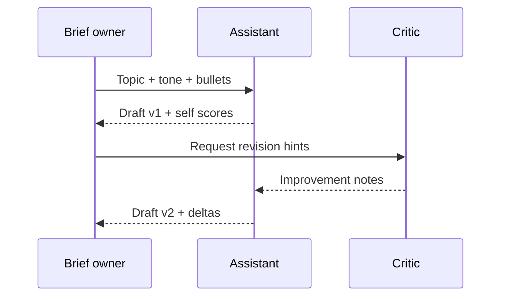

## Why this assistant
A content drafter is a reliable starter for marketing, release notes, or knowledge-base snippets. Instead of ad-hoc copy, teams get on-tone drafts with transparent review criteria. You can plug the workflow into CMS or issue trackers while keeping a human editor in the loop.

### You’ll learn
- How to describe tone and structure without over-constraining creativity.
- How to capture reviewer expectations in a rubric that drives revisions.
- How to orchestrate iterative draft→critique loops with Node.js and Python.
- How to score outputs and log feedback for continuous improvement.

## Prompt spec
- **Intent**: Produce a 150–250 word draft on a given topic, with explicit tone and audience guidance.
- **Inputs**: Topic, target audience, tone adjectives, must-include bullet points, banned phrases.
- **Outputs**: JSON payload with draft text, key messages covered, and rubric scores (correctness, clarity, tone fit, call-to-action strength).
- **Constraints**: Avoid banned phrases; flag missing inputs in an `issues` array; limit each section to ≤ 3 sentences.
- **Risks**: Hallucinated data, tone drift, repeated sentences. Mitigate by providing grounding bullets and running rubric-based critique loops.
- **Eval hooks**: Compare rubric self-scores with human ratings; track banned-phrase violations per 100 drafts.

## Workflow diagram



## Prompt template

```text
You are a concise technical marketing writer.
Audience: {{audience}}
Tone: {{tone}}
Required talking points:
{{#each bullets}}
- {{this}}
{{/each}}
Banned phrases: {{banned}}
Write 150-250 words with three paragraphs. End with a single-sentence call to action.
Return JSON with fields draft, key_messages (array of bullet strings), rubric (correctness, clarity, tone_fit, cta_strength scored 1-5), and issues (array of strings when you are uncertain).
```

### Critique prompt (optional)

```text
You review marketing drafts. Compare the draft to the brief. Respond with JSON: {"revision_notes": ["..."], "score_delta": {"correctness": -1, "clarity": 0, "tone_fit": -1, "cta_strength": +1}}. Each note references a sentence number.
```

## Node.js orchestration

```ts
import OpenAI from "openai";
import { z } from "zod";

const client = new OpenAI({ apiKey: process.env.OPENAI_API_KEY! });

const DraftSchema = z.object({
  draft: z.string().min(120).max(600),
  key_messages: z.array(z.string().min(4)).min(3).max(6),
  rubric: z.object({
    correctness: z.number().int().min(1).max(5),
    clarity: z.number().int().min(1).max(5),
    tone_fit: z.number().int().min(1).max(5),
    cta_strength: z.number().int().min(1).max(5)
  }),
  issues: z.array(z.string()).max(5)
});

const CritiqueSchema = z.object({
  revision_notes: z.array(z.string().min(10)).max(5),
  score_delta: z.object({
    correctness: z.number().int().min(-2).max(2),
    clarity: z.number().int().min(-2).max(2),
    tone_fit: z.number().int().min(-2).max(2),
    cta_strength: z.number().int().min(-2).max(2)
  })
});

async function callModel(prompt: string, schema: any) {
  const response = await client.responses.create({
    model: "gpt-4.1-mini",
    input: prompt,
    temperature: 0.4,
    response_format: { type: "json_schema", json_schema: { name: "content", schema } },
    max_output_tokens: 700
  });
  const output = response.output_text;
  const parsed = schema.safeParse(JSON.parse(output));
  if (!parsed.success) {
    throw new Error(parsed.error.message);
  }
  return parsed.data;
}

function buildDraftPrompt(brief: {
  topic: string;
  audience: string;
  tone: string;
  bullets: string[];
  banned: string[];
}) {
  return `You are a concise technical marketing writer.\nAudience: ${brief.audience}\nTone: ${brief.tone}\nRequired talking points:\n${brief.bullets.map((b) => `- ${b}`).join("\n")}\nBanned phrases: ${brief.banned.join(", ") || "none"}\nTopic: ${brief.topic}`;
}

function buildCritiquePrompt(draft: string, brief: {
  topic: string;
  audience: string;
  tone: string;
}) {
  return `You review marketing drafts for ${brief.audience}. Compare the draft to the topic "${brief.topic}" and tone "${brief.tone}". Draft:\n${draft}`;
}

function chooseAction(draft: z.infer<typeof DraftSchema>, critique: z.infer<typeof CritiqueSchema>) {
  const lowScores = Object.entries(draft.rubric).filter(([, score]) => score < 3);
  if (lowScores.length) {
    return "needs_editor";
  }
  const largePenalty = Object.values(critique.score_delta).some((delta) => delta < 0);
  return largePenalty ? "revise" : "ship";
}

export async function draftContent(brief: {
  topic: string;
  audience: string;
  tone: string;
  bullets: string[];
  banned: string[];
}) {
  const draftPrompt = buildDraftPrompt(brief);
  const draft = await callModel(draftPrompt, DraftSchema);

  const critiquePrompt = buildCritiquePrompt(draft.draft, brief);
  const critique = await callModel(critiquePrompt, CritiqueSchema);

  return {
    ...draft,
    critique,
    final_recommendation: chooseAction(draft, critique)
  };
}
```

## Python orchestration

```python
from typing import List, Dict
from openai import OpenAI
from pydantic import BaseModel, Field

client = OpenAI()

class Rubric(BaseModel):
    correctness: int = Field(ge=1, le=5)
    clarity: int = Field(ge=1, le=5)
    tone_fit: int = Field(ge=1, le=5)
    cta_strength: int = Field(ge=1, le=5)

class Draft(BaseModel):
    draft: str = Field(min_length=120, max_length=600)
    key_messages: List[str] = Field(min_items=3, max_items=6)
    rubric: Rubric
    issues: List[str] = Field(default_factory=list, max_items=5)

class Critique(BaseModel):
    revision_notes: List[str] = Field(min_items=1, max_items=5)
    score_delta: Dict[str, int]


def build_draft_prompt(brief: Dict[str, str]) -> str:
    bullets = "\n".join(f"- {point}" for point in brief.get("bullets", []))
    banned = ", ".join(brief.get("banned", [])) or "none"
    return (
        "You are a concise technical marketing writer.\n"
        f"Audience: {brief['audience']}\n"
        f"Tone: {brief['tone']}\n"
        "Required talking points:\n"
        f"{bullets}\n"
        f"Banned phrases: {banned}\n"
        f"Topic: {brief['topic']}"
    )


def build_critique_prompt(draft: str, brief: Dict[str, str]) -> str:
    return (
        f"You review marketing drafts for {brief['audience']}.\n"
        f"Evaluate tone {brief['tone']} for topic {brief['topic']}.\n"
        "Draft:\n"
        f"{draft}"
    )


def create_response(prompt: str, schema: BaseModel) -> BaseModel:
    response = client.responses.create(
        model="gpt-4.1-mini",
        input=prompt,
        temperature=0.4,
        response_format={
            "type": "json_schema",
            "json_schema": {
                "name": schema.model_config.get("title", "content"),
                "schema": schema.model_json_schema(),
            },
        },
        max_output_tokens=700,
    )
    return schema.model_validate_json(response.output[0].content[0].text)


def run_workflow(brief: Dict[str, str]) -> Dict[str, BaseModel]:
    draft_prompt = build_draft_prompt(brief)
    draft = create_response(draft_prompt, Draft)

    if draft.issues:
        return {"status": "needs_input", "draft": draft}

    critique_prompt = build_critique_prompt(draft.draft, brief)
    critique = create_response(critique_prompt, Critique)
    return {"status": "ready_for_review", "draft": draft, "critique": critique}
```

## Human-in-the-loop review
- Route drafts with rubric scores ≤ 3 to editors automatically.
- Capture editor edits and feed them back as fine-tuning or RAG exemplars.
- Track time-to-approve per topic to spot friction or unclear prompts.

## Evaluation checklist
1. Build a dataset of 30 briefs with approved human drafts.
2. Score model drafts on correctness and banned-phrase compliance; compute precision/recall for required bullet coverage.
3. A/B test tones (`friendly`, `executive`, `technical`) with stakeholders for clarity ratings.
4. Log mismatch between model self-scores and human rubric to calibrate adjustments.

## References
- [OpenAI: Prompt engineering for writers](https://platform.openai.com/docs/guides/prompt-engineering) — guidance on tone and constraints.【F:docs/examples/content-drafter.md†L196-L197】
- [Mailchimp content style guide](https://mailchimp.com/resources/content-style-guide/) — example of tone and voice guidelines to ground prompts.【F:docs/examples/content-drafter.md†L197-L198】
- [Google developer documentation style guide](https://developers.google.com/style) — clarity and terminology patterns for technical content.【F:docs/examples/content-drafter.md†L198-L199】

## Cross-links
- Prompt fundamentals: [/docs/concepts/prompting-styles.md](/docs/concepts/prompting-styles.md)
- Structured summaries: [/docs/examples/meeting-summarizer.md](/docs/examples/meeting-summarizer.md)
- Evaluation rubrics: [/docs/evaluations/rubric-prompts.md](/docs/evaluations/rubric-prompts.md)
- Safety guidance: [/docs/concepts/safety-basics.md](/docs/concepts/safety-basics.md)
