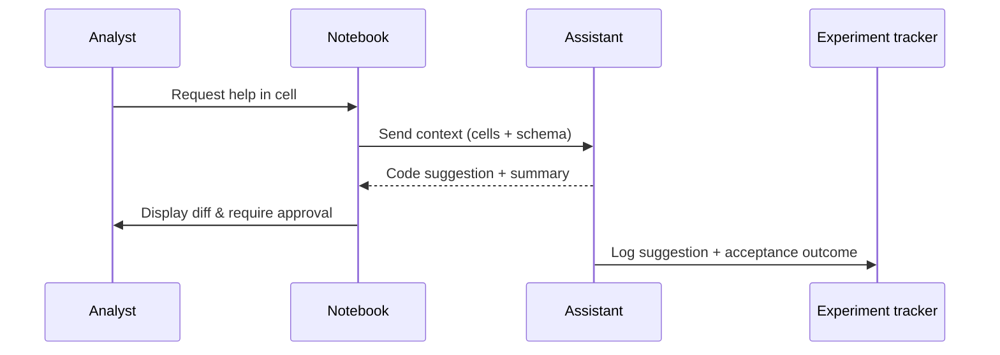

## Why this assistant
Data scientists iterate quickly in notebooks, juggling exploratory code, visualizations, and documentation. An AI helper embedded in Jupyter or Colab can propose code snippets, validate assumptions, run data quality checks, and summarize findings for stakeholders. This accelerates insights while encouraging reproducibility.

### You’ll learn
- How to prompt for context-aware notebook assistance with guardrails.
- How to integrate dataset schemas, profiling results, and experiment metadata into prompts.
- How to stream Node.js and Python completions back into notebooks with validation.
- How to track model suggestions, user acceptance, and evaluation metrics.
- How to mitigate data leakage and maintain reproducibility logs.

## Prompt spec
- **Intent**: Given notebook context, recommend next code cell, highlight data quality issues, and summarize results in structured form.
- **Inputs**: Recent notebook cells (code + markdown), dataset schema, profiling stats, experiment config, user request, compliance policies.
- **Outputs**: JSON with `next_code_cell`, `explanation`, `data_checks`, `result_summary`, `experiment_log`, `warnings`.
- **Constraints**: Provide runnable code; include references to column names; log any assumptions; avoid executing destructive operations (e.g., DROP table).
- **Risks**: Executing unsafe code, leaking sensitive data, encouraging overfitting. Mitigate with sandboxing, approval prompts, and logging.
- **Eval hooks**: Track accuracy of suggested code vs. ground truth, measure adoption rate, monitor flagged warnings resolved by users.

## Workflow diagram



## Prompt template

```text
You are a data science assistant embedded in a notebook. Provide safe, reproducible guidance.

Notebook context:
{{recent_cells}}

Dataset schema:
{{dataset_schema}}

Profiling summary:
{{profiling_stats}}

Experiment config: {{experiment_config}}
User request: {{user_request}}
Policies: {{policy_notes}}

Return JSON:
{
  "next_code_cell": "code fenced Python snippet",
  "explanation": "<=120 words on what the code does",
  "data_checks": [{"check": "", "status": "pass|warn|fail", "details": ""}],
  "result_summary": [{"metric": "", "value": "", "context": ""}],
  "experiment_log": {
    "dataset_version": "",
    "parameters": ["param=value"],
    "artifacts": ["path"],
    "review_needed": true|false
  },
  "warnings": ["caution message"],
  "issues": ["missing context"]
}
If an operation might mutate data, include a warning and set review_needed to true.
```

## Node.js orchestration

```ts
import OpenAI from "openai";
import { z } from "zod";

const client = new OpenAI({ apiKey: process.env.OPENAI_API_KEY! });

const NotebookSchema = z.object({
  next_code_cell: z.string(),
  explanation: z.string().max(600),
  data_checks: z.array(z.object({
    check: z.string(),
    status: z.enum(["pass", "warn", "fail"]),
    details: z.string()
  })),
  result_summary: z.array(z.object({ metric: z.string(), value: z.string(), context: z.string() })),
  experiment_log: z.object({
    dataset_version: z.string(),
    parameters: z.array(z.string()),
    artifacts: z.array(z.string()),
    review_needed: z.boolean()
  }),
  warnings: z.array(z.string()),
  issues: z.array(z.string())
});

export async function suggestNotebookUpdate(payload: {
  recent_cells: string;
  dataset_schema: string;
  profiling_stats: string;
  experiment_config: string;
  user_request: string;
  policy_notes: string;
}) {
  const response = await client.responses.create({
    model: "gpt-4.1-mini",
    input: buildPrompt(payload),
    temperature: 0.3,
    max_output_tokens: 800,
    response_format: {
      type: "json_schema",
      json_schema: { name: "notebook_helper", schema: NotebookSchema }
    },
    metadata: { feature: "notebook_helper" }
  });

  const parsed = NotebookSchema.safeParse(JSON.parse(response.output_text));
  if (!parsed.success) {
    throw new Error(parsed.error.message);
  }

  return parsed.data;
}

function buildPrompt(payload: any) {
  return `You are a data science assistant embedded in a notebook. Provide safe, reproducible guidance.\n\nNotebook context:\n${payload.recent_cells}\n\nDataset schema:\n${payload.dataset_schema}\n\nProfiling summary:\n${payload.profiling_stats}\n\nExperiment config: ${payload.experiment_config}\nUser request: ${payload.user_request}\nPolicies: ${payload.policy_notes}\n\nReturn JSON as specified.`;
}
```

## Python orchestration

```python
import os
from openai import OpenAI
from pydantic import BaseModel, Field
from typing import List

client = OpenAI(api_key=os.environ["OPENAI_API_KEY"])

class DataCheck(BaseModel):
    check: str
    status: str
    details: str

class ResultSummary(BaseModel):
    metric: str
    value: str
    context: str

class ExperimentLog(BaseModel):
    dataset_version: str
    parameters: List[str]
    artifacts: List[str]
    review_needed: bool

class NotebookSuggestion(BaseModel):
    next_code_cell: str
    explanation: str = Field(max_length=600)
    data_checks: List[DataCheck]
    result_summary: List[ResultSummary]
    experiment_log: ExperimentLog
    warnings: List[str]
    issues: List[str]


def build_prompt(payload: dict) -> str:
    return (
        "You are a data science assistant embedded in a notebook. Provide safe, reproducible guidance.\n\n"
        f"Notebook context:\n{payload['recent_cells']}\n\n"
        f"Dataset schema:\n{payload['dataset_schema']}\n\n"
        f"Profiling summary:\n{payload['profiling_stats']}\n\n"
        f"Experiment config: {payload['experiment_config']}\n"
        f"User request: {payload['user_request']}\n"
        f"Policies: {payload['policy_notes']}\n\n"
        "Return JSON as specified."
    )


def suggest_notebook_update(payload: dict) -> NotebookSuggestion:
    response = client.responses.create(
        model="gpt-4.1-mini",
        input=build_prompt(payload),
        temperature=0.3,
        max_output_tokens=800,
        response_format={
            "type": "json_schema",
            "json_schema": {
                "name": "notebook_helper",
                "schema": NotebookSuggestion.model_json_schema(),
            },
        },
        metadata={"feature": "notebook_helper"},
    )
    return NotebookSuggestion.model_validate_json(response.output_text)
```

## Evaluation hooks
- Maintain a benchmark notebook set with known solutions; evaluate suggestion accuracy and runtime.
- Track adoption metrics (accepted vs. rejected code) and correlate with user satisfaction surveys.
- Monitor warnings about data leakage or reproducibility and ensure follow-up actions are logged.

## Guardrails and operations
- Run generated code in a sandbox or dry-run mode before execution.
- Restrict access to sensitive datasets; redact PII from prompts or require differential privacy.
- Log all suggestions, user actions, and dataset versions for reproducibility audits.
- Provide an “explain” button to show reasoning and encourage critical review.

## Deployment checklist
- ✅ Integrate with JupyterLab or VS Code extensions to capture notebook context.
- ✅ Connect to experiment tracking tools (MLflow, Weights & Biases) for logging.
- ✅ Implement retry logic and caching for large prompts.
- ✅ Provide offline fallback templates for low-connectivity environments.

## References
- Project Jupyter. "JupyterLab documentation." 2024. https://jupyterlab.readthedocs.io
- Google. "Colab notebooks best practices." 2024. https://research.google/guides/google-colaboratory/
- OpenAI. "Best practices for using AI with code." 2024. https://platform.openai.com/docs/guides/code

## Related reading
- [/docs/examples/data-quality-qa.md](/docs/examples/data-quality-qa.md)
- [/docs/patterns/tool-use.md](/docs/patterns/tool-use.md)
- [/docs/evaluations/notebook-benchmarks.md](/docs/evaluations/notebook-benchmarks.md)
