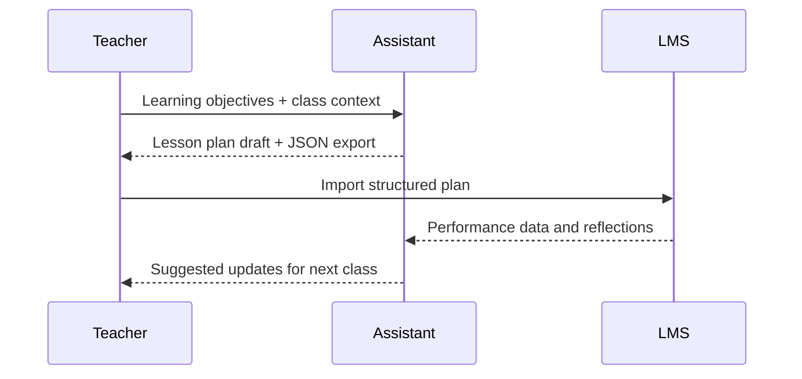

## Why this assistant
Teachers spend hours building lesson plans that align standards, student needs, and assessment strategies. An AI lesson planner can gather curriculum objectives, prior knowledge, and classroom constraints to propose differentiated activities with scaffolding suggestions. Human educators stay in control, editing and customizing as needed.

### You’ll learn
- How to capture learning objectives, standards, and student profiles in a prompt.
- How to generate differentiated activities and formative assessments.
- How to produce both narrative lesson flow and structured JSON for LMS integration.
- How to address privacy concerns when handling student data.
- How to evaluate lesson plans with instructional rubrics.

## Prompt spec
- **Intent**: Generate a lesson plan aligned to standards, including objectives, agenda, materials, differentiation strategies, and assessment checkpoints.
- **Inputs**: Subject, grade level, standards, learning objectives, class duration, student personas (e.g., advanced, emerging), available materials, tech constraints.
- **Outputs**: JSON with `overview`, `objectives`, `standards`, `agenda`, `differentiation`, `assessments`, `materials`, `homework`, `extensions`, `safety_notes`.
- **Constraints**: Agenda must fit within class duration; include at least two differentiation strategies; align assessments to objectives.
- **Risks**: Overgeneralized strategies, ignoring accessibility needs, storing student data insecurely. Mitigate with templates and privacy guidelines.
- **Eval hooks**: Rubric scoring for alignment, engagement, and accessibility; collect teacher feedback on usability.

## Workflow diagram



## Prompt template

```text
You are an instructional designer. Create a standards-aligned lesson plan.

Subject: {{subject}}
Grade level: {{grade_level}}
Standards:
{{#each standards}}- {{this}}
{{/each}}
Learning objectives:
{{#each objectives}}- {{this}}
{{/each}}
Class duration: {{duration_minutes}} minutes
Student profiles:
{{#each student_profiles}}- {{this}}
{{/each}}
Materials available:
{{#each materials}}- {{this}}
{{/each}}
Technology constraints: {{tech_constraints}}
Safety or accessibility notes: {{safety_notes}}

Return JSON:
{
  "overview": "<=120 word summary",
  "objectives": ["objective"],
  "standards": ["standard"],
  "agenda": [{"time": "HH:MM", "activity": "", "grouping": "whole|small|individual", "purpose": ""}],
  "differentiation": [{"need": "", "strategy": "", "materials": ""}],
  "assessments": [{"type": "formative|summative", "description": "", "evidence": ""}],
  "materials": ["item"],
  "homework": "", 
  "extensions": ["idea"],
  "safety_notes": ["note"],
  "issues": ["missing info"]
}
Ensure agenda total time does not exceed duration_minutes. Align each assessment to at least one objective.
```

## Node.js orchestration

```ts
import OpenAI from "openai";
import { z } from "zod";

const client = new OpenAI({ apiKey: process.env.OPENAI_API_KEY! });

const LessonSchema = z.object({
  overview: z.string().max(600),
  objectives: z.array(z.string()),
  standards: z.array(z.string()),
  agenda: z.array(z.object({
    time: z.string(),
    activity: z.string(),
    grouping: z.enum(["whole", "small", "individual"]),
    purpose: z.string()
  })),
  differentiation: z.array(z.object({ need: z.string(), strategy: z.string(), materials: z.string() })).min(2),
  assessments: z.array(z.object({ type: z.enum(["formative", "summative"]), description: z.string(), evidence: z.string() })),
  materials: z.array(z.string()),
  homework: z.string().max(400),
  extensions: z.array(z.string()),
  safety_notes: z.array(z.string()),
  issues: z.array(z.string())
});

export async function generateLessonPlan(payload: any) {
  const response = await client.responses.create({
    model: "gpt-4.1-mini",
    input: buildPrompt(payload),
    temperature: 0.3,
    max_output_tokens: 900,
    response_format: {
      type: "json_schema",
      json_schema: { name: "lesson_plan", schema: LessonSchema }
    },
    metadata: { feature: "lesson_planner" }
  });

  const parsed = LessonSchema.safeParse(JSON.parse(response.output_text));
  if (!parsed.success) {
    throw new Error(parsed.error.message);
  }
  return parsed.data;
}

function buildPrompt(payload: any) {
  const block = (items: string[]) => items.map((item) => `- ${item}`).join("\n");
  return `You are an instructional designer. Create a standards-aligned lesson plan.\n\nSubject: ${payload.subject}\nGrade level: ${payload.grade_level}\nStandards:\n${block(payload.standards)}\nLearning objectives:\n${block(payload.objectives)}\nClass duration: ${payload.duration_minutes} minutes\nStudent profiles:\n${block(payload.student_profiles)}\nMaterials available:\n${block(payload.materials)}\nTechnology constraints: ${payload.tech_constraints}\nSafety or accessibility notes: ${payload.safety_notes}\n\nReturn JSON as specified.`;
}
```

## Python orchestration

```python
import os
from openai import OpenAI
from pydantic import BaseModel, Field
from typing import List

client = OpenAI(api_key=os.environ["OPENAI_API_KEY"])

class AgendaItem(BaseModel):
    time: str
    activity: str
    grouping: str
    purpose: str

class Differentiation(BaseModel):
    need: str
    strategy: str
    materials: str

class Assessment(BaseModel):
    type: str
    description: str
    evidence: str

class LessonPlan(BaseModel):
    overview: str = Field(max_length=600)
    objectives: List[str]
    standards: List[str]
    agenda: List[AgendaItem]
    differentiation: List[Differentiation]
    assessments: List[Assessment]
    materials: List[str]
    homework: str = Field(max_length=400)
    extensions: List[str]
    safety_notes: List[str]
    issues: List[str]


def build_prompt(payload: dict) -> str:
    def block(items: List[str]) -> str:
        return "\n".join(f"- {item}" for item in items)
    return (
        "You are an instructional designer. Create a standards-aligned lesson plan.\n\n"
        f"Subject: {payload['subject']}\n"
        f"Grade level: {payload['grade_level']}\n"
        f"Standards:\n{block(payload['standards'])}\n"
        f"Learning objectives:\n{block(payload['objectives'])}\n"
        f"Class duration: {payload['duration_minutes']} minutes\n"
        f"Student profiles:\n{block(payload['student_profiles'])}\n"
        f"Materials available:\n{block(payload['materials'])}\n"
        f"Technology constraints: {payload['tech_constraints']}\n"
        f"Safety or accessibility notes: {payload['safety_notes']}\n\n"
        "Return JSON as specified."
    )


def generate_lesson_plan(payload: dict) -> LessonPlan:
    response = client.responses.create(
        model="gpt-4.1-mini",
        input=build_prompt(payload),
        temperature=0.3,
        max_output_tokens=900,
        response_format={
            "type": "json_schema",
            "json_schema": {
                "name": "lesson_plan",
                "schema": LessonPlan.model_json_schema(),
            },
        },
        metadata={"feature": "lesson_planner"},
    )
    return LessonPlan.model_validate_json(response.output_text)
```

## Evaluation hooks
- Use an instructional quality rubric (clarity, differentiation, assessment alignment) to score outputs and compare to teacher-created plans.
- Collect teacher feedback after classroom trials and adjust prompts for pacing or materials.
- Track alignment to standards coverage over time to prevent gaps.

## Guardrails and operations
- Avoid storing identifiable student data; use aggregate descriptors.
- Provide teachers with edit controls and a review checklist before publishing to students.
- Include accessibility accommodations (e.g., captions, multilingual resources) based on profiles.
- Version lesson plans and reflect on outcomes in professional learning communities.

## Deployment checklist
- ✅ Integrate with LMS templates for import/export (e.g., Google Classroom, Canvas).
- ✅ Provide manual overrides for agenda timing and differentiation strategies.
- ✅ Add audit logs for which inputs were used to generate the plan.
- ✅ Train educators on responsible AI use and privacy safeguards.

## References
- International Society for Technology in Education (ISTE). "ISTE Standards for Educators." 2021. https://www.iste.org/standards/iste-standards-for-educators
- Learning Forward. "Standards for professional learning." 2022. https://learningforward.org/standards-for-professional-learning/
- OpenAI. "Education guidance." 2024. https://openai.com/education

## Related reading
- [/docs/safety/sensitive-data-handling.md](/docs/safety/sensitive-data-handling.md)
- [/docs/examples/meeting-summarizer.md](/docs/examples/meeting-summarizer.md)
- [/docs/concepts/prompting-styles.md](/docs/concepts/prompting-styles.md)
