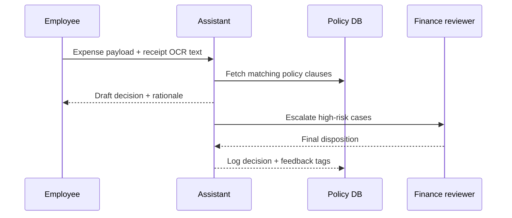

## Why this assistant
Finance controllers juggle thousands of expense line items that vary by vendor, geography, and policy. A lightweight AI assistant can pre-screen reimbursements, explain why something looks risky, and route it for human review. Unlike generic anomaly detection, this workflow ties LLM reasoning to structured policy checks and audit trails, reducing manual triage time.

### You’ll learn
- How to combine deterministic policy checks with LLM rationales.
- How to design prompts that surface audit evidence and next actions.
- How to call an AI provider from Node.js and Python with schema validation.
- How to log review outcomes for continuous calibration.
- How to mitigate privacy, bias, and false-positive risks in financial data.

## Prompt spec
- **Intent**: Review an expense submission, compare it against company policy, and recommend `approve`, `escalate`, or `reject` with supporting evidence.
- **Inputs**: Expense metadata (employee, department, cost center, category), receipt summary, policy snippets, historical averages, allowed thresholds, region risk flags.
- **Outputs**: JSON with `decision`, `confidence`, `policy_refs`, `risk_factors`, `recommended_actions`, and `explanations` keyed to evidence.
- **Constraints**: Must cite at least one policy clause for non-approvals; flag missing data in `issues`; cap explanations at 120 words.
- **Risks**: Privacy leaks, uneven false positives for specific regions/vendors, hallucinated policies. Mitigate by grounding prompts with policy excerpts and logging outcomes for calibration.
- **Eval hooks**: Track precision/recall against historical human labels; sample escalate decisions weekly for controller review.

## Workflow diagram



## Prompt template

```text
You are a meticulous finance compliance analyst. Review the expense described below.

Company policies:
{{#each policy_clauses}}
- ID {{this.id}}: {{this.text}}
{{/each}}

Historical context:
- Average spend for category {{category}}: {{historical_average}}
- Recent anomalies: {{recent_anomalies}}

Expense submission:
Employee: {{employee_name}} ({{employee_role}})
Department: {{department}}
Cost center: {{cost_center}}
Region risk level: {{region_risk}}
Vendor: {{vendor}}
Category: {{category}}
Amount: {{amount}}
Receipt summary: {{receipt_summary}}
Supporting notes: {{notes}}

Respond in strict JSON with fields:
{
  "decision": "approve" | "escalate" | "reject",
  "confidence": 0-1 float,
  "policy_refs": ["policy-id"],
  "risk_factors": ["short phrase"],
  "recommended_actions": ["short imperative"],
  "explanations": "<=120 words rationale",
  "issues": ["missing data notes"]
}
Use policy_refs for any non-approval. If information is missing, add to issues and lower confidence.
```

## Node.js orchestration

```ts
import OpenAI from "openai";
import { z } from "zod";

const client = new OpenAI({ apiKey: process.env.OPENAI_API_KEY! });

const ExpenseDecisionSchema = z.object({
  decision: z.enum(["approve", "escalate", "reject"]),
  confidence: z.number().min(0).max(1),
  policy_refs: z.array(z.string()).max(5),
  risk_factors: z.array(z.string()).max(5),
  recommended_actions: z.array(z.string()).max(5),
  explanations: z.string().max(600),
  issues: z.array(z.string()).max(5)
});

export async function reviewExpense(expense: {
  employee_name: string;
  employee_role: string;
  department: string;
  cost_center: string;
  region_risk: "low" | "medium" | "high";
  vendor: string;
  category: string;
  amount: string;
  receipt_summary: string;
  notes?: string;
  policy_clauses: { id: string; text: string }[];
  historical_average: string;
  recent_anomalies: string;
}) {
  const prompt = buildPrompt(expense);

  const response = await client.responses.create({
    model: "gpt-4.1-mini",
    input: prompt,
    temperature: 0.2,
    max_output_tokens: 500,
    response_format: {
      type: "json_schema",
      json_schema: { name: "expense_review", schema: ExpenseDecisionSchema }
    },
    metadata: { feature: "expense_audit" }
  });

  const outputText = response.output_text;
  const parsed = ExpenseDecisionSchema.safeParse(JSON.parse(outputText));
  if (!parsed.success) {
    throw new Error(parsed.error.message);
  }

  return parsed.data;
}

function buildPrompt(expense: any) {
  const policyList = expense.policy_clauses
    .map((clause: { id: string; text: string }) => `- ID ${clause.id}: ${clause.text}`)
    .join("\n");

  return `You are a meticulous finance compliance analyst. Review the expense described below.\n\nCompany policies:\n${policyList}\n\nHistorical context:\n- Average spend for category ${expense.category}: ${expense.historical_average}\n- Recent anomalies: ${expense.recent_anomalies}\n\nExpense submission:\nEmployee: ${expense.employee_name} (${expense.employee_role})\nDepartment: ${expense.department}\nCost center: ${expense.cost_center}\nRegion risk level: ${expense.region_risk}\nVendor: ${expense.vendor}\nCategory: ${expense.category}\nAmount: ${expense.amount}\nReceipt summary: ${expense.receipt_summary}\nSupporting notes: ${expense.notes ?? "(none)"}\n\nRespond in JSON as specified.`;
}
```

## Python orchestration

```python
import os
import json
from typing import List, Dict
from openai import OpenAI
from pydantic import BaseModel, Field, ValidationError

client = OpenAI(api_key=os.environ["OPENAI_API_KEY"])

class ExpenseDecision(BaseModel):
    decision: str = Field(pattern=r"^(approve|escalate|reject)$")
    confidence: float = Field(ge=0.0, le=1.0)
    policy_refs: List[str] = Field(default_factory=list, max_items=5)
    risk_factors: List[str] = Field(default_factory=list, max_items=5)
    recommended_actions: List[str] = Field(default_factory=list, max_items=5)
    explanations: str = Field(max_length=600)
    issues: List[str] = Field(default_factory=list, max_items=5)


def build_prompt(payload: Dict[str, str]) -> str:
    policy_lines = "\n".join(
        f"- ID {clause['id']}: {clause['text']}" for clause in payload["policy_clauses"]
    )
    return f"""You are a meticulous finance compliance analyst.\n\nCompany policies:\n{policy_lines}\n\nHistorical context:\n- Average spend for category {payload['category']}: {payload['historical_average']}\n- Recent anomalies: {payload['recent_anomalies']}\n\nExpense submission:\nEmployee: {payload['employee_name']} ({payload['employee_role']})\nDepartment: {payload['department']}\nCost center: {payload['cost_center']}\nRegion risk level: {payload['region_risk']}\nVendor: {payload['vendor']}\nCategory: {payload['category']}\nAmount: {payload['amount']}\nReceipt summary: {payload['receipt_summary']}\nSupporting notes: {payload.get('notes', '(none)')}\n\nRespond in JSON as specified."""


def review_expense(payload: Dict[str, str]) -> ExpenseDecision:
    prompt = build_prompt(payload)
    response = client.responses.create(
        model="gpt-4.1-mini",
        input=prompt,
        temperature=0.2,
        max_output_tokens=500,
        response_format={
            "type": "json_schema",
            "json_schema": {
                "name": "expense_review",
                "schema": ExpenseDecision.model_json_schema()
            },
        },
        metadata={"feature": "expense_audit"},
    )

    try:
        return ExpenseDecision.model_validate_json(response.output_text)
    except ValidationError as exc:
        raise RuntimeError(f"Invalid response: {exc}") from exc
```

## Evaluation hooks
- Assemble a labelled dataset of past expenses and outcomes; run nightly evaluation to compute precision/recall and false-positive rate by department.
- Track decision drift: compare LLM confidence to human override frequency.
- Add guardrail tests for privacy by redacting PII before logging and verifying redaction via automated checks.

## Guardrails and operations
- Encrypt expense payloads in transit and at rest; limit prompt content to required fields.
- Require human approval for `reject` decisions; escalate ambiguous cases automatically.
- Log every policy reference and provide finance reviewers with a diff when policies change.
- Rotate API keys quarterly and monitor rate limits to avoid throttling during monthly close.

## Deployment checklist
- ✅ Load policy excerpts from a versioned knowledge base.
- ✅ Set up error monitoring for schema validation failures.
- ✅ Store final decisions with reviewer notes in an immutable ledger or append-only table.
- ✅ Configure weekly calibration reviews with controllers and compliance.

## References
- OpenAI. "Responses API." 2025. https://platform.openai.com/docs/guides/responses
- U.S. GAO. "Standards for Internal Control in the Federal Government." 2014. https://www.gao.gov/products/gao-14-704g
- Microsoft. "Responsible AI practices for finance." 2023. https://learn.microsoft.com/azure/cloud-adoption-framework/ai/responsible-ai

## Related reading
- [/docs/examples/data-quality-qa.md](/docs/examples/data-quality-qa.md)
- [/docs/concepts/safety-basics.md](/docs/concepts/safety-basics.md)
- [/docs/patterns/tool-use.md](/docs/patterns/tool-use.md)
