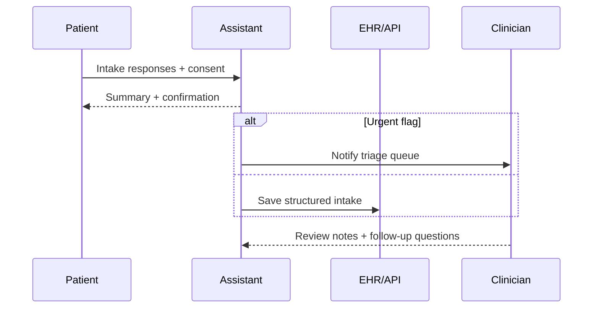

## Why this assistant
Healthcare organizations need structured intake data before a clinical visit. An AI-assisted intake form can gather symptoms, history, medications, and consent while routing urgent signals to clinicians. With strong privacy controls, audit logging, and human oversight, the assistant shortens wait times without making diagnoses.

### You’ll learn
- How to prompt for structured clinical intake data with consent reminders.
- How to separate triage guidance from diagnostic decisions.
- How to implement secure Node.js and Python endpoints with PHI handling safeguards.
- How to store audit trails and support clinician review workflows.
- How to evaluate the assistant for completeness, accuracy, and safety.

## Prompt spec
- **Intent**: Collect patient intake details, summarize symptoms, capture consent, and flag urgent conditions for clinician review.
- **Inputs**: Patient-provided text, symptom checklist, medication list, allergies, visit reason, risk guidelines, consent statement, locale.
- **Outputs**: JSON with `patient_summary`, `structured_data` (symptoms, onset, severity, medications, allergies), `consent_captured`, `urgent_flags`, `next_steps`, `issues`.
- **Constraints**: No diagnoses; urgent flags limited to guideline-based triggers; consent must be explicit before saving data.
- **Risks**: Handling PHI, mis-triaging urgent cases, storing data insecurely. Mitigate with HIPAA-compliant hosting, clinician review, and encryption.
- **Eval hooks**: Completeness checks vs. nurse-reviewed forms; false-negative urgent flag rate; consent capture metrics.

## Workflow diagram



## Prompt template

```text
You are a clinical intake assistant. Collect information to support a healthcare professional. Do not provide diagnoses.

Consent statement: {{consent_text}}
The patient must agree before data is stored.

Patient responses:
{{patient_input}}

Guideline reminders: {{guideline_summary}}

Return JSON:
{
  "patient_summary": "<=120 word restatement in plain language",
  "structured_data": {
    "symptoms": [{"name": "", "severity": "mild|moderate|severe", "onset": ""}],
    "medications": ["name"],
    "allergies": ["allergy"],
    "conditions": ["existing condition"],
    "vitals": [{"name": "", "value": "", "unit": ""}]
  },
  "consent_captured": true|false,
  "urgent_flags": [{"reason": "", "guideline": ""}],
  "next_steps": ["clarifying question or instruction"],
  "issues": ["missing info"]
}
If consent_captured is false, leave structured_data empty and recommend collecting consent first.
```

## Node.js orchestration

```ts
import OpenAI from "openai";
import { z } from "zod";

const client = new OpenAI({ apiKey: process.env.OPENAI_API_KEY! });

const IntakeSchema = z.object({
  patient_summary: z.string().max(600),
  structured_data: z.object({
    symptoms: z.array(z.object({
      name: z.string(),
      severity: z.enum(["mild", "moderate", "severe"]),
      onset: z.string()
    })),
    medications: z.array(z.string()),
    allergies: z.array(z.string()),
    conditions: z.array(z.string()),
    vitals: z.array(z.object({ name: z.string(), value: z.string(), unit: z.string() }))
  }),
  consent_captured: z.boolean(),
  urgent_flags: z.array(z.object({ reason: z.string(), guideline: z.string() })),
  next_steps: z.array(z.string()),
  issues: z.array(z.string())
});

export async function collectIntake(payload: {
  consent_text: string;
  patient_input: string;
  guideline_summary: string;
}) {
  const response = await client.responses.create({
    model: "gpt-4.1-mini",
    input: buildPrompt(payload),
    temperature: 0.2,
    max_output_tokens: 700,
    response_format: {
      type: "json_schema",
      json_schema: { name: "intake", schema: IntakeSchema }
    },
    metadata: { feature: "healthcare_intake" }
  });

  const parsed = IntakeSchema.safeParse(JSON.parse(response.output_text));
  if (!parsed.success) {
    throw new Error(parsed.error.message);
  }

  if (!parsed.data.consent_captured) {
    parsed.data.structured_data = {
      symptoms: [],
      medications: [],
      allergies: [],
      conditions: [],
      vitals: []
    } as any;
  }

  return parsed.data;
}

function buildPrompt(payload: any) {
  return `You are a clinical intake assistant. Collect information to support a healthcare professional. Do not provide diagnoses.\n\nConsent statement: ${payload.consent_text}\nThe patient must agree before data is stored.\n\nPatient responses:\n${payload.patient_input}\n\nGuideline reminders: ${payload.guideline_summary}\n\nReturn JSON as specified.`;
}
```

## Python orchestration

```python
import os
from typing import Dict
from openai import OpenAI
from pydantic import BaseModel, Field

client = OpenAI(api_key=os.environ["OPENAI_API_KEY"])

class Symptom(BaseModel):
    name: str
    severity: str
    onset: str

class Vital(BaseModel):
    name: str
    value: str
    unit: str

class Intake(BaseModel):
    patient_summary: str = Field(max_length=600)
    structured_data: Dict[str, list]
    consent_captured: bool
    urgent_flags: list
    next_steps: list
    issues: list


def build_prompt(payload: Dict[str, str]) -> str:
    return (
        "You are a clinical intake assistant. Collect information to support a healthcare professional. Do not provide diagnoses.\n\n"
        f"Consent statement: {payload['consent_text']}\n"
        "The patient must agree before data is stored.\n\n"
        f"Patient responses:\n{payload['patient_input']}\n\n"
        f"Guideline reminders: {payload['guideline_summary']}\n\n"
        "Return JSON as specified."
    )


def collect_intake(payload: Dict[str, str]) -> Intake:
    response = client.responses.create(
        model="gpt-4.1-mini",
        input=build_prompt(payload),
        temperature=0.2,
        max_output_tokens=700,
        response_format={
            "type": "json_schema",
            "json_schema": {
                "name": "intake",
                "schema": Intake.model_json_schema(),
            },
        },
        metadata={"feature": "healthcare_intake"},
    )
    data = Intake.model_validate_json(response.output_text)
    if not data.consent_captured:
        data.structured_data = {
            "symptoms": [],
            "medications": [],
            "allergies": [],
            "conditions": [],
            "vitals": [],
        }
    return data
```

## Evaluation hooks
- Compare AI-collected data with nurse-led interviews for completeness; target ≥95% agreement on critical fields.
- Run safety tests to ensure urgent flags fire for guideline scenarios (e.g., chest pain) and avoid false reassurance.
- Audit consent capture rates and require re-collection if missing.

## Guardrails and operations
- Host within a HIPAA-compliant environment with encryption at rest and in transit.
- Mask identifiers when using third-party services; prefer on-prem or BAA-covered models.
- Provide clinicians with a summary UI showing AI-captured data, confidence, and urgent flags before the visit.
- Maintain audit logs of data access and modifications for regulatory reporting.

## Deployment checklist
- ✅ Obtain legal approval and update Notice of Privacy Practices.
- ✅ Implement identity verification (e.g., patient portal login) before sharing PHI.
- ✅ Integrate with EHR via HL7 FHIR or secure APIs with minimal scopes.
- ✅ Train intake staff on reviewing AI summaries and escalating urgent cases.

## References
- U.S. Department of Health & Human Services. "Summary of the HIPAA Security Rule." 2013. https://www.hhs.gov/hipaa/for-professionals/security/laws-regulations/index.html
- American Medical Association. "Augmented intelligence in health care: policy recommendations." 2023. https://www.ama-assn.org/system/files/2023-02/augmented-intelligence-policy-report.pdf
- OpenAI. "Safety best practices." 2024. https://platform.openai.com/docs/guides/safety-best-practices

## Related reading
- [/docs/safety/sensitive-data-handling.md](/docs/safety/sensitive-data-handling.md)
- [/docs/patterns/tool-use.md](/docs/patterns/tool-use.md)
- [/docs/concepts/structured-outputs.md](/docs/concepts/structured-outputs.md)
