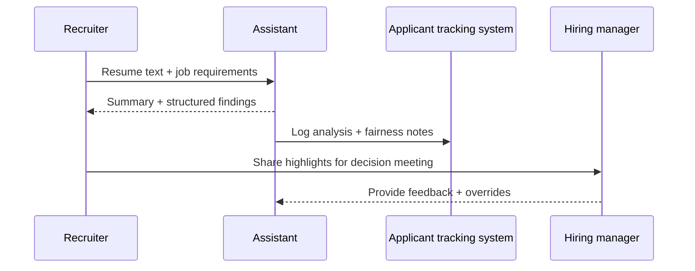

## Why this assistant
Recruiters need quick snapshots of applicant experience without automating hiring decisions. A carefully scoped AI assistant can summarize resumes, highlight aligned skills, and call out missing requirements while keeping humans in the loop. By grounding the assistant in job descriptions and fairness guidelines, teams reduce bias risks and maintain compliance with equal employment regulations.

### You’ll learn
- How to capture job requirements and fairness guardrails inside a prompt.
- How to extract structured skill profiles alongside narrative summaries.
- How to integrate LLM outputs into HR applicant tracking workflows.
- How to monitor disparate impact and log human override decisions.
- How to provide transparency notes to candidates and hiring managers.

## Prompt spec
- **Intent**: Compare a candidate resume to a target job description and output a neutral summary, matched skills, gaps, and recommended recruiter follow-ups.
- **Inputs**: Job role, must-have qualifications, nice-to-have skills, location constraints, resume text, optional candidate notes, fairness policy reminders.
- **Outputs**: JSON with `summary`, `matched_skills`, `missing_requirements`, `culture_notes`, `recommended_actions`, `fairness_flags`.
- **Constraints**: Use objective language; avoid demographic inference; provide at least one quote referencing resume evidence for each matched skill.
- **Risks**: Bias amplification, reliance on poor OCR, leaking sensitive candidate data. Mitigate with fairness reminders, data minimization, and human approvals.
- **Eval hooks**: Track recruiter agreement rate, time saved, and fairness flag frequency across demographic proxies (if available).

## Workflow diagram



## Prompt template

```text
You are a neutral talent researcher assisting recruiters. Compare the candidate resume to the job description.

Job role: {{job_title}}
Must-have qualifications:
{{#each must_haves}}- {{this}}
{{/each}}
Nice-to-have skills:
{{#each nice_to_haves}}- {{this}}
{{/each}}
Location constraint: {{location}}
Fairness reminders: {{fairness_policy}}

Candidate resume:
{{resume_text}}

Respond in JSON with:
{
  "summary": "<=120 word neutral summary",
  "matched_skills": [{"skill": "", "evidence_quote": ""}],
  "missing_requirements": ["short phrase"],
  "culture_notes": ["short observation grounded in resume"],
  "recommended_actions": ["short recruiter task"],
  "fairness_flags": ["potential bias risk"],
  "issues": ["missing data"]
}
Never infer demographic attributes. If unsure about a qualification, add it to issues instead of guessing.
```

## Node.js orchestration

```ts
import OpenAI from "openai";
import { z } from "zod";

const client = new OpenAI({ apiKey: process.env.OPENAI_API_KEY! });

const CandidateSchema = z.object({
  summary: z.string().max(600),
  matched_skills: z.array(z.object({
    skill: z.string(),
    evidence_quote: z.string().max(240)
  })).max(10),
  missing_requirements: z.array(z.string()).max(10),
  culture_notes: z.array(z.string()).max(5),
  recommended_actions: z.array(z.string()).max(5),
  fairness_flags: z.array(z.string()).max(5),
  issues: z.array(z.string()).max(5)
});

export async function screenCandidate(payload: {
  job_title: string;
  must_haves: string[];
  nice_to_haves: string[];
  location: string;
  fairness_policy: string;
  resume_text: string;
}) {
  const prompt = buildPrompt(payload);

  const response = await client.responses.create({
    model: "gpt-4.1-mini",
    input: prompt,
    temperature: 0.1,
    max_output_tokens: 600,
    response_format: {
      type: "json_schema",
      json_schema: { name: "candidate_screen", schema: CandidateSchema }
    },
    metadata: { feature: "candidate_screen" }
  });

  const parsed = CandidateSchema.safeParse(JSON.parse(response.output_text));
  if (!parsed.success) {
    throw new Error(parsed.error.message);
  }

  return parsed.data;
}

function buildPrompt(payload: any) {
  const must = payload.must_haves.map((item: string) => `- ${item}`).join("\n");
  const nice = payload.nice_to_haves.map((item: string) => `- ${item}`).join("\n");
  return `You are a neutral talent researcher assisting recruiters. Compare the candidate resume to the job description.\n\nJob role: ${payload.job_title}\nMust-have qualifications:\n${must}\nNice-to-have skills:\n${nice}\nLocation constraint: ${payload.location}\nFairness reminders: ${payload.fairness_policy}\n\nCandidate resume:\n${payload.resume_text}\n\nRespond in JSON as specified.`;
}
```

## Python orchestration

```python
import os
from typing import Dict
from openai import OpenAI
from pydantic import BaseModel, Field

client = OpenAI(api_key=os.environ["OPENAI_API_KEY"])

class CandidateSummary(BaseModel):
    summary: str = Field(max_length=600)
    matched_skills: list[dict] = Field(default_factory=list)
    missing_requirements: list[str] = Field(default_factory=list)
    culture_notes: list[str] = Field(default_factory=list)
    recommended_actions: list[str] = Field(default_factory=list)
    fairness_flags: list[str] = Field(default_factory=list)
    issues: list[str] = Field(default_factory=list)


def build_prompt(payload: Dict[str, str]) -> str:
    must = "\n".join(f"- {item}" for item in payload["must_haves"])
    nice = "\n".join(f"- {item}" for item in payload["nice_to_haves"])
    return (
        "You are a neutral talent researcher assisting recruiters. Compare the candidate resume to the job description.\n\n"
        f"Job role: {payload['job_title']}\n"
        f"Must-have qualifications:\n{must}\n"
        f"Nice-to-have skills:\n{nice}\n"
        f"Location constraint: {payload['location']}\n"
        f"Fairness reminders: {payload['fairness_policy']}\n\n"
        f"Candidate resume:\n{payload['resume_text']}\n\n"
        "Respond in JSON as specified."
    )


def screen_candidate(payload: Dict[str, str]) -> CandidateSummary:
    response = client.responses.create(
        model="gpt-4.1-mini",
        input=build_prompt(payload),
        temperature=0.1,
        max_output_tokens=600,
        response_format={
            "type": "json_schema",
            "json_schema": {
                "name": "candidate_screen",
                "schema": CandidateSummary.model_json_schema(),
            },
        },
        metadata={"feature": "candidate_screen"},
    )
    return CandidateSummary.model_validate_json(response.output_text)
```

## Evaluation hooks
- Annotate a validation set with recruiter-approved summaries; compare overlap of matched skills and missing requirements.
- Review fairness flags by demographic proxy (e.g., anonymized location) with HR legal partners.
- Log human override reasons to refine prompt instructions and fairness reminders.

## Guardrails and operations
- Strip PII not needed for screening (e.g., addresses, birth dates) before sending to the model.
- Display a disclosure banner to recruiters: the assistant is advisory, not a decision-maker.
- Store all AI outputs inside the ATS with timestamps and reviewer IDs for auditability.
- Run quarterly audits to confirm the assistant is not filtering by protected categories.

## Deployment checklist
- ✅ Align prompts with EEOC guidance and local hiring regulations.
- ✅ Integrate with ATS webhook to attach summaries to candidate profiles.
- ✅ Add human-in-the-loop confirmations before forwarding to hiring managers.
- ✅ Provide opt-out instructions if candidates decline AI-assisted review.

## References
- U.S. Equal Employment Opportunity Commission. "Select Issues: Assessing adverse impact in software, algorithms, and AI used in employment selection procedures." 2023. https://www.eeoc.gov/select-issues-assessing-adverse-impact-software-algorithms-and-ai-used-employment-selection
- OpenAI. "Response schemas." 2025. https://platform.openai.com/docs/guides/structured-outputs
- Society for Human Resource Management. "How to use AI responsibly in hiring." 2024. https://www.shrm.org/resourcesandtools/hr-topics/technology/pages/how-to-use-ai-responsibly-in-hiring.aspx

## Related reading
- [/docs/concepts/ethics-responsible-ai.md](/docs/concepts/ethics-responsible-ai.md)
- [/docs/examples/data-quality-qa.md](/docs/examples/data-quality-qa.md)
- [/docs/concepts/safety-basics.md](/docs/concepts/safety-basics.md)
