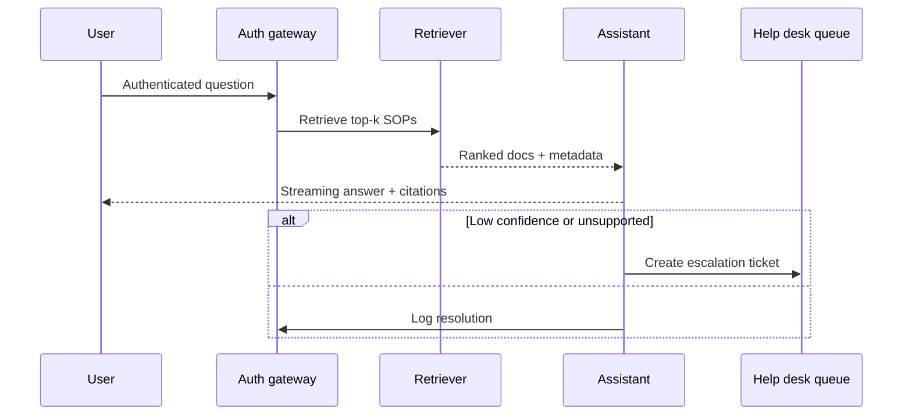

## Why this assistant
Internal help desks need consistent answers grounded in approved runbooks. An AI knowledge bot layered over your documentation system can deliver quick responses, cite sources, and hand off tricky incidents to human agents. By coupling retrieval-augmented generation (RAG) with escalation triggers, teams reduce repetitive tickets without risking unsupported fixes.

### You’ll learn
- How to structure prompts for citation-rich answers grounded in IT SOPs.
- How to orchestrate a retrieval pipeline with confidence scoring and deflection logic.
- How to implement streaming responses and tool-based escalations in Node.js and Python.
- How to audit knowledge freshness and retire outdated articles.
- How to handle sensitive data, authentication, and logging for IT support scenarios.

## Prompt spec
- **Intent**: Answer employee IT questions using approved knowledge articles, cite sources, and decide whether to escalate.
- **Inputs**: User question, top-k retrieved documents (title, URL, snippet, last updated), incident severity heuristics, list of unsupported topics.
- **Outputs**: JSON with `answer`, `citations`, `confidence`, `follow_up_questions`, `escalation`, `knowledge_gaps`.
- **Constraints**: Answer must only use retrieved content; cite URLs or doc IDs; escalate if confidence < 0.6 or unsupported topic detected.
- **Risks**: Stale instructions, leaking privileged information, hallucinated fixes. Mitigate with strict grounding, doc expiry checks, and access controls.
- **Eval hooks**: Track resolution rate, citation accuracy, and false-negative escalations using labelled ticket data.

## Architecture overview



## Retrieval prompt (system message)

```text
You are an IT support specialist. Only answer using the supplied knowledge articles. If the articles do not answer the question, reply with "I need to escalate this" and set escalation to true.
```

## Generation prompt (assistant instructions)

```text
Answer the employee question using the retrieved documents. Include inline citation markers like [Doc-1].
If multiple documents conflict, choose the most recent `last_updated` value.
If confidence would be below 0.6 or no documents are relevant, set escalation to true and provide a short apology.
Return JSON with:
{
  "answer": "markdown string",
  "citations": [{"label": "Doc-1", "source": "URL or ID"}],
  "confidence": 0-1 float,
  "follow_up_questions": ["short question"],
  "escalation": true|false,
  "knowledge_gaps": ["missing article suggestion"],
  "issues": ["missing data"]
}
```

## Node.js orchestration

```ts
import OpenAI from "openai";
import { z } from "zod";

type RetrievedDoc = {
  title: string;
  url: string;
  snippet: string;
  last_updated: string;
};

const client = new OpenAI({ apiKey: process.env.OPENAI_API_KEY! });

const ResponseSchema = z.object({
  answer: z.string(),
  citations: z.array(z.object({ label: z.string(), source: z.string().url().or(z.string()) })),
  confidence: z.number().min(0).max(1),
  follow_up_questions: z.array(z.string()).max(5),
  escalation: z.boolean(),
  knowledge_gaps: z.array(z.string()).max(5),
  issues: z.array(z.string()).max(5)
});

export async function answerQuestion(question: string, documents: RetrievedDoc[]) {
  const systemPrompt = "You are an IT support specialist. Only answer using the supplied knowledge articles.";
  const docContext = documents
    .map((doc, idx) => `Doc-${idx + 1} (${doc.last_updated}) ${doc.title}\n${doc.snippet}\nSource: ${doc.url}`)
    .join("\n\n");

  const response = await client.responses.create({
    model: "gpt-4.1-mini",
    input: [
      { role: "system", content: systemPrompt },
      {
        role: "user",
        content: `Question: ${question}\n\nKnowledge base:\n${docContext}`
      }
    ],
    temperature: 0.2,
    max_output_tokens: 700,
    response_format: {
      type: "json_schema",
      json_schema: { name: "it_kb", schema: ResponseSchema }
    },
    metadata: { feature: "it_kb" }
  });

  const parsed = ResponseSchema.safeParse(JSON.parse(response.output_text));
  if (!parsed.success) {
    throw new Error(parsed.error.message);
  }

  return parsed.data;
}
```

## Python orchestration

```python
import os
from openai import OpenAI
from pydantic import BaseModel, Field
from typing import List

client = OpenAI(api_key=os.environ["OPENAI_API_KEY"])

class Citation(BaseModel):
    label: str
    source: str

class ITAnswer(BaseModel):
    answer: str
    citations: List[Citation]
    confidence: float = Field(ge=0.0, le=1.0)
    follow_up_questions: List[str]
    escalation: bool
    knowledge_gaps: List[str]
    issues: List[str]


def answer_question(question: str, documents: List[dict]) -> ITAnswer:
    system_prompt = "You are an IT support specialist. Only answer using the supplied knowledge articles."
    doc_context = "\n\n".join(
        f"Doc-{idx+1} ({doc['last_updated']}) {doc['title']}\n{doc['snippet']}\nSource: {doc['url']}"
        for idx, doc in enumerate(documents)
    )
    response = client.responses.create(
        model="gpt-4.1-mini",
        input=[
            {"role": "system", "content": system_prompt},
            {
                "role": "user",
                "content": f"Question: {question}\n\nKnowledge base:\n{doc_context}",
            },
        ],
        temperature=0.2,
        max_output_tokens=700,
        response_format={
            "type": "json_schema",
            "json_schema": {
                "name": "it_kb",
                "schema": ITAnswer.model_json_schema(),
            },
        },
        metadata={"feature": "it_kb"},
    )
    return ITAnswer.model_validate_json(response.output_text)
```

## Evaluation hooks
- Build a labelled test set of common help desk questions; compare AI answers to canonical solutions for accuracy and citation correctness.
- Run weekly freshness audits: flag documents older than 12 months referenced in answers.
- Track escalation rates by category and ensure critical incidents are never auto-resolved.

## Guardrails and operations
- Require authentication and scope prompts to the requester’s access level (e.g., employee vs. contractor).
- Mask secrets such as passwords, VPN keys, and admin credentials; refuse to output them even if present in docs.
- Log citations and resolved tickets to detect outdated or conflicting SOPs.
- Provide a human escalation path with SLA timers and notifications.

## Deployment checklist
- ✅ Sync knowledge base from Confluence, SharePoint, or Notion with metadata and access controls.
- ✅ Implement vector search with document expiry filtering.
- ✅ Add streaming UI with partial answer rendering and citation tooltips.
- ✅ Instrument analytics for answer helpfulness votes and follow-up conversions.

## References
- OpenAI. "Retrieval augmented generation." 2024. https://platform.openai.com/docs/guides/retrieval
- Google Cloud. "Designing reliable generative AI agents." 2024. https://cloud.google.com/architecture/designing-reliable-generative-ai-agents
- NIST. "AI Risk Management Framework." 2023. https://nvlpubs.nist.gov/nistpubs/ai/NIST.AI.100-1.pdf

## Related reading
- [/docs/patterns/rag-overview.md](/docs/patterns/rag-overview.md)
- [/docs/examples/a2a-coordination.md](/docs/examples/a2a-coordination.md)
- [/docs/safety/sensitive-data-handling.md](/docs/safety/sensitive-data-handling.md)
