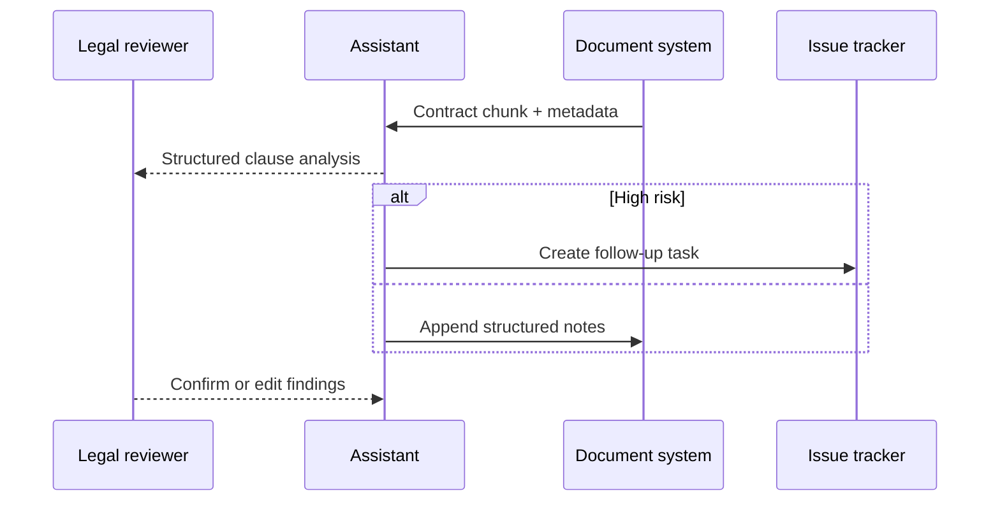

## Why this assistant
In-house counsel and legal ops teams sift through lengthy agreements to locate critical clauses (e.g., indemnity, termination, data protection). An AI clause extractor accelerates review by tagging sections, summarizing obligations, and flagging risky language. With structured outputs and human validation, teams can triage contracts faster while preserving legal accountability.

### You’ll learn
- How to structure prompts that extract clause metadata and risk summaries.
- How to chunk long contracts and stitch responses with pagination.
- How to implement Node.js and Python pipelines with validation and redaction.
- How to add evaluation datasets with attorney-labelled clauses.
- How to mitigate confidentiality risks and log reviewer actions.

## Prompt spec
- **Intent**: Parse a contract snippet, extract specified clause types, summarize obligations, and flag risk indicators.
- **Inputs**: Contract text chunk, clause taxonomy (e.g., termination, liability, data protection), risk heuristics, jurisdiction notes, review instructions.
- **Outputs**: JSON with `clauses` array (each containing `type`, `text_excerpt`, `summary`, `risk_level`, `obligations`, `next_steps`, `confidence`), plus `issues`.
- **Constraints**: Cite paragraph numbers if available; mark `risk_level` as `low`, `medium`, or `high`; avoid legal advice disclaimers beyond provided template.
- **Risks**: Hallucinated clauses, missing key obligations, confidentiality leaks. Mitigate with chunk overlap, retrieval grounding, and strict access controls.
- **Eval hooks**: Compare extracted clauses against attorney-labelled datasets; track false negatives by clause type.

## Workflow diagram



## Prompt template

```text
You are a legal analyst helping review contracts. Focus on the clause types listed below.

Clause types of interest:
{{#each clause_types}}- {{this}}
{{/each}}
Jurisdiction: {{jurisdiction}}
Risk heuristics: {{risk_heuristics}}

Contract excerpt (include paragraph numbers if present):
{{contract_text}}

Respond in JSON:
{
  "clauses": [{
    "type": "clause type from list",
    "text_excerpt": "verbatim snippet",
    "summary": "<=80 word neutral summary",
    "risk_level": "low|medium|high",
    "obligations": ["short obligation"],
    "next_steps": ["action item"],
    "confidence": 0-1 float,
    "citations": ["paragraph reference"]
  }],
  "issues": ["missing data or uncertainty"]
}
If no clause is found, return an empty clauses array and add a note to issues.
```

## Node.js orchestration

```ts
import OpenAI from "openai";
import { z } from "zod";

const client = new OpenAI({ apiKey: process.env.OPENAI_API_KEY! });

const ClauseSchema = z.object({
  type: z.string(),
  text_excerpt: z.string(),
  summary: z.string().max(400),
  risk_level: z.enum(["low", "medium", "high"]),
  obligations: z.array(z.string()).max(6),
  next_steps: z.array(z.string()).max(6),
  confidence: z.number().min(0).max(1),
  citations: z.array(z.string()).max(5)
});

const ExtractResponse = z.object({
  clauses: z.array(ClauseSchema),
  issues: z.array(z.string()).max(5)
});

export async function extractClauses(payload: {
  contract_text: string;
  clause_types: string[];
  jurisdiction: string;
  risk_heuristics: string;
}) {
  const prompt = buildPrompt(payload);

  const response = await client.responses.create({
    model: "gpt-4.1-mini",
    input: prompt,
    temperature: 0.1,
    max_output_tokens: 800,
    response_format: {
      type: "json_schema",
      json_schema: { name: "clause_extract", schema: ExtractResponse }
    },
    metadata: { feature: "clause_extract" }
  });

  const parsed = ExtractResponse.safeParse(JSON.parse(response.output_text));
  if (!parsed.success) {
    throw new Error(parsed.error.message);
  }

  return parsed.data;
}

function buildPrompt(payload: any) {
  const clauses = payload.clause_types.map((type: string) => `- ${type}`).join("\n");
  return `You are a legal analyst helping review contracts. Focus on the clause types listed below.\n\nClause types of interest:\n${clauses}\nJurisdiction: ${payload.jurisdiction}\nRisk heuristics: ${payload.risk_heuristics}\n\nContract excerpt (include paragraph numbers if present):\n${payload.contract_text}\n\nRespond in JSON as specified.`;
}
```

## Python orchestration

```python
import os
from openai import OpenAI
from pydantic import BaseModel, Field
from typing import List

client = OpenAI(api_key=os.environ["OPENAI_API_KEY"])

class Clause(BaseModel):
    type: str
    text_excerpt: str
    summary: str = Field(max_length=400)
    risk_level: str
    obligations: List[str]
    next_steps: List[str]
    confidence: float = Field(ge=0.0, le=1.0)
    citations: List[str]

class ClauseResponse(BaseModel):
    clauses: List[Clause]
    issues: List[str]


def build_prompt(payload: dict) -> str:
    clause_list = "\n".join(f"- {item}" for item in payload["clause_types"])
    return (
        "You are a legal analyst helping review contracts. Focus on the clause types listed below.\n\n"
        f"Clause types of interest:\n{clause_list}\n"
        f"Jurisdiction: {payload['jurisdiction']}\n"
        f"Risk heuristics: {payload['risk_heuristics']}\n\n"
        f"Contract excerpt (include paragraph numbers if present):\n{payload['contract_text']}\n\n"
        "Respond in JSON as specified."
    )


def extract_clauses(payload: dict) -> ClauseResponse:
    response = client.responses.create(
        model="gpt-4.1-mini",
        input=build_prompt(payload),
        temperature=0.1,
        max_output_tokens=800,
        response_format={
            "type": "json_schema",
            "json_schema": {
                "name": "clause_extract",
                "schema": ClauseResponse.model_json_schema(),
            },
        },
        metadata={"feature": "clause_extract"},
    )
    return ClauseResponse.model_validate_json(response.output_text)
```

## Evaluation hooks
- Curate labelled contract excerpts by clause type; compute recall and precision of extractions.
- Run red team tests with tricky language (e.g., disguised indemnity clauses) to evaluate robustness.
- Track human reviewer overrides and feed back into prompt instructions.

## Guardrails and operations
- Maintain client confidentiality: host models in a secure environment with audit logging.
- Redact personal data or sensitive pricing before sending to external APIs if policy requires.
- Require attorney approval before updating contract status based on AI findings.
- Version prompts and clause taxonomies; document changes for compliance audits.

## Deployment checklist
- ✅ Integrate with document management systems to fetch clause-level context.
- ✅ Implement chunking with overlap and paragraph references.
- ✅ Provide reviewer UI to accept/edit clauses and export summaries.
- ✅ Schedule periodic replays with updated prompts on historic contracts.

## References
- American Bar Association. "Ethical guidelines for the use of AI in legal practice." 2024. https://www.americanbar.org/groups/law_practice/publications/law_practice_magazine/2024/mj/ethical-guidelines-use-ai-legal-practice/
- International Association for Contract and Commercial Management (WorldCC). "Contract management standards." 2023. https://www.worldcc.com/learn/standards-and-guidelines
- OpenAI. "Managing sensitive data." 2024. https://platform.openai.com/docs/guides/safety-best-practices

## Related reading
- [/docs/concepts/structured-outputs.md](/docs/concepts/structured-outputs.md)
- [/docs/patterns/tool-use.md](/docs/patterns/tool-use.md)
- [/docs/safety/compliance-disclosure.md](/docs/safety/compliance-disclosure.md)
