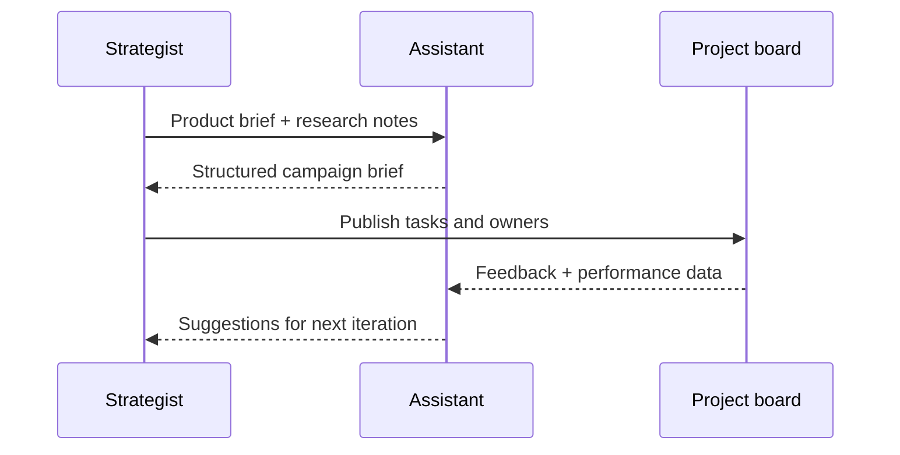

## Why this assistant
Creative teams often need a single source of truth capturing objectives, audience, key messages, and metrics. A marketing brief generator aggregates research notes, positioning statements, and timeline constraints into a shareable artifact. Using structured outputs keeps the brief consistent while leaving room for human edits.

### You’ll learn
- How to define brief sections (objectives, audience, messaging, channels, measurement) in a prompt spec.
- How to combine qualitative research snippets with quantitative KPIs.
- How to render a shareable brief in Markdown and JSON for workflow tools.
- How to synchronize briefs with project management systems.
- How to evaluate brief quality using rubrics and feedback loops.

## Prompt spec
- **Intent**: Produce a marketing campaign brief summarizing goal, audience, key messages, creative guardrails, channels, and success metrics.
- **Inputs**: Product overview, target audience segments, insights, competitive notes, previous campaign learnings, budget, timeline, KPIs.
- **Outputs**: JSON with `summary`, `objectives`, `audience`, `key_messages`, `channel_plan`, `deliverables`, `timeline`, `measurement`, `risks`, `open_questions`.
- **Constraints**: Provide at least three objectives; align each channel with metrics; highlight assumptions needing validation.
- **Risks**: Stale research, overfitting to a single persona, missing compliance constraints. Mitigate by linking to sources and requiring reviewer sign-off.
- **Eval hooks**: Rubric scoring on clarity, strategic fit, measurement, and risks.

## Workflow diagram



## Prompt template

```text
You are a senior marketing strategist. Create a campaign brief using the provided inputs.

Product overview: {{product_overview}}
Budget: {{budget}}
Timeline: {{timeline}}
Target segments:
{{#each segments}}- {{this}}
{{/each}}
Insights:
{{#each insights}}- {{this}}
{{/each}}
Competitive notes:
{{#each competitors}}- {{this}}
{{/each}}
Previous learnings:
{{#each learnings}}- {{this}}
{{/each}}
Key KPIs:
{{#each kpis}}- {{this}}
{{/each}}
Compliance or legal constraints: {{constraints}}

Return JSON:
{
  "summary": "<=120 words",
  "objectives": [{"description": "", "metric": "", "target": ""}],
  "audience": [{"segment": "", "insight": "", "tone": ""}],
  "key_messages": ["short message"],
  "channel_plan": [{"channel": "", "purpose": "", "content_format": "", "primary_metric": ""}],
  "deliverables": [{"asset": "", "owner": "", "due": ""}],
  "timeline": [{"milestone": "", "date": ""}],
  "measurement": [{"metric": "", "tool": "", "cadence": ""}],
  "risks": ["short risk"],
  "open_questions": ["short question"],
  "references": ["source link"],
  "issues": ["missing info"]
}
Highlight assumptions needing validation in open_questions.
```

## Node.js orchestration

```ts
import OpenAI from "openai";
import { z } from "zod";

const client = new OpenAI({ apiKey: process.env.OPENAI_API_KEY! });

const BriefSchema = z.object({
  summary: z.string().max(600),
  objectives: z.array(z.object({ description: z.string(), metric: z.string(), target: z.string() })).min(3),
  audience: z.array(z.object({ segment: z.string(), insight: z.string(), tone: z.string() })).min(1),
  key_messages: z.array(z.string()).min(3),
  channel_plan: z.array(z.object({ channel: z.string(), purpose: z.string(), content_format: z.string(), primary_metric: z.string() })),
  deliverables: z.array(z.object({ asset: z.string(), owner: z.string(), due: z.string() })),
  timeline: z.array(z.object({ milestone: z.string(), date: z.string() })),
  measurement: z.array(z.object({ metric: z.string(), tool: z.string(), cadence: z.string() })),
  risks: z.array(z.string()),
  open_questions: z.array(z.string()),
  references: z.array(z.string()),
  issues: z.array(z.string())
});

export async function generateBrief(payload: any) {
  const response = await client.responses.create({
    model: "gpt-4.1-mini",
    input: buildPrompt(payload),
    temperature: 0.4,
    max_output_tokens: 900,
    response_format: {
      type: "json_schema",
      json_schema: { name: "marketing_brief", schema: BriefSchema }
    },
    metadata: { feature: "marketing_brief" }
  });

  const parsed = BriefSchema.safeParse(JSON.parse(response.output_text));
  if (!parsed.success) {
    throw new Error(parsed.error.message);
  }
  return parsed.data;
}

function buildPrompt(payload: any) {
  const sections = (items: string[]) => items.map((item) => `- ${item}`).join("\n");
  return `You are a senior marketing strategist. Create a campaign brief using the provided inputs.\n\nProduct overview: ${payload.product_overview}\nBudget: ${payload.budget}\nTimeline: ${payload.timeline}\nTarget segments:\n${sections(payload.segments)}\nInsights:\n${sections(payload.insights)}\nCompetitive notes:\n${sections(payload.competitors)}\nPrevious learnings:\n${sections(payload.learnings)}\nKey KPIs:\n${sections(payload.kpis)}\nCompliance or legal constraints: ${payload.constraints}\n\nReturn JSON as specified.`;
}
```

## Python orchestration

```python
import os
from openai import OpenAI
from pydantic import BaseModel, Field
from typing import List

client = OpenAI(api_key=os.environ["OPENAI_API_KEY"])

class Objective(BaseModel):
    description: str
    metric: str
    target: str

class AudienceEntry(BaseModel):
    segment: str
    insight: str
    tone: str

class ChannelPlan(BaseModel):
    channel: str
    purpose: str
    content_format: str
    primary_metric: str

class Brief(BaseModel):
    summary: str = Field(max_length=600)
    objectives: List[Objective]
    audience: List[AudienceEntry]
    key_messages: List[str]
    channel_plan: List[ChannelPlan]
    deliverables: List[dict]
    timeline: List[dict]
    measurement: List[dict]
    risks: List[str]
    open_questions: List[str]
    references: List[str]
    issues: List[str]


def build_prompt(payload: dict) -> str:
    def block(items: List[str]) -> str:
        return "\n".join(f"- {item}" for item in items)
    return (
        "You are a senior marketing strategist. Create a campaign brief using the provided inputs.\n\n"
        f"Product overview: {payload['product_overview']}\n"
        f"Budget: {payload['budget']}\n"
        f"Timeline: {payload['timeline']}\n"
        f"Target segments:\n{block(payload['segments'])}\n"
        f"Insights:\n{block(payload['insights'])}\n"
        f"Competitive notes:\n{block(payload['competitors'])}\n"
        f"Previous learnings:\n{block(payload['learnings'])}\n"
        f"Key KPIs:\n{block(payload['kpis'])}\n"
        f"Compliance or legal constraints: {payload['constraints']}\n\n"
        "Return JSON as specified."
    )


def generate_brief(payload: dict) -> Brief:
    response = client.responses.create(
        model="gpt-4.1-mini",
        input=build_prompt(payload),
        temperature=0.4,
        max_output_tokens=900,
        response_format={
            "type": "json_schema",
            "json_schema": {
                "name": "marketing_brief",
                "schema": Brief.model_json_schema(),
            },
        },
        metadata={"feature": "marketing_brief"},
    )
    return Brief.model_validate_json(response.output_text)
```

## Evaluation hooks
- Score generated briefs with a rubric (clarity, strategic alignment, measurement) and compare to human-authored baselines.
- Track downstream creative cycle time and revision counts after using AI briefs.
- Monitor references for outdated market data or missing source links.

## Guardrails and operations
- Store source research in a versioned repository; include doc IDs in references.
- Require product marketing sign-off before distributing briefs to agencies.
- Mask confidential pricing or roadmap information unless recipients have clearance.
- Archive briefs with performance outcomes to refine future prompts.

## Deployment checklist
- ✅ Connect to research repositories (Docs, Notion) through read-only integrations.
- ✅ Provide editing UI for marketing leads to adjust tone and messaging.
- ✅ Sync deliverable tasks to project management tools with owner assignments.
- ✅ Configure analytics to capture campaign performance against listed KPIs.

## References
- HubSpot. "How to write a marketing campaign brief." 2024. https://blog.hubspot.com/marketing/marketing-brief
- Gartner. "B2B demand generation benchmarks." 2023. https://www.gartner.com/en/insights/sales/b2b-demand-generation
- OpenAI. "Structured outputs." 2025. https://platform.openai.com/docs/guides/structured-outputs

## Related reading
- [/docs/examples/content-drafter.md](/docs/examples/content-drafter.md)
- [/docs/concepts/structured-outputs.md](/docs/concepts/structured-outputs.md)
- [/docs/evaluations/rubric-prompts.md](/docs/evaluations/rubric-prompts.md)
