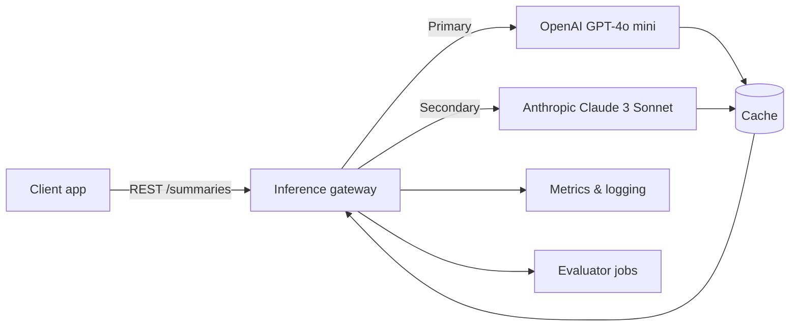

## Summary
Vendor lock-in hurts resilience and negotiating leverage. This example demonstrates how to wrap OpenAI and Anthropic chat APIs behind a consistent contract so you can fail over quickly, compare quality in production, and gradually migrate workloads.

### You’ll learn
- A reference architecture for switching providers without breaking downstream systems
- How to normalize prompts, tools, and metadata across OpenAI and Anthropic clients
- How to add runtime routing rules and fallbacks with observability baked in
- How to run smoke tests and evaluations during a migration window
- How to capture rollout metrics to inform long-term provider strategy

## Scenario
You ship a document summarization service using OpenAI GPT-4o mini. Procurement wants a secondary provider for redundancy and price benchmarking. You need to:

1. Maintain the current API contract to the product team.
2. Allow per-request routing to OpenAI or Anthropic.
3. Collect metrics that compare latency, cost, and quality across providers.
4. Provide a rollback switch if the new provider underperforms.

## Architecture



- **Inference gateway** handles auth, prompt templating, retries, and structured responses.
- **Routing policy** selects a provider based on feature flags, latency SLOs, or customer tier.
- **Cache** stores deterministic summaries so repeated requests skip recompute.
- **Evaluator jobs** replay a canary dataset nightly to compare providers.

## Prompt contract

| Field | Description |
| --- | --- |
| `task` | Short string describing the use case (e.g., `release_notes_summary`). |
| `input` | Raw markdown or text to summarize. |
| `tone` | Optional string: `"formal"`, `"friendly"`, etc. |
| `constraints` | Array of rules (e.g., `"<= 120 words"`, `"cite release ID"`). |
| `metadata` | Trace info: customer ID, experiment flag, request UUID. |

Expected JSON response:

```json
{
  "summary": "…",
  "bullets": ["…"],
  "confidence": 0.78,
  "token_usage": {
    "input": 1024,
    "output": 190
  },
  "provider": "openai|anthropic",
  "request_id": "uuid"
}
```

## Implementation: TypeScript gateway

```ts
import crypto from "node:crypto";
import OpenAI from "openai";
import Anthropic from "@anthropic-ai/sdk";
import { z } from "zod";

const openai = new OpenAI({ apiKey: process.env.OPENAI_API_KEY });
const anthropic = new Anthropic({ apiKey: process.env.ANTHROPIC_API_KEY });

const SummaryRequest = z.object({
  task: z.string(),
  input: z.string(),
  tone: z.string().default("concise"),
  constraints: z.array(z.string()).default([]),
  metadata: z.record(z.string(), z.any()).default({})
});

type SummaryRequest = z.infer<typeof SummaryRequest>;

type Provider = "openai" | "anthropic";

async function callOpenAI(payload: SummaryRequest) {
  const response = await openai.chat.completions.create({
    model: "gpt-4o-mini",
    temperature: 0.3,
    messages: [
      { role: "system", content: "You are a release note summarizer that outputs JSON." },
      {
        role: "user",
        content: `Summarize the following text. Tone: ${payload.tone}. Constraints: ${payload.constraints.join("; ")}.\n\n${payload.input}`
      }
    ],
    response_format: { type: "json_schema", json_schema: {
      name: "summary",
      schema: {
        type: "object",
        properties: {
          summary: { type: "string" },
          bullets: { type: "array", items: { type: "string" }, minItems: 3, maxItems: 3 },
          confidence: { type: "number", minimum: 0, maximum: 1 }
        },
        required: ["summary", "bullets", "confidence"]
      }
    }}
  });

  const message = response.choices[0].message.content;
  if (!message) throw new Error('OpenAI returned no content');
  return {
    data: JSON.parse(message),
    usage: response.usage,
  };
}

async function callAnthropic(payload: SummaryRequest) {
  const response = await anthropic.messages.create({
    model: "claude-3-sonnet-20240229",
    max_output_tokens: 512,
    temperature: 0.3,
    system: "You are a release note summarizer that outputs JSON.",
    messages: [
      {
        role: "user",
        content: `Summarize the following text. Tone: ${payload.tone}. Constraints: ${payload.constraints.join("; ")}.\n\n${payload.input}`
      }
    ],
    response_format: {
      type: "json_schema",
      json_schema: {
        name: "summary",
        schema: {
          type: "object",
          properties: {
            summary: { type: "string" },
            bullets: { type: "array", items: { type: "string" }, minItems: 3, maxItems: 3 },
            confidence: { type: "number", minimum: 0, maximum: 1 }
          },
          required: ["summary", "bullets", "confidence"]
        }
      }
    }
  });

  const content = response.content[0];
  if (content.type !== 'text') throw new Error('Unexpected Anthropic content type');
  return {
    data: JSON.parse(content.text),
    usage: response.usage,
  };
}

export async function summarize(raw: unknown, provider: Provider) {
  const payload = SummaryRequest.parse(raw);
  const requestId = crypto.randomUUID();
  const startedAt = Date.now();

  const call = provider === "anthropic" ? callAnthropic : callOpenAI;
  const result = await call(payload);

  const durationMs = Date.now() - startedAt;
  return {
    summary: result.data.summary,
    bullets: result.data.bullets,
    confidence: result.data.confidence,
    provider,
    request_id: requestId,
    token_usage: result.usage,
    latency_ms: durationMs,
    metadata: payload.metadata
  };
}
```

## Python smoke test harness

```python
import json
import time
from pathlib import Path

from openai import OpenAI
from anthropic import Anthropic

client_openai = OpenAI()
client_anthropic = Anthropic()

def run(provider: str, text: str) -> dict:
    if provider == "openai":
        response = client_openai.chat.completions.create(
            model="gpt-4o-mini",
            temperature=0.3,
            messages=[
                {"role": "system", "content": "You are a release note summarizer that outputs JSON."},
                {"role": "user", "content": text},
            ],
            response_format={
                "type": "json_schema",
                "json_schema": {
                    "name": "summary",
                    "schema": {
                        "type": "object",
                        "properties": {
                            "summary": {"type": "string"},
                            "bullets": {"type": "array", "items": {"type": "string"}},
                            "confidence": {"type": "number"},
                        },
                        "required": ["summary", "bullets", "confidence"],
                    },
                },
            },
        )
        content = response.choices[0].message.content
        usage = response.usage
    else:
        response = client_anthropic.messages.create(
            model="claude-3-sonnet-20240229",
            max_output_tokens=512,
            temperature=0.3,
            system="You are a release note summarizer that outputs JSON.",
            messages=[{"role": "user", "content": text}],
            response_format={
                "type": "json_schema",
                "json_schema": {
                    "name": "summary",
                    "schema": {
                        "type": "object",
                        "properties": {
                            "summary": {"type": "string"},
                            "bullets": {"type": "array", "items": {"type": "string"}},
                            "confidence": {"type": "number"},
                        },
                        "required": ["summary", "bullets", "confidence"],
                    },
                },
            },
        )
        content = response.content[0].text
        usage = response.usage

    return {
        "provider": provider,
        "content": json.loads(content),
        "usage": usage,
    }

if __name__ == "__main__":
    sample = Path("tests/canary.txt").read_text()
    for provider in ["openai", "anthropic"]:
        start = time.perf_counter()
        result = run(provider, sample)
        elapsed = (time.perf_counter() - start) * 1000
        print(json.dumps({
            "provider": provider,
            "latency_ms": round(elapsed, 1),
            "usage": result["usage"],
            "confidence": result["content"]["confidence"],
        }))
```

## Rollout checklist

1. **Shadow mode.** Route 5–10% of traffic to the secondary provider and compare outputs using `/docs/patterns/observability-context.md` dashboards.
2. **Eval gates.** Run nightly regression tests on a golden dataset before flipping the default provider.
3. **Cost audit.** Track token usage and invoice deltas per provider in `/docs/patterns/cost-controls.md` budgets.
4. **Feedback loop.** Capture user-flagged issues and bucket them by provider to inform prompt adjustments.
5. **Runbooks.** Document incident response steps for each provider (rate limits, support escalation).

## References

- OpenAI. “Chat completions API reference.” (2024). <https://platform.openai.com/docs/api-reference/chat>
- Anthropic. “Messages API guide.” (2024). <https://docs.anthropic.com/en/api/messages>
- Microsoft. “Design for resilient AI workloads.” (2024). <https://learn.microsoft.com/azure/architecture/guide/ai/responsible-ai-applications>
