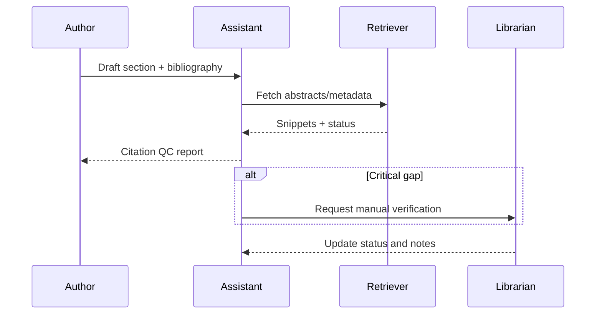

## Why this assistant
Research teams must ensure every claim is backed by credible sources before publication. Manual citation review is tedious and error-prone. An AI citation checker can read draft sections, match statements to provided references, fetch metadata, and flag inconsistencies or missing evidence. Humans retain final judgment while accelerating due diligence.

### You’ll learn
- How to design prompts that align claims with citations and metadata.
- How to use retrieval to fetch abstracts and confirm publication details.
- How to implement Node.js and Python pipelines that surface verification status and follow-up tasks.
- How to evaluate precision/recall on citation matches.
- How to mitigate risks like hallucinated sources or paywalled content.

## Prompt spec
- **Intent**: Analyze research text, map statements to citations, validate availability, and flag unsupported claims.
- **Inputs**: Draft section text, citation list (identifier, title, URL/DOI, year), retrieval snippets (abstracts, key sentences), domain guidelines.
- **Outputs**: JSON with `claim_summaries`, `citation_matches`, `missing_support`, `quality_flags`, `follow_up_actions`, `issues`.
- **Constraints**: Provide direct quotes or snippets for each match; mark DOIs that return errors; highlight paywall or retraction notices.
- **Risks**: Trusting hallucinated references, outdated or retracted studies, inaccessible links. Mitigate with DOI lookups, metadata caches, and human review.
- **Eval hooks**: Compare AI matches to annotated ground truth; monitor false negatives and false positives per claim category.

## Workflow diagram



## Prompt template

```text
You are a research integrity analyst. Verify that claims are supported by the provided citations.

Draft section:
{{draft_text}}

Citations:
{{#each citations}}- {{this.identifier}}: {{this.title}} ({{this.year}}) — {{this.url}}
{{/each}}

Retrieved snippets:
{{retrieved_snippets}}

Guidelines: {{guidelines}}

Return JSON:
{
  "claim_summaries": [{"claim": "", "location": "paragraph/sentence", "strength": "high|medium|low"}],
  "citation_matches": [{"claim": "", "citation_id": "", "evidence_quote": "", "status": "supported|partial|unsupported", "notes": ""}],
  "missing_support": [{"claim": "", "recommended_source_type": ""}],
  "quality_flags": [{"type": "broken-link|retraction|paywall|outdated", "citation_id": "", "details": ""}],
  "follow_up_actions": ["task"],
  "issues": ["uncertainty"]
}
Quote only from retrieved snippets or the draft. Flag any citation missing metadata.
```

## Node.js orchestration

```ts
import OpenAI from "openai";
import { z } from "zod";

const client = new OpenAI({ apiKey: process.env.OPENAI_API_KEY! });

const ClaimSchema = z.object({
  claim: z.string(),
  citation_id: z.string(),
  evidence_quote: z.string(),
  status: z.enum(["supported", "partial", "unsupported"]),
  notes: z.string()
});

const QCResponse = z.object({
  claim_summaries: z.array(z.object({ claim: z.string(), location: z.string(), strength: z.enum(["high", "medium", "low"]) })),
  citation_matches: z.array(ClaimSchema),
  missing_support: z.array(z.object({ claim: z.string(), recommended_source_type: z.string() })),
  quality_flags: z.array(z.object({ type: z.enum(["broken-link", "retraction", "paywall", "outdated"]), citation_id: z.string(), details: z.string() })),
  follow_up_actions: z.array(z.string()),
  issues: z.array(z.string())
});

export async function checkCitations(payload: {
  draft_text: string;
  citations: { identifier: string; title: string; year: string; url: string }[];
  retrieved_snippets: string;
  guidelines: string;
}) {
  const response = await client.responses.create({
    model: "gpt-4.1-mini",
    input: buildPrompt(payload),
    temperature: 0.1,
    max_output_tokens: 900,
    response_format: {
      type: "json_schema",
      json_schema: { name: "citation_check", schema: QCResponse }
    },
    metadata: { feature: "citation_check" }
  });

  const parsed = QCResponse.safeParse(JSON.parse(response.output_text));
  if (!parsed.success) {
    throw new Error(parsed.error.message);
  }
  return parsed.data;
}

function buildPrompt(payload: any) {
  const citationList = payload.citations
    .map((c: any) => `- ${c.identifier}: ${c.title} (${c.year}) — ${c.url}`)
    .join("\n");
  return `You are a research integrity analyst. Verify that claims are supported by the provided citations.\n\nDraft section:\n${payload.draft_text}\n\nCitations:\n${citationList}\n\nRetrieved snippets:\n${payload.retrieved_snippets}\n\nGuidelines: ${payload.guidelines}\n\nReturn JSON as specified.`;
}
```

## Python orchestration

```python
import os
from openai import OpenAI
from pydantic import BaseModel, Field
from typing import List

client = OpenAI(api_key=os.environ["OPENAI_API_KEY"])

class CitationMatch(BaseModel):
    claim: str
    citation_id: str
    evidence_quote: str
    status: str
    notes: str

class QualityFlag(BaseModel):
    type: str
    citation_id: str
    details: str

class CitationQC(BaseModel):
    claim_summaries: List[dict]
    citation_matches: List[CitationMatch]
    missing_support: List[dict]
    quality_flags: List[QualityFlag]
    follow_up_actions: List[str]
    issues: List[str]


def build_prompt(payload: dict) -> str:
    citation_list = "\n".join(
        f"- {item['identifier']}: {item['title']} ({item['year']}) — {item['url']}" for item in payload["citations"]
    )
    return (
        "You are a research integrity analyst. Verify that claims are supported by the provided citations.\n\n"
        f"Draft section:\n{payload['draft_text']}\n\n"
        f"Citations:\n{citation_list}\n\n"
        f"Retrieved snippets:\n{payload['retrieved_snippets']}\n\n"
        f"Guidelines: {payload['guidelines']}\n\n"
        "Return JSON as specified."
    )


def check_citations(payload: dict) -> CitationQC:
    response = client.responses.create(
        model="gpt-4.1-mini",
        input=build_prompt(payload),
        temperature=0.1,
        max_output_tokens=900,
        response_format={
            "type": "json_schema",
            "json_schema": {
                "name": "citation_check",
                "schema": CitationQC.model_json_schema(),
            },
        },
        metadata={"feature": "citation_check"},
    )
    return CitationQC.model_validate_json(response.output_text)
```

## Evaluation hooks
- Build a labelled dataset of claims with known supporting references; compute precision/recall and error types.
- Track how often the assistant flags broken links or retractions and time to resolution.
- Monitor false positives where citations are marked unsupported despite valid evidence.

## Guardrails and operations
- Cache retrieval results and DOI metadata to avoid redundant network calls.
- Respect paywall terms; only fetch accessible metadata and surface manual review for restricted content.
- Provide researchers with a diff view showing claim text and supporting evidence for transparency.
- Require final human approval before updating publication readiness status.

## Deployment checklist
- ✅ Integrate with reference managers (Zotero, Mendeley) for citation metadata sync.
- ✅ Provide UI for librarians to override statuses and add notes.
- ✅ Log all verification actions in a research integrity register.
- ✅ Configure alerts for retractions using Crossref or Retraction Watch feeds.

## References
- Crossref. "REST API documentation." 2024. https://api.crossref.org
- Retraction Watch. "Retraction database." 2024. https://retractionwatch.com/retraction-database/
- OpenAI. "Safety best practices." 2024. https://platform.openai.com/docs/guides/safety-best-practices

## Related reading
- [/docs/patterns/rag-overview.md](/docs/patterns/rag-overview.md)
- [/docs/examples/data-quality-qa.md](/docs/examples/data-quality-qa.md)
- [/docs/evaluations/evidence-checks.md](/docs/evaluations/evidence-checks.md)
