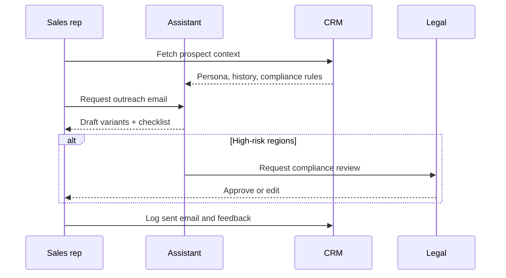

## Why this assistant
Outbound sales teams need tailored messaging that respects regional regulations and brand tone. An AI-powered email drafter can blend CRM insights, prospect pain points, and compliance rules to propose first-touch outreach and follow-up variants. With structured outputs and review loops, reps retain control while accelerating personalization.

### You’ll learn
- How to prompt for persona-aware messaging with grounded context.
- How to enforce compliance guardrails such as unsubscribe language and data usage disclosures.
- How to produce multiple email variants and follow-up suggestions in Node.js and Python.
- How to log performance metrics to iterate on prompt instructions.
- How to integrate with CRM systems while protecting sensitive prospect data.

## Prompt spec
- **Intent**: Draft outreach emails tailored to a prospect persona using CRM notes and product value props, returning variants and follow-up tasks.
- **Inputs**: Prospect name, role, company, region, pain points, product differentiators, compliance requirements, previous interactions, CTA preference.
- **Outputs**: JSON with `primary_email`, `variant_email`, `follow_up_plan`, `cta`, `personalization_sources`, `compliance_checks`, `issues`.
- **Constraints**: Include an unsubscribe or opt-out sentence; reference at least two personalization sources; keep each email under 180 words.
- **Risks**: Over-personalization using sensitive data, inconsistent tone, regulatory violations (e.g., GDPR, CAN-SPAM). Mitigate with compliance checklist and human approval.
- **Eval hooks**: Track open/reply rates by variant, compliance violations, and human edit distance.

## Workflow diagram



## Prompt template

```text
You are a B2B sales development representative. Draft a concise outreach email.

Prospect: {{prospect_name}} ({{prospect_role}}) at {{company}}
Region: {{region}}
Known pain points:
{{#each pain_points}}- {{this}}
{{/each}}
Product differentiators:
{{#each differentiators}}- {{this}}
{{/each}}
Previous interactions: {{previous_touch}}
Required compliance language: {{compliance_requirements}}
Preferred call to action: {{cta_preference}}

Return JSON:
{
  "primary_email": "<=180 word email with greeting, body, closing, opt-out",
  "variant_email": "<=180 word alternative angle",
  "follow_up_plan": [{"day_offset": int, "channel": "email|call|social", "message_hint": ""}],
  "cta": "short CTA phrase",
  "personalization_sources": ["data point"],
  "compliance_checks": [{"rule": "", "present": true|false}],
  "issues": ["missing info"]
}
Ensure opt-out language is explicit. If compliance requirement cannot be met, set present=false and explain in issues.
```

## Node.js orchestration

```ts
import OpenAI from "openai";
import { z } from "zod";

const client = new OpenAI({ apiKey: process.env.OPENAI_API_KEY! });

const EmailSchema = z.object({
  primary_email: z.string().max(1200),
  variant_email: z.string().max(1200),
  follow_up_plan: z.array(z.object({
    day_offset: z.number().int().min(1).max(14),
    channel: z.enum(["email", "call", "social"]),
    message_hint: z.string().max(160)
  })).max(4),
  cta: z.string().max(120),
  personalization_sources: z.array(z.string()).min(2).max(6),
  compliance_checks: z.array(z.object({
    rule: z.string(),
    present: z.boolean()
  })).max(5),
  issues: z.array(z.string()).max(5)
});

export async function draftSalesEmail(payload: {
  prospect_name: string;
  prospect_role: string;
  company: string;
  region: string;
  pain_points: string[];
  differentiators: string[];
  previous_touch: string;
  compliance_requirements: string;
  cta_preference: string;
}) {
  const response = await client.responses.create({
    model: "gpt-4.1-mini",
    input: buildPrompt(payload),
    temperature: 0.6,
    max_output_tokens: 800,
    response_format: {
      type: "json_schema",
      json_schema: { name: "sales_email", schema: EmailSchema }
    },
    metadata: { feature: "sales_outreach" }
  });

  const parsed = EmailSchema.safeParse(JSON.parse(response.output_text));
  if (!parsed.success) {
    throw new Error(parsed.error.message);
  }

  return parsed.data;
}

function buildPrompt(payload: any) {
  const pains = payload.pain_points.map((point: string) => `- ${point}`).join("\n");
  const diffs = payload.differentiators.map((point: string) => `- ${point}`).join("\n");
  return `You are a B2B sales development representative. Draft a concise outreach email.\n\nProspect: ${payload.prospect_name} (${payload.prospect_role}) at ${payload.company}\nRegion: ${payload.region}\nKnown pain points:\n${pains}\nProduct differentiators:\n${diffs}\nPrevious interactions: ${payload.previous_touch}\nRequired compliance language: ${payload.compliance_requirements}\nPreferred call to action: ${payload.cta_preference}\n\nReturn JSON as specified.`;
}
```

## Python orchestration

```python
import os
from openai import OpenAI
from pydantic import BaseModel, Field
from typing import List

client = OpenAI(api_key=os.environ["OPENAI_API_KEY"])

class FollowUp(BaseModel):
    day_offset: int = Field(ge=1, le=14)
    channel: str
    message_hint: str = Field(max_length=160)

class SalesEmail(BaseModel):
    primary_email: str = Field(max_length=1200)
    variant_email: str = Field(max_length=1200)
    follow_up_plan: List[FollowUp]
    cta: str = Field(max_length=120)
    personalization_sources: List[str]
    compliance_checks: List[dict]
    issues: List[str]


def build_prompt(payload: dict) -> str:
    pains = "\n".join(f"- {p}" for p in payload["pain_points"])
    diffs = "\n".join(f"- {d}" for d in payload["differentiators"])
    return (
        "You are a B2B sales development representative. Draft a concise outreach email.\n\n"
        f"Prospect: {payload['prospect_name']} ({payload['prospect_role']}) at {payload['company']}\n"
        f"Region: {payload['region']}\n"
        f"Known pain points:\n{pains}\n"
        f"Product differentiators:\n{diffs}\n"
        f"Previous interactions: {payload['previous_touch']}\n"
        f"Required compliance language: {payload['compliance_requirements']}\n"
        f"Preferred call to action: {payload['cta_preference']}\n\n"
        "Return JSON as specified."
    )


def draft_sales_email(payload: dict) -> SalesEmail:
    response = client.responses.create(
        model="gpt-4.1-mini",
        input=build_prompt(payload),
        temperature=0.6,
        max_output_tokens=800,
        response_format={
            "type": "json_schema",
            "json_schema": {
                "name": "sales_email",
                "schema": SalesEmail.model_json_schema(),
            },
        },
        metadata={"feature": "sales_outreach"},
    )
    return SalesEmail.model_validate_json(response.output_text)
```

## Evaluation hooks
- Compare open and reply rates across generated variants using CRM analytics.
- Run automated compliance scans for required opt-out phrases before emails are sent.
- Collect human edit summaries to adjust prompts and follow-up cadences.

## Guardrails and operations
- Limit personalization inputs to consented CRM fields; exclude sensitive demographics.
- Provide a manual approval UI before emails are dispatched.
- Localize compliance language based on region (e.g., GDPR, CASL) and track audit logs.
- Rotate product differentiators to avoid repetitive messaging and spam filters.

## Deployment checklist
- ✅ Sync CRM contacts and opportunity context with least privilege access.
- ✅ Add rate limiting to avoid spamming prospects.
- ✅ Implement webhook to update CRM with sent status and human edits.
- ✅ Educate reps on reviewing AI drafts and logging manual tweaks.

## References
- CAN-SPAM Act. "A compliance guide for business." Federal Trade Commission, 2009. https://www.ftc.gov/business-guidance/resources/can-spam-act-compliance-guide-business
- European Commission. "GDPR guidelines for direct marketing." 2023. https://commission.europa.eu/law/law-topic/data-protection/guidance-and-cases/gdpr-guidelines-direct-marketing_en
- OpenAI. "Prompt engineering for marketing." 2024. https://platform.openai.com/docs/guides/prompt-engineering

## Related reading
- [/docs/examples/content-drafter.md](/docs/examples/content-drafter.md)
- [/docs/safety/compliance-disclosure.md](/docs/safety/compliance-disclosure.md)
- [/docs/concepts/prompting-styles.md](/docs/concepts/prompting-styles.md)
