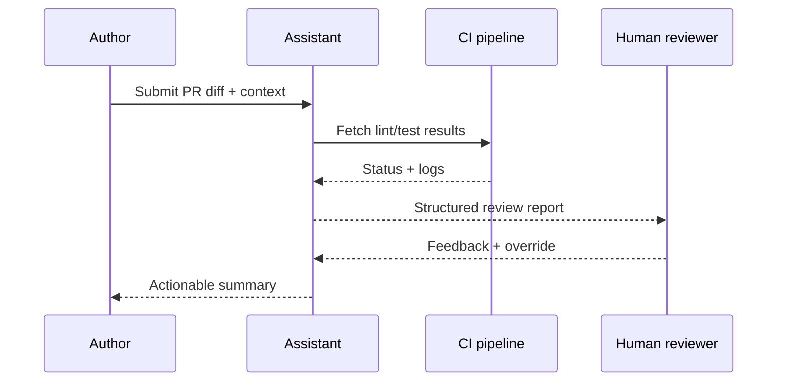

## Why this assistant
Engineering teams want faster feedback on pull requests without skipping human judgment. An AI code reviewer can summarize changes, highlight risky areas, suggest tests, and cross-reference style guides. By combining LLM analysis with static checks, teams reduce review latency while keeping final approvals with engineers.

### You’ll learn
- How to design prompts that map diffs to risk-focused feedback.
- How to integrate lint/test results and repository metadata into prompts.
- How to run Node.js and Python reviewers with schema validation and rate limiting.
- How to log reviewer quality metrics and prevent rubber-stamping.
- How to implement guardrails to avoid leaking secrets or approving insecure code.

## Prompt spec
- **Intent**: Analyze pull request diffs, summarize key changes, highlight risks, suggest tests, and flag policy violations.
- **Inputs**: Diff chunks, file metadata, repository guidelines, test coverage report, static analysis findings, issue/ticket summary.
- **Outputs**: JSON with `summary`, `risk_assessment`, `test_suggestions`, `policy_flags`, `review_decision`, `questions`, `issues`.
- **Constraints**: Provide at least one risk note per touched subsystem; default `review_decision` to `needs_review` unless confidence ≥0.8 and no policy flags.
- **Risks**: Missing subtle bugs, leaking secrets from code, over-trusting AI suggestions. Mitigate with static checks, human approvals, and audit logs.
- **Eval hooks**: Compare AI review findings against human reviewer comments; track false negatives and false positives.

## Workflow diagram



## Prompt template

```text
You are a senior software reviewer. Analyze the pull request diff and provide actionable feedback.

Repository guidelines:
{{repository_guidelines}}
Open issue summary: {{issue_summary}}
Static analysis findings:
{{#each static_findings}}- {{this}}
{{/each}}
Test coverage report: {{coverage_summary}}

Diff:
{{diff_text}}

Return JSON:
{
  "summary": "<=120 word recap of intent and major files",
  "risk_assessment": [{"area": "", "risk": "", "confidence": 0-1 float, "evidence": ""}],
  "test_suggestions": ["specific test case"],
  "policy_flags": [{"rule": "", "description": "", "severity": "info|warn|block"}],
  "review_decision": "approve|needs_review|block",
  "questions": ["clarifying question"],
  "issues": ["missing data"]
}
Default review_decision to needs_review unless risks are low and no policy flags remain. Never expose secrets from the diff.
```

## Node.js orchestration

```ts
import OpenAI from "openai";
import { z } from "zod";

const client = new OpenAI({ apiKey: process.env.OPENAI_API_KEY! });

const ReviewSchema = z.object({
  summary: z.string().max(600),
  risk_assessment: z.array(z.object({
    area: z.string(),
    risk: z.string(),
    confidence: z.number().min(0).max(1),
    evidence: z.string()
  })).max(10),
  test_suggestions: z.array(z.string()).max(10),
  policy_flags: z.array(z.object({ rule: z.string(), description: z.string(), severity: z.enum(["info", "warn", "block"]) })),
  review_decision: z.enum(["approve", "needs_review", "block"]),
  questions: z.array(z.string()).max(5),
  issues: z.array(z.string()).max(5)
});

export async function reviewPullRequest(payload: {
  repository_guidelines: string;
  issue_summary: string;
  static_findings: string[];
  coverage_summary: string;
  diff_text: string;
}) {
  const response = await client.responses.create({
    model: "gpt-4.1-mini",
    input: buildPrompt(payload),
    temperature: 0.2,
    max_output_tokens: 900,
    response_format: {
      type: "json_schema",
      json_schema: { name: "code_review", schema: ReviewSchema }
    },
    metadata: { feature: "code_review" }
  });

  const parsed = ReviewSchema.safeParse(JSON.parse(response.output_text));
  if (!parsed.success) {
    throw new Error(parsed.error.message);
  }

  return parsed.data;
}

function buildPrompt(payload: any) {
  const staticList = payload.static_findings.map((finding: string) => `- ${finding}`).join("\n");
  return `You are a senior software reviewer. Analyze the pull request diff and provide actionable feedback.\n\nRepository guidelines:\n${payload.repository_guidelines}\nOpen issue summary: ${payload.issue_summary}\nStatic analysis findings:\n${staticList}\nTest coverage report: ${payload.coverage_summary}\n\nDiff:\n${payload.diff_text}\n\nReturn JSON as specified.`;
}
```

## Python orchestration

```python
import os
from openai import OpenAI
from pydantic import BaseModel, Field
from typing import List

client = OpenAI(api_key=os.environ["OPENAI_API_KEY"])

class RiskItem(BaseModel):
    area: str
    risk: str
    confidence: float = Field(ge=0.0, le=1.0)
    evidence: str

class PolicyFlag(BaseModel):
    rule: str
    description: str
    severity: str

class Review(BaseModel):
    summary: str = Field(max_length=600)
    risk_assessment: List[RiskItem]
    test_suggestions: List[str]
    policy_flags: List[PolicyFlag]
    review_decision: str
    questions: List[str]
    issues: List[str]


def build_prompt(payload: dict) -> str:
    static_lines = "\n".join(f"- {item}" for item in payload["static_findings"])
    return (
        "You are a senior software reviewer. Analyze the pull request diff and provide actionable feedback.\n\n"
        f"Repository guidelines:\n{payload['repository_guidelines']}\n"
        f"Open issue summary: {payload['issue_summary']}\n"
        f"Static analysis findings:\n{static_lines}\n"
        f"Test coverage report: {payload['coverage_summary']}\n\n"
        f"Diff:\n{payload['diff_text']}\n\n"
        "Return JSON as specified."
    )


def review_pull_request(payload: dict) -> Review:
    response = client.responses.create(
        model="gpt-4.1-mini",
        input=build_prompt(payload),
        temperature=0.2,
        max_output_tokens=900,
        response_format={
            "type": "json_schema",
            "json_schema": {
                "name": "code_review",
                "schema": Review.model_json_schema(),
            },
        },
        metadata={"feature": "code_review"},
    )
    return Review.model_validate_json(response.output_text)
```

## Evaluation hooks
- Compare AI-generated risk notes to human reviewer comments to estimate recall on high-severity issues.
- Track whether suggested tests catch defects by linking to CI failures post-merge.
- Monitor approval decisions; ensure the assistant rarely auto-approves without human oversight.

## Guardrails and operations
- Limit diff size; fallback to targeted file analysis for large PRs.
- Strip secrets, tokens, and credentials from prompts.
- Log AI feedback and human overrides to refine prompts.
- Provide reviewers with a “reject suggestions” control to avoid automation bias.

## Deployment checklist
- ✅ Integrate with GitHub/GitLab webhooks to trigger reviews on demand.
- ✅ Cache static analysis and coverage summaries to reduce token usage.
- ✅ Provide IDE/PR comments linking to specific code lines.
- ✅ Set thresholds for auto-labeling (e.g., `needs-tests`, `security-review`).

## References
- GitHub. "Building AI-assisted code reviews responsibly." 2024. https://github.blog/ai-and-ml/building-ai-assisted-code-reviews-responsibly/
- Microsoft. "Responsible AI in engineering workflows." 2024. https://learn.microsoft.com/azure/architecture/example-scenario/ai/responsible-engineering-ai
- OpenAI. "Safety best practices." 2024. https://platform.openai.com/docs/guides/safety-best-practices

## Related reading
- [/docs/examples/provider-switching.md](/docs/examples/provider-switching.md)
- [/docs/patterns/tool-use.md](/docs/patterns/tool-use.md)
- [/docs/evaluations/automation-benchmarks.md](/docs/evaluations/automation-benchmarks.md)
