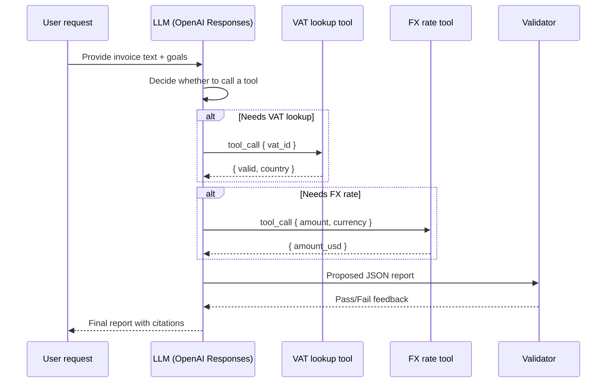

## Summary
Toolformer showed that LLMs can learn when to call external APIs during generation rather than relying on hand-authored rules. This example builds a lightweight variant: a document extraction agent that drafts answers, selectively invokes tools for entity lookup or normalization, and returns a structured JSON report. The pattern keeps costs in check and avoids unnecessary API calls.

### You’ll learn
- How to design prompts that encourage tool calls only when confidence is low.
- How to implement a streaming controller in Node.js and Python that feeds tool results back into the model.
- How to validate structured outputs and track cost/latency impacts of each tool decision.
- How to evaluate the agent with golden documents, synthetic noise, and fault injection.
- How to extend the pattern to planner–executor agents or retrieval pipelines.

## Use case
You receive semi-structured invoices from vendors and need to extract supplier metadata, invoice totals, and compliance checks. A baseline LLM often hallucinates tax IDs or currency conversions. By allowing the model to call specialized tools—such as a VAT lookup API or currency normalizer—it can confirm details before responding. The final output is a JSON report consumed by downstream finance dashboards.

## Architecture


## Prompt spec (planner/extractor combined)
- **Intent:** Extract supplier info, totals, and compliance warnings from semi-structured documents.
- **Inputs:** Document text (chunked), document metadata (language, currency), tool descriptions, JSON schema, last validator response.
- **Outputs:** JSON with `supplier`, `financials`, `compliance`, `tool_calls`, and `confidence`.
- **Policies:** Call tools only when the document lacks explicit data or values need normalization; cite the paragraph or tool response for every field.
- **Risks:** Over-calling tools (cost), hallucinating tool outputs, missing citations. Mitigate with validation and feedback loops.【F:docs/patterns/tools/function-calling.md†L35-L176】

## Tool definitions
```ts
export const tools = [
  {
    type: "function" as const,
    function: {
      name: "vat_lookup",
      description: "Validate an EU VAT ID and return registration details.",
      parameters: {
        type: "object",
        properties: {
          vat_id: { type: "string", pattern: "^[A-Z0-9]{8,12}$" },
          country_hint: { type: "string" }
        },
        required: ["vat_id"],
        additionalProperties: false
      }
    }
  },
  {
    type: "function" as const,
    function: {
      name: "fx_normalizer",
      description: "Convert an amount to USD using the latest daily rate.",
      parameters: {
        type: "object",
        properties: {
          amount: { type: "number" },
          currency: { type: "string", minLength: 3, maxLength: 3 },
          invoice_date: { type: "string", format: "date" }
        },
        required: ["amount", "currency"],
        additionalProperties: false
      }
    }
  }
];
```
Document the expected latency, retry policy, and failure codes for each tool in `/docs/patterns/specs/tool-spec-template.md`.

## Node.js controller
```ts
import OpenAI from "openai";
import { z } from "zod";
import { tools } from "./tools.js";

const client = new OpenAI({ apiKey: process.env.OPENAI_API_KEY! });

const reportSchema = z.object({
  supplier: z.object({
    name: z.string(),
    vat_id: z.string().optional(),
    vat_verified: z.boolean(),
    country: z.string().optional(),
    source: z.string(),
  }),
  financials: z.object({
    amount_original: z.object({ value: z.number(), currency: z.string() }),
    amount_usd: z.number().optional(),
    fx_source: z.string().optional(),
    source: z.string(),
  }),
  compliance: z.array(
    z.object({
      flag: z.string(),
      severity: z.enum(["low", "medium", "high"]),
      rationale: z.string(),
      source: z.string(),
    })
  ),
  tool_calls: z.array(
    z.object({ name: z.string(), arguments: z.record(z.unknown()) })
  ),
  confidence: z.number().min(0).max(1),
});

const reportJsonSchema = {
  type: "object",
  properties: {
    supplier: {
      type: "object",
      properties: {
        name: { type: "string" },
        vat_id: { type: "string" },
        vat_verified: { type: "boolean" },
        country: { type: "string" },
        source: { type: "string" },
      },
      required: ["name", "vat_verified", "source"],
      additionalProperties: false,
    },
    financials: {
      type: "object",
      properties: {
        amount_original: {
          type: "object",
          properties: {
            value: { type: "number" },
            currency: { type: "string" },
          },
          required: ["value", "currency"],
          additionalProperties: false,
        },
        amount_usd: { type: "number" },
        fx_source: { type: "string" },
        source: { type: "string" },
      },
      required: ["amount_original", "source"],
      additionalProperties: false,
    },
    compliance: {
      type: "array",
      items: {
        type: "object",
        properties: {
          flag: { type: "string" },
          severity: { type: "string", enum: ["low", "medium", "high"] },
          rationale: { type: "string" },
          source: { type: "string" },
        },
        required: ["flag", "severity", "rationale", "source"],
        additionalProperties: false,
      },
    },
    tool_calls: {
      type: "array",
      items: {
        type: "object",
        properties: {
          name: { type: "string" },
          arguments: { type: "object" },
        },
        required: ["name", "arguments"],
        additionalProperties: false,
      },
    },
    confidence: { type: "number", minimum: 0, maximum: 1 },
  },
  required: ["supplier", "financials", "compliance", "tool_calls", "confidence"],
  additionalProperties: false,
};

export async function extractInvoice({ document, metadata }) {
  const messages = [
    {
      role: "system",
      content:
        "You extract invoice data. Use tools only when the document lacks explicit values. Cite paragraphs (P1, P2, ...) or tool responses.",
    },
    {
      role: "user",
      content: JSON.stringify({ document, metadata }),
    },
  ];

  const stream = await client.responses.stream({
    model: "gpt-4o-mini",
    input: messages,
    tools,
    response_format: {
      type: "json_schema",
      json_schema: {
        name: "invoice_report",
        schema: reportJsonSchema,
      },
    },
    max_output_tokens: 800,
  });

  const toolCalls = [];

  for await (const event of stream) {
    if (event.type === "response.error") throw new Error(event.error.message);
    if (event.type !== "response.tool_call") continue;

    const payload = JSON.parse(event.arguments);
    const toolResult = await executeTool(event.name, payload);
    toolCalls.push({ name: event.name, arguments: payload, result: toolResult });

    await stream.send({
      type: "tool_result",
      tool_call_id: event.id,
      output: JSON.stringify(toolResult),
    });
  }

  const final = await stream.final_response;
  const report = reportSchema.parse(JSON.parse(final.output_text));
  return { report, toolCalls, usage: final.usage };
}
```
`executeTool` should enforce retries, timeouts, and structured error returns so the model can reason about failures.【F:docs/patterns/tools/function-calling.md†L135-L176】

## Python controller
```python
import json
from typing import Any, Dict

from typing import Literal

from openai import OpenAI
from pydantic import BaseModel, ValidationError

from tools import TOOLS, execute_tool

client = OpenAI()

class ComplianceFlag(BaseModel):
    flag: str
    severity: Literal["low", "medium", "high"]
    rationale: str
    source: str

class InvoiceReport(BaseModel):
    supplier: Dict[str, Any]
    financials: Dict[str, Any]
    compliance: list[ComplianceFlag]
    tool_calls: list[Dict[str, Any]]
    confidence: float


def extract_invoice(document: Dict[str, Any], metadata: Dict[str, Any]):
    messages = [
        {
            "role": "system",
            "content": "Extract invoice data, using tools sparingly and citing document paragraphs.",
        },
        {"role": "user", "content": json.dumps({"document": document, "metadata": metadata})},
    ]

    response = client.responses.create(
        model="gpt-4.1-mini",
        input=messages,
        tools=TOOLS,
        response_format={
            "type": "json_schema",
            "json_schema": {
                "name": "invoice_report",
                "schema": InvoiceReport.model_json_schema(),
            },
        },
        max_output_tokens=900,
    )

    tool_calls = []
    for output in response.output:
        if output.type != "tool_call":
            continue
        payload = json.loads(output.arguments)
        result = execute_tool(output.name, payload)
        tool_calls.append({"name": output.name, "arguments": payload, "result": result})

    try:
        report = InvoiceReport.model_validate_json(response.output_text)
    except ValidationError as exc:
        raise ValueError({"error": "invalid_report", "details": exc.errors()}) from exc

    return {"report": report.model_dump(), "tool_calls": tool_calls, "usage": response.usage}
```

## Evaluation strategy
- **Golden set:** Collect 30+ invoices with verified fields. Compare agent output to ground truth and track precision/recall per field.
- **Budget tests:** Replay transcripts with forced tool failures to confirm the agent escalates or returns partial answers gracefully.
- **Cost audits:** Log tokens and tool latency; alert when tool invocation rate exceeds thresholds.
- **Human review:** Sample 10% of outputs weekly for manual inspection. Capture false positives in compliance flags and feed back into the prompt.
- **Regression CI:** Wire `/tools/eval/run.js` (or similar harness) to run nightly with new documents and synthetic noise (extra whitespace, OCR errors).

## Extensions
- Plug into a planner–executor agent where the planner decides whether to summarize, extract, or escalate the invoice.
- Add retrieval hooks to fetch supplier history or past invoices for comparison.
- Integrate a confidence-based router that falls back to deterministic rules when the model is uncertain.
- Stream partial results to reviewers for real-time correction and loop them back as additional context.

## References
- Schick et al. “Toolformer: Language Models Can Teach Themselves to Use Tools.” (Meta AI, 2023). <https://arxiv.org/abs/2302.04761>
- OpenAI. “Function calling and tool use.” (2024). <https://platform.openai.com/docs/guides/function-calling>
- Anthropic. “Build with Claude tool use.” (2024). <https://docs.anthropic.com/en/docs/build-with-claude/tool-use>
- European Commission. “VAT Information Exchange System (VIES).” (2024). <https://taxation-customs.ec.europa.eu/online-services/validation-vat-identification-numbers_en>

## Cross-links
- Tool schema guardrails: [/docs/patterns/tools/function-calling.md](/docs/patterns/tools/function-calling.md)
- Planner–executor orchestration: [/docs/patterns/agentic/planner-executor.md](/docs/patterns/agentic/planner-executor.md)
- Compliance flag evaluation rubrics: [/docs/evaluations/tool-use-evals.md](/docs/evaluations/tool-use-evals.md)
- Data quality agent: [/docs/examples/data-quality-qa.md](/docs/examples/data-quality-qa.md)
