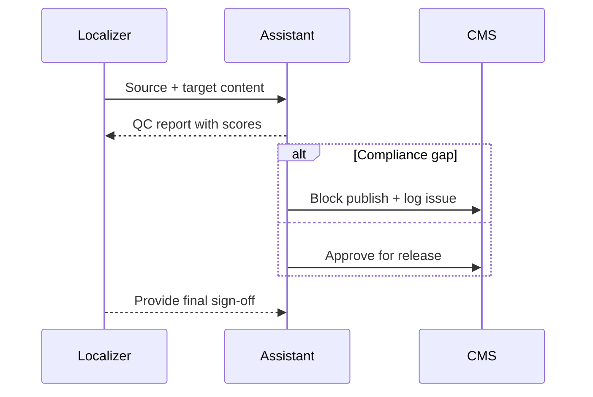

## Why this assistant
Localization teams need to ensure translated content preserves meaning, tone, and compliance disclaimers. Manual review is time-consuming, especially across multiple languages. An AI quality checker can compare source and target texts, detect terminology drift, and confirm required disclaimers, speeding up publication while keeping human linguists in control.

### You’ll learn
- How to prompt for bilingual evaluation with terminology and tone guidance.
- How to produce structured quality reports for translators and reviewers.
- How to run Node.js and Python pipelines with multi-language safety checks.
- How to track quality metrics like accuracy, fluency, and compliance coverage.
- How to handle region-specific regulatory content (e.g., pharmaceutical disclaimers).

## Prompt spec
- **Intent**: Compare source and translated text, score quality dimensions, flag terminology issues, and confirm required disclaimers.
- **Inputs**: Source text, target text, glossary terms, tone guidelines, regulatory requirements, locale metadata.
- **Outputs**: JSON with `overall_rating`, `dimension_scores` (accuracy, fluency, terminology, tone, compliance), `terminology_notes`, `missing_content`, `suggested_fixes`, `disclaimer_check`, `issues`.
- **Constraints**: Provide evidence quotes for each critical issue; support multi-sentence comparisons; mark compliance failures explicitly.
- **Risks**: Hallucinated glossary matches, cultural misinterpretations, missing mandatory disclaimers. Mitigate with curated glossaries and human review.
- **Eval hooks**: Use bilingual QA datasets to benchmark accuracy; track false negatives on compliance checks.

## Workflow diagram



## Prompt template

```text
You are a bilingual localization reviewer. Evaluate the translation for fidelity, tone, and compliance.

Source ({{source_locale}}):
{{source_text}}

Target ({{target_locale}}):
{{target_text}}

Glossary terms:
{{#each glossary}}- {{this}}
{{/each}}
Tone guidance: {{tone_notes}}
Regulatory requirements: {{regulatory_notes}}

Return JSON:
{
  "overall_rating": "excellent|good|fair|poor",
  "dimension_scores": {
    "accuracy": 1-5,
    "fluency": 1-5,
    "terminology": 1-5,
    "tone": 1-5,
    "compliance": 1-5
  },
  "terminology_notes": [{"term": "", "status": "correct|incorrect|missing", "evidence": ""}],
  "missing_content": ["description"],
  "suggested_fixes": ["actionable rewrite"],
  "disclaimer_check": {
    "required": ["disclaimer"],
    "present": ["disclaimer"],
    "missing": ["disclaimer"],
    "severity": "info|warn|block"
  },
  "issues": ["uncertainty"]
}
Provide evidence quotes in the target language where appropriate.
```

## Node.js orchestration

```ts
import OpenAI from "openai";
import { z } from "zod";

const client = new OpenAI({ apiKey: process.env.OPENAI_API_KEY! });

const QCReport = z.object({
  overall_rating: z.enum(["excellent", "good", "fair", "poor"]),
  dimension_scores: z.object({
    accuracy: z.number().int().min(1).max(5),
    fluency: z.number().int().min(1).max(5),
    terminology: z.number().int().min(1).max(5),
    tone: z.number().int().min(1).max(5),
    compliance: z.number().int().min(1).max(5)
  }),
  terminology_notes: z.array(z.object({ term: z.string(), status: z.enum(["correct", "incorrect", "missing"]), evidence: z.string() })),
  missing_content: z.array(z.string()),
  suggested_fixes: z.array(z.string()),
  disclaimer_check: z.object({
    required: z.array(z.string()),
    present: z.array(z.string()),
    missing: z.array(z.string()),
    severity: z.enum(["info", "warn", "block"])
  }),
  issues: z.array(z.string())
});

export async function qualityCheckTranslation(payload: {
  source_locale: string;
  target_locale: string;
  source_text: string;
  target_text: string;
  glossary: string[];
  tone_notes: string;
  regulatory_notes: string;
}) {
  const response = await client.responses.create({
    model: "gpt-4.1-mini",
    input: buildPrompt(payload),
    temperature: 0.2,
    max_output_tokens: 800,
    response_format: {
      type: "json_schema",
      json_schema: { name: "translation_qc", schema: QCReport }
    },
    metadata: { feature: "translation_qc" }
  });

  const parsed = QCReport.safeParse(JSON.parse(response.output_text));
  if (!parsed.success) {
    throw new Error(parsed.error.message);
  }

  return parsed.data;
}

function buildPrompt(payload: any) {
  const glossary = payload.glossary.map((term: string) => `- ${term}`).join("\n");
  return `You are a bilingual localization reviewer. Evaluate the translation for fidelity, tone, and compliance.\n\nSource (${payload.source_locale}):\n${payload.source_text}\n\nTarget (${payload.target_locale}):\n${payload.target_text}\n\nGlossary terms:\n${glossary}\nTone guidance: ${payload.tone_notes}\nRegulatory requirements: ${payload.regulatory_notes}\n\nReturn JSON as specified.`;
}
```

## Python orchestration

```python
import os
from openai import OpenAI
from pydantic import BaseModel, Field
from typing import List

client = OpenAI(api_key=os.environ["OPENAI_API_KEY"])

class DimensionScores(BaseModel):
    accuracy: int = Field(ge=1, le=5)
    fluency: int = Field(ge=1, le=5)
    terminology: int = Field(ge=1, le=5)
    tone: int = Field(ge=1, le=5)
    compliance: int = Field(ge=1, le=5)

class TerminologyNote(BaseModel):
    term: str
    status: str
    evidence: str

class DisclaimerCheck(BaseModel):
    required: List[str]
    present: List[str]
    missing: List[str]
    severity: str

class QCReportModel(BaseModel):
    overall_rating: str
    dimension_scores: DimensionScores
    terminology_notes: List[TerminologyNote]
    missing_content: List[str]
    suggested_fixes: List[str]
    disclaimer_check: DisclaimerCheck
    issues: List[str]


def build_prompt(payload: dict) -> str:
    glossary = "\n".join(f"- {term}" for term in payload["glossary"])
    return (
        "You are a bilingual localization reviewer. Evaluate the translation for fidelity, tone, and compliance.\n\n"
        f"Source ({payload['source_locale']}):\n{payload['source_text']}\n\n"
        f"Target ({payload['target_locale']}):\n{payload['target_text']}\n\n"
        f"Glossary terms:\n{glossary}\n"
        f"Tone guidance: {payload['tone_notes']}\n"
        f"Regulatory requirements: {payload['regulatory_notes']}\n\n"
        "Return JSON as specified."
    )


def quality_check_translation(payload: dict) -> QCReportModel:
    response = client.responses.create(
        model="gpt-4.1-mini",
        input=build_prompt(payload),
        temperature=0.2,
        max_output_tokens=800,
        response_format={
            "type": "json_schema",
            "json_schema": {
                "name": "translation_qc",
                "schema": QCReportModel.model_json_schema(),
            },
        },
        metadata={"feature": "translation_qc"},
    )
    return QCReportModel.model_validate_json(response.output_text)
```

## Evaluation hooks
- Maintain bilingual reference sets with human QA ratings; compare model scores to human consensus.
- Monitor compliance misses by region and escalate to legal/compliance teams.
- Track resolution time for issues flagged by the assistant vs. manual reviews.

## Guardrails and operations
- Limit glossary to verified terms for each locale; update when terminology changes.
- Require human linguist approval for final publish decisions.
- Mask personal data and avoid sending regulated content to providers without appropriate agreements.
- Store QC reports alongside CMS entries for auditability.

## Deployment checklist
- ✅ Integrate with translation management systems (e.g., Smartling, Lokalise) via API.
- ✅ Support fallback to human-only review when latency or confidence thresholds fail.
- ✅ Provide dashboards for quality metrics and recurring terminology issues.
- ✅ Implement retry and throttling controls for high-volume localization cycles.

## References
- TAUS. "Quality Evaluation Best Practices." 2023. https://www.taus.net/think-tank/reports/quality-evaluation-best-practices
- European Medicines Agency. "Guideline on multilingual product information." 2024. https://www.ema.europa.eu/en/human-regulatory/marketing-authorisation/product-information
- OpenAI. "Structured outputs." 2025. https://platform.openai.com/docs/guides/structured-outputs

## Related reading
- [/docs/examples/content-drafter.md](/docs/examples/content-drafter.md)
- [/docs/concepts/structured-outputs.md](/docs/concepts/structured-outputs.md)
- [/docs/safety/compliance-disclosure.md](/docs/safety/compliance-disclosure.md)
