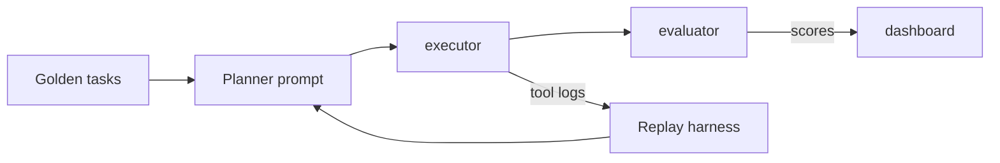

## Summary
The planner–executor pattern splits an agent into two cooperating roles: a planner that decomposes work into steps and an executor that performs each step with tools or prompts. The separation keeps reasoning transparent, enforces budgets, and lets you swap execution strategies without retraining the planner. Use this guide to design prompts, state stores, guardrails, and evaluation hooks for reliable multi-step automation.

### You’ll learn
- How to tell whether a use case needs planning or a simpler single-call prompt.
- How to structure planner state, memory, and budget controls.
- How to implement the loop with Node.js and Python using OpenAI Responses and Anthropic Messages.
- How to log intermediate steps and evaluate success/failure rigorously.
- How to extend the pattern with human review, caching, and fallback automation.

## When to prefer planner–executor agents
- **Ambiguous tasks:** The user request requires decomposition (e.g., “Draft a release note and notify impacted teams”).
- **Multiple tools:** You have several APIs or workflows and want the LLM to decide which to call.
- **Explainability:** Stakeholders need visibility into reasoning steps before approval.
- **Iterative improvement:** You expect the agent to reflect on partial results and adapt plans.

Stay with single prompts or deterministic workflows when the task is linear, latency-sensitive, or must be perfectly reproducible.

## Architecture blueprint
| Component | Responsibilities | Guardrails |
| --- | --- | --- |
| **Planner prompt** | Interpret goals, produce ordered steps, and track remaining budget. | Limit maximum steps, include stop conditions, embed policy reminders. |
| **Shared state store** | Persist plan, tool responses, evaluator scores, user clarifications. | Redact PII, expire after SLA, include versioning for replay. |
| **Executor** | Perform the current step via tool calls or focused prompts. | Validate tool schemas, enforce per-step timeouts, attach confidence scores. |
| **Critic/evaluator (optional)** | Score intermediate outputs before the next iteration. | Run deterministic checks (linting, schema validation, rubric scoring). |
| **Supervisor** | Decide whether to continue, escalate, or stop. | Enforce token/latency budgets, human escalation triggers. |

## Planner prompt spec
- **Inputs:** Task description, constraints, available tools, current step number, remaining budget, history of prior steps.
- **Outputs:** JSON object with `thought`, `next_step`, `tool`, `arguments`, `stop` (boolean), and `confidence`.
- **Policies:** Planner must stop when steps exceed `MAX_STEPS`, when confidence drops below threshold, or when evaluator reports `fail`.
- **Risks:** Planner loops endlessly, chooses forbidden tools, or ignores evaluator warnings. Mitigate with validation and explicit refusal examples in the prompt.【F:docs/concepts/genai-vs-agentic.md†L66-L114】

## Execution loop (Node.js)
```ts
import OpenAI from "openai";
import { z } from "zod";
import { tools } from "./tools.js"; // Same schema objects used in other patterns

const client = new OpenAI({ apiKey: process.env.OPENAI_API_KEY! });

const plannerSchema = z.object({
  thought: z.string(),
  next_step: z.string(),
  tool: z.string(),
  arguments: z.record(z.unknown()),
  stop: z.boolean(),
  confidence: z.number().min(0).max(1),
});

const plannerJsonSchema = {
  type: "object",
  properties: {
    thought: { type: "string" },
    next_step: { type: "string" },
    tool: { type: "string" },
    arguments: { type: "object" },
    stop: { type: "boolean" },
    confidence: { type: "number", minimum: 0, maximum: 1 },
  },
  required: ["thought", "next_step", "tool", "arguments", "stop", "confidence"],
  additionalProperties: false,
};

export async function runPlannerExecutor(task) {
  const transcript = [];
  let remainingSteps = 6;
  let context = [];

  while (remainingSteps > 0) {
    const planner = await client.responses.create({
      model: "gpt-4o-mini",
      input: [
        {
          role: "system",
          content: `You are a planner. Decide the next step. Remaining steps: ${remainingSteps}. Stop when done or unclear.`,
        },
        {
          role: "user",
          content: JSON.stringify({ task, context, tools: tools.map((t) => t.function?.name ?? t.name) }),
        },
      ],
      response_format: {
        type: "json_schema",
        json_schema: { name: "planner_step", schema: plannerJsonSchema },
      },
      max_output_tokens: 400,
      metadata: { feature: "planner-executor" },
    });

    const plan = plannerSchema.parse(JSON.parse(planner.output_text));
    transcript.push({ role: "planner", plan });

    if (plan.stop) break;

    if (!tools.find((tool) => tool.function?.name === plan.tool)) {
      transcript.push({
        role: "supervisor",
        note: `Planner chose unknown tool ${plan.tool}. Escalating to human.`,
      });
      break;
    }

    const execution = await executeStep(plan.tool, plan.arguments);
    context.push({ tool: plan.tool, execution });
    transcript.push({ role: "executor", execution });

    const evaluation = await scoreStep(plan, execution);
    transcript.push({ role: "evaluator", evaluation });
    if (evaluation.status === "fail") {
      transcript.push({
        role: "supervisor",
        note: "Evaluator requested human review.",
      });
      break;
    }

    remainingSteps -= 1;
  }

  return { transcript, context };
}
```
`executeStep` validates tool schemas (reusing the pattern from the tool-calling guide) and sends results back to the planner on the next iteration. `scoreStep` can run rubric prompts or deterministic checks to guard against hallucinated actions.【F:docs/patterns/tools/function-calling.md†L80-L170】

## Execution loop (Python, Anthropic)
```python
import json
from typing import Any, Dict, List
from anthropic import Anthropic

client = Anthropic()

MAX_STEPS = 5

planner_system = (
    "You are a planner. Produce JSON with thought, next_step, tool, arguments, stop, confidence."
    " Stop when unsure or goals met."
)


def planner_iteration(task: Dict[str, Any], context: List[Dict[str, Any]]):
    response = client.messages.create(
        model="claude-3-haiku-20240307",
        max_output_tokens=400,
        system=planner_system,
        messages=[
            {
                "role": "user",
                "content": json.dumps({
                    "task": task,
                    "context": context,
                    "tools": [tool["name"] for tool in TOOLS],
                    "remaining_steps": MAX_STEPS - len(context),
                }),
            }
        ],
        response_format={
            "type": "json_schema",
            "json_schema": {
                "name": "planner_response",
                "schema": {
                    "type": "object",
                    "properties": {
                        "thought": {"type": "string"},
                        "next_step": {"type": "string"},
                        "tool": {"type": "string"},
                        "arguments": {"type": "object"},
                        "stop": {"type": "boolean"},
                        "confidence": {"type": "number", "minimum": 0, "maximum": 1},
                    },
                    "required": ["thought", "next_step", "tool", "arguments", "stop", "confidence"],
                },
            },
        },
        tools=TOOLS,
    )

    payload = json.loads(response.content[0].text)
    return payload


def run_agent(task: Dict[str, Any]):
    context: List[Dict[str, Any]] = []
    transcript: List[Dict[str, Any]] = []

    for _ in range(MAX_STEPS):
        plan = planner_iteration(task, context)
        transcript.append({"planner": plan})

        if plan["stop"]:
            break

        if plan["tool"] not in TOOL_REGISTRY:
            transcript.append({"supervisor": "Unknown tool chosen; escalating."})
            break

        execution = execute_tool(plan["tool"], plan["arguments"])
        transcript.append({"executor": execution})

        evaluation = evaluate_execution(plan, execution)
        transcript.append({"evaluator": evaluation})
        if evaluation["status"] == "fail":
            break

        context.append({"plan": plan, "execution": execution})

    return {"transcript": transcript, "context": context}
```
Anthropic’s JSON response_format keeps planner outputs machine-parsable, while the executor leverages standard tool definitions for deterministic calls.【F:docs/patterns/tools/function-calling.md†L1-L180】

## Safeguards and budgets
- **Step caps:** Set `MAX_STEPS` and enforce cumulative token/latency budgets. Abort gracefully when thresholds are reached.
- **Confidence gating:** Require `confidence >= 0.6` before executing sensitive tools; otherwise escalate to a human reviewer.
- **Stop reasons:** Teach the planner to emit `stop: true` when goals met, the evaluator fails, or no tool fits.
- **State snapshots:** Persist transcripts to blob storage for audit and replay. Redact user PII before persistence.
- **Human review:** Route transcripts to reviewers with checklists (e.g., policy compliance) before releasing results.

## Evaluation strategy

- **Golden tasks:** Curate prompts with expected tool sequences and final answers. Compare planner outputs step-by-step.
- **Offline replays:** Inject simulated tool failures to ensure the planner escalates rather than looping forever.
- **Metrics:** Track steps per task, tool success rate, evaluator disagreement rate, and escalation frequency.
- **CI hooks:** Block deployments when regression metrics fall outside tolerance bands defined in `/docs/evaluations/tool-use-evals.md`.

## Variations
- **Planner ensembles:** Use a fast model (e.g., `gpt-4o-mini`) for initial plans and escalate to a larger model for ambiguous steps.
- **Memory injection:** Persist successful plans and reuse them for similar tasks (case-based reasoning) to reduce latency.
- **Multi-executor pools:** Route steps to specialized executors (SQL agent, email drafter) based on plan metadata.
- **Hybrid automation:** Allow deterministic scripts to finish work when the planner signals “handoff”.

## References
- OpenAI. “Reasoning and planning with tool use.” (2024). <https://platform.openai.com/docs/guides/agents>
- Anthropic. “Designing multi-step agents with Claude.” (2024). <https://docs.anthropic.com/en/docs/build-with-claude/agentic-workflows>
- LangChain. “Plan-and-execute agents.” (2023). <https://python.langchain.com/docs/modules/agents/agent_types/plan_and_execute>
- Microsoft Learn. “Agent orchestration patterns.” (2024). <https://learn.microsoft.com/azure/ai-services/openai/concepts/agent>

## Cross-links
- Tool schema checklist: [/docs/patterns/tools/function-calling.md](/docs/patterns/tools/function-calling.md)
- Observability templates: [/docs/patterns/observability-context.md](/docs/patterns/observability-context.md)
- Safety guardrails primer: [/docs/concepts/safety-basics.md](/docs/concepts/safety-basics.md)
- Meeting summarizer example using planner handoffs: [/docs/examples/meeting-summarizer.md](/docs/examples/meeting-summarizer.md)
