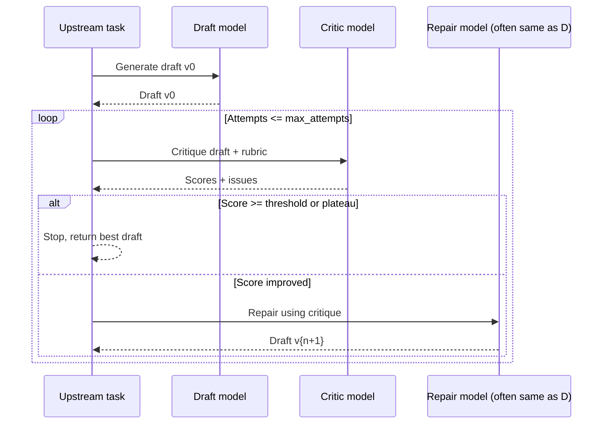

## When to reach for reflection

Reflection loops shine when a single prompt cannot guarantee correctness but the task has a clear scoring rubric: drafting support replies, summarizing documents, grading code, or extracting entities. Instead of shipping the first answer, the system:

1. Generates an initial output.
2. Critiques it against explicit criteria.
3. Repairs the answer using the critique.
4. Stops when quality surpasses a threshold or the retry budget is exhausted.

This pattern raises accuracy by ~10–30 percentage points on complex reasoning benchmarks according to research such as Reflexion, while keeping humans in control with transparent scores.【F:docs/patterns/agentic/reflection-self-heal.md†L83-L110】【F:docs/patterns/agentic/reflection-self-heal.md†L141-L198】

## Design principles

- **Static rubric:** Define objective criteria (correctness, completeness, safety, formatting). Store them in versioned specs so evaluation and production match.
- **Bounded budgets:** Cap attempts (usually ≤3) to control latency and token spend. Stop early if the score stagnates.
- **Traceability:** Log every draft, critique, and score with correlation IDs for audits.
- **Human override:** Allow reviewers to approve or reject any iteration, especially for regulated content.

## Rubric anatomy

| Element | Purpose | Example |
| --- | --- | --- |
| Dimension | Distinct lens to judge the answer | `correctness`, `completeness`, `tone_fit`, `safety` |
| Scale | Numeric range or labels | 0–5 integer scale |
| Threshold | Minimum acceptable value | `correctness >= 4`, average ≥ 4 |
| Guidance | Concrete instructions for critics | “Flag when claims lack citations.” |

Document rubrics in `/docs/patterns/specs/eval-spec-template.md` so product, legal, and QA teams can review them.

## System prompts

### Draft prompt skeleton

```text
You are a policy-aware assistant producing customer-ready answers.
Follow the brief below.
Return JSON {"answer": string, "citations": ["..."], "confidence": 0-1}.
```

### Critique prompt skeleton

```text
You are a meticulous reviewer.
Evaluate the DRAFT using this rubric:
- Correctness: factual accuracy and grounded in provided sources.
- Completeness: covers required points.
- Tone: matches requested tone words.
- Safety: avoids policy violations.

Return JSON {"scores": {"correctness": 0-5, ...}, "issues": ["..."], "suggested_actions": ["..."], "overall": 0-5}.
```

### Repair prompt skeleton

```text
You are revising a draft after critique.
Incorporate fixes without inventing unsupported facts.
Return JSON {"answer": string, "changes": ["..."], "confidence": 0-1}.
```

Keep prompts short and reference rubric IDs rather than prose walls. Temperature 0–0.3 yields stable scores.

## Control flow template



You can run the critic and repair with the same frontier model or cheaper specialized models. Many teams use a strong model for critique (e.g., Claude 3.5 Sonnet) and a lighter model for drafting to balance cost.【F:docs/patterns/agentic/reflection-self-heal.md†L141-L198】

## Sample TypeScript orchestrator

```ts
import OpenAI from "openai";
import { z } from "zod";

const client = new OpenAI({ apiKey: process.env.OPENAI_API_KEY! });

const DraftSchema = z.object({
  answer: z.string(),
  citations: z.array(z.string()).max(5),
  confidence: z.number().min(0).max(1)
});

const CritiqueSchema = z.object({
  scores: z.object({
    correctness: z.number().int().min(0).max(5),
    completeness: z.number().int().min(0).max(5),
    tone: z.number().int().min(0).max(5),
    safety: z.number().int().min(0).max(5)
  }),
  overall: z.number().int().min(0).max(5),
  issues: z.array(z.string()).max(10),
  suggested_actions: z.array(z.string()).max(5)
});

async function callModel<T>(schema: z.ZodType<T>, args: {
  model: string;
  input: any;
}) {
  const response = await client.responses.create({
    model: args.model,
    input: args.input,
    response_format: { type: "json_schema", json_schema: { name: "payload", schema: schema.toJSON() } },
    max_output_tokens: 700,
    temperature: 0.3
  });
  const parsed = schema.safeParse(JSON.parse(response.output_text));
  if (!parsed.success) {
    throw new Error(parsed.error.message);
  }
  return parsed.data;
}

export async function reflect(task: DraftInput, opts = { maxAttempts: 3, minScore: 4 }) {
  const attempts: DraftResult[] = [];
  const draftPrompt = buildDraftPrompt(task);
  let draft = await callModel(DraftSchema, { model: "gpt-4.1-mini", input: draftPrompt });

  for (let i = 0; i < opts.maxAttempts; i++) {
    const critique = await callModel(CritiqueSchema, {
      model: "gpt-4.1",
      input: buildCritiquePrompt(draft, task.rubric)
    });

    attempts.push({ draft, critique });

    if (critique.overall >= opts.minScore) {
      return { best: draft, attempts };
    }

    const repaired = await callModel(DraftSchema, {
      model: "gpt-4.1-mini",
      input: buildRepairPrompt(draft, critique)
    });

    if (critique.overall <= lastOverall(attempts)) {
      break; // plateau
    }

    draft = repaired;
  }

  const best = attempts.sort((a, b) => b.critique.overall - a.critique.overall)[0]?.draft ?? draft;
  return { best, attempts };
}
```

## Monitoring and evaluation

- **Offline evals:** Curate ~50 golden examples per task with human-written critiques. Measure pass rate at thresholds and delta per iteration.
- **Live telemetry:** Log `(attempt, score, model, tokens)` to correlate improvements with latency and cost.
- **Drift detection:** Re-run eval suites when upgrading models or rubrics. Flag when median score drops.
- **Explainability:** Provide UI that surfaces the latest critique, the applied fixes, and outstanding issues.

## Risk controls

- Cap total tokens per request. If a loop exceeds the budget, surface the highest-scoring draft to humans.
- Strip user PII from critiques before storing them.
- Combine with output filtering (moderation APIs, regex) after the final draft.
- Allow manual overrides: human editors can mark a critique as invalid and accept the original draft.

## References

- OpenAI. “Prompt engineering best practices.” 2024. <https://platform.openai.com/docs/guides/prompt-engineering>
- Anthropic. “Evaluate prompts with Claude.” 2024. <https://docs.anthropic.com/en/docs/build-with-claude/evaluate-prompts>
- Shinn, Noa, Sun, and Chen. “Reflexion: Language Agents with Verbal Reinforcement Learning.” arXiv, 2023. <https://arxiv.org/abs/2303.11366>
