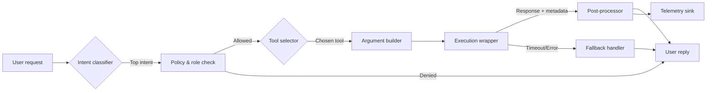

## Why build a router?

Router agents decide *which* capability should answer a request before any tool executes. They prevent models from guessing when a deterministic system (search, SQL, workflow API) is better suited. A good router balances accuracy, latency, and safety by combining intent detection, allow lists, and budget-aware execution plans.

### You’ll learn

- Core components of a production router agent and how they interact
- Prompt and embedding strategies for accurate intent classification
- Guardrail patterns: per-tool budgets, timeouts, and role-based allow lists
- How to score routers with offline test sets and live telemetry
- Reference implementations in TypeScript and Python using OpenAI and Anthropic APIs

## Architecture at a glance



- **Intent classifier:** Lightweight prompt or embedding similarity model that maps the request to a known domain (billing, incidents, knowledge lookup).
- **Policy & role check:** Ensures the user’s role can call the candidate tool. Deny by default.
- **Tool selector:** Chooses the best tool or sub-agent based on intent, context, and tool health.
- **Argument builder:** Extracts structured arguments from the prompt, validates JSON Schema, and redacts secrets.
- **Execution wrapper:** Invokes the tool with retries, timeouts, and circuit breakers.
- **Post-processor:** Formats human-friendly replies and merges tool metadata for auditing.

## Building the tool registry

Keep the registry declarative so you can reason about risk and perform static checks.

```ts
export type ToolConfig<TArgs, TResult> = {
  name: string;
  description: string;
  inputSchema: z.ZodType<TArgs>;
  outputSchema: z.ZodType<TResult>;
  timeoutMs: number;
  maxRetries: number;
  costBudgetTokens: number;
  allowedRoles: string[];
  execute: (args: TArgs, context: RequestContext) => Promise<TResult>;
};
```

Store the registry in code or configuration (YAML/JSON) and load it at boot. Require explicit `allowedRoles` and budgets to avoid accidentally exposing privileged tools.

### Metadata to include

| Field | Why it matters |
| --- | --- |
| `description` | Used in the router prompt and for UI documentation. |
| `inputSchema` | Enables validation and automatic JSON schema export for OpenAI, Anthropic, and Gemini tool definitions. |
| `timeoutMs` & `maxRetries` | Bound worst-case latency; couple retries with idempotency keys. |
| `costBudgetTokens` | Cap downstream LLM calls (e.g., RAG sub-agents). |
| `allowedRoles` | Enforce least-privilege access at runtime. |

## Designing the router prompt

Create a deterministic prompt that outputs JSON only. Provide an explicit fallback action when nothing matches.

```text
You are a tool router for the Support Automation team.
Choose the single best action or return `{"tool": "clarify", "args": {"question": "..."}}` when uncertain.

Tools:
1. search_docs — Answer with knowledge base articles. Requires {"query": string}.
2. create_ticket — File an incident. Requires {"summary": string, "priority": "P1|P2|P3"}.
3. escalate_human — Ping on-call. Requires {"context": string}.

Rules:
- Return valid JSON only: {"tool": string, "args": object, "confidence": 0-1, "rationale": string}
- Obey role policies passed in the `allowed_tools` list.
- Ask for clarification when key fields are missing.
```

Pass structured context alongside the prompt:

```ts
const allowedTools = getAllowedTools(userRole);
const response = await client.responses.create({
  model: "gpt-4.1-mini",
  input: [
    {
      role: "system",
      content: [
        { type: "text", text: basePrompt },
        { type: "json", json: { allowed_tools: allowedTools } }
      ]
    },
    { role: "user", content: userMessage }
  ],
  response_format: { type: "json_schema", json_schema: routerSchema },
  max_output_tokens: 300,
  temperature: 0
});
```

- Use temperature 0 to maximize determinism.
- Provide current state (`allowed_tools`, feature flags, recent tool errors) as JSON context rather than prose.

## Embedding-assisted routing

For mature stacks, combine prompt-based classification with embedding similarity to reduce hallucinated tool picks:

1. Embed the user request with a lightweight model (e.g., `text-embedding-3-small`).
2. Compare against canonical intent descriptions or past labeled tickets.
3. Blend scores with the LLM’s confidence. Example heuristic: `final = 0.6 * llm_confidence + 0.4 * embedding_similarity`.
4. If no candidate exceeds a threshold, return a clarification request.

## Execution guardrails

### Validation pipeline

1. Parse the JSON output and validate against the tool’s schema.
2. Run domain-specific guards (e.g., profanity filter on ticket summaries).
3. Inject audit fields: `request_id`, `correlation_id`, `issued_at`.
4. Execute via a wrapper that enforces timeout and retries.

```ts
async function executeTool(selection: RouterSelection, ctx: RequestContext) {
  const tool = registry.get(selection.tool);
  if (!tool) throw new Error("Unsupported tool");
  if (!tool.allowedRoles.includes(ctx.user.role)) throw new ForbiddenError();

  const args = tool.inputSchema.parse(selection.args);

  return await withTimeout(tool.timeoutMs, async () =>
    withRetry(tool.maxRetries, () => tool.execute(args, ctx))
  );
}
```

### Handling errors and fallbacks

- Surface user-friendly messages while logging detailed stack traces server-side.
- Offer an alternate path: `search_docs` → fallback to `clarify`; `create_ticket` → open draft and request human confirmation.
- Trigger alerts when failure rate or latency for a tool exceeds baseline to pause routing automatically.

## Measuring performance

Instrument the router like a service:

- **Accuracy:** % of offline labeled queries routed to the correct tool. Maintain a regression suite (50–200 examples per tool).
- **Clarification rate:** Monitor how often the router returns `clarify`. Spikes indicate missing intents.
- **Escalation rate:** Track manual overrides; use them to retrain the classifier.
- **Latency budget:** Measure total time (classification + execution). Set SLOs per tool (e.g., ≤ 800 ms P95 for `search_docs`).
- **Cost per request:** Attribute downstream token usage to the router decision for budget alerts.

## Reference implementation snippets

### TypeScript with OpenAI Responses API

```ts
import OpenAI from "openai";
import { z } from "zod";

const client = new OpenAI({ apiKey: process.env.OPENAI_API_KEY! });

const RouterSchema = z.object({
  tool: z.string(),
  args: z.record(z.any()),
  confidence: z.number().min(0).max(1),
  rationale: z.string().min(10)
});

export async function routeRequest(payload: {
  message: string;
  role: string;
}) {
  const allowedTools = computeAllowList(payload.role);

  const response = await client.responses.create({
    model: "gpt-4.1-mini",
    input: [
      { role: "system", content: baseRouterPrompt },
      { role: "user", content: payload.message },
      { role: "system", content: JSON.stringify({ allowed_tools: allowedTools }) }
    ],
    response_format: {
      type: "json_schema",
      json_schema: { name: "router", schema: RouterSchema.toJSON() }
    },
    max_output_tokens: 256,
    temperature: 0
  });

  const parsed = RouterSchema.safeParse(JSON.parse(response.output_text));
  if (!parsed.success) throw new Error(parsed.error.message);

  return executeTool(parsed.data, payload);
}
```

### Python with Anthropic Claude tool use

```python
import anthropic
from pydantic import BaseModel, ValidationError

client = anthropic.Anthropic(api_key=os.environ["ANTHROPIC_API_KEY"])

class RouterChoice(BaseModel):
    tool: str
    args: dict
    confidence: float
    rationale: str

router_tools = [
    {
        "name": "search_docs",
        "description": "Look up knowledge base articles",
        "input_schema": {
            "type": "object",
            "properties": {"query": {"type": "string"}},
            "required": ["query"],
        },
    },
    {
        "name": "create_ticket",
        "description": "File a support ticket",
        "input_schema": {
            "type": "object",
            "properties": {
                "summary": {"type": "string"},
                "priority": {"type": "string", "enum": ["P1", "P2", "P3"]},
            },
            "required": ["summary", "priority"],
        },
    },
]

SYSTEM = (
    "You are a router. Choose one tool or reply with clarify when unsure."
)

def route(message: str, allowed_tools: list[str]) -> RouterChoice:
    response = client.messages.create(
        model="claude-3-5-sonnet-latest",
        system=SYSTEM,
        messages=[{"role": "user", "content": message}],
        tools=router_tools,
        metadata={"allowed_tools": allowed_tools},
        max_output_tokens=256,
    )

    if not response.stop_reason == "tool_use":
        raise RuntimeError("Expected tool selection")

    tool_call = response.content[0]
    payload = RouterChoice(
        tool=tool_call.name,
        args=tool_call.input,
        confidence=tool_call.annotations.get("confidence", 0.7),
        rationale=tool_call.annotations.get("rationale", "") or "LLM selection",
    )
    return payload
```

## Operational checklist

- Version router prompts; store them alongside schema hashes so you can replay historical traffic.
- Run smoke tests for every tool at deploy time (synthetic request → expected tool).
- Shadow new tools by running the router in “observe” mode before allowing execution.
- Integrate with feature flags to disable a tool quickly when downstream systems degrade.
- Provide transparency to users: surface which tool executed and link to logs for debugging.

## References

- OpenAI. “Function calling.” 2024. <https://platform.openai.com/docs/guides/function-calling>
- Anthropic. “Tool use.” 2024. <https://docs.anthropic.com/en/docs/tool-use>
- LangChain. “Router chains.” 2024. <https://python.langchain.com/docs/modules/chains/additional/routers>
