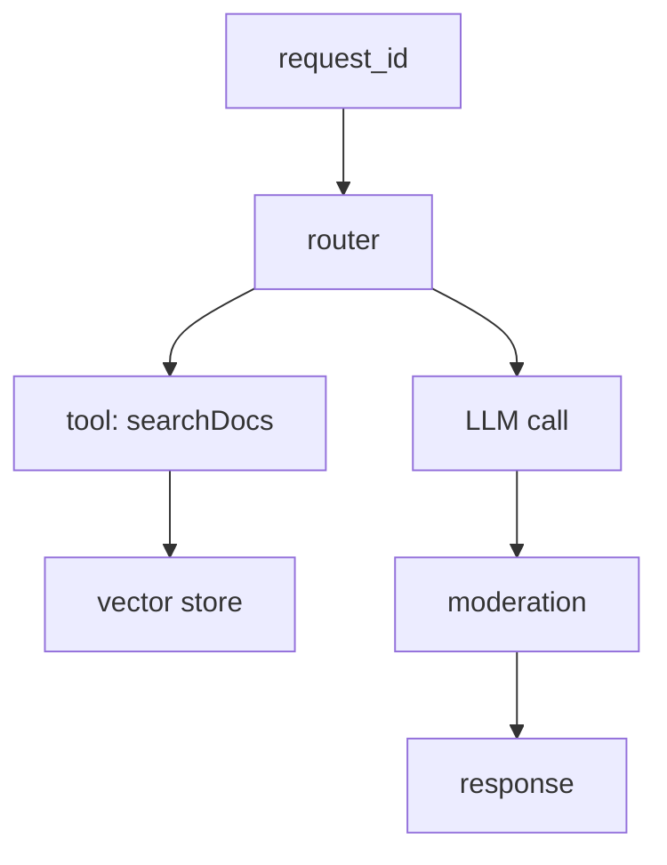

## Goals for AI observability

AI observability differs from classic microservices because prompts and retrieved context drive behavior. The goal is to capture enough metadata to debug and audit without storing sensitive raw text. Focus on four questions: *What request triggered the model? Which context and tools were used? How much did it cost? Did it succeed safely?*【F:docs/patterns/observability-context.md†L41-L120】

## Minimum viable log record

| Field | Example | Notes |
| --- | --- | --- |
| `request_id` | UUID | Tie all stages together |
| `user_handle` | Hash of user ID | Hash or pseudonymize to avoid PII |
| `session_id` | Conversation ID | Allows chronological reconstruction |
| `model` | `gpt-4o-mini` | Include provider + region |
| `prompt_template_id` | `kb-answering@2025-02-17` | Link to versioned prompt specs |
| `retrieved_docs` | `["doc-123#4", "doc-456#2"]` | Reference IDs, not raw text |
| `tool_calls` | `["searchDocs", "createTicket"]` | With latency and status |
| `tokens_in/out` | `{in: 780, out: 320}` | Use provider usage fields |
| `latency_ms` | `910` | Measure end-to-end |
| `result_status` | `success | policy_violation | tool_error` | Normalize enums |

Store logs in a structured format (JSON) to power dashboards and anomaly detection.

## Privacy guardrails

- **Redact inputs**: Use regex or classification models to remove PII (emails, credit cards) before logging.
- **Access control:** Restrict log viewers via IAM roles; redact content further for non-privileged roles.
- **Retention policies:** Align with legal requirements—often 30–90 days for raw metadata, longer for aggregated analytics.
- **Encryption:** Encrypt at rest and in transit; rotate keys regularly.
- **User requests:** Support deletion requests by indexing logs with user hashes to locate records quickly.

## Trace multi-step workflows



- Generate a trace ID at the API gateway and pass it via headers or context objects.
- Each component logs `request_id`, `span_id`, `parent_span_id` (OpenTelemetry conventions).
- Record retries as separate spans with reason codes to highlight flaky tools or throttling.

## Dashboards to build

1. **Latency:** P50/P95 for routing, retrieval, LLM, post-processing.
2. **Quality signals:** Faithfulness scores, human review outcomes, moderation hits.
3. **Cost:** Tokens per route, cost per workspace, anomaly detection on spikes.
4. **Tool reliability:** Success rate and latency by tool; highlight top errors.
5. **User journey:** Conversion funnels (e.g., requests → clarifications → resolved).

## Alerting strategy

- Set SLOs per route (e.g., 99% of chat responses < 5 s). Alert when breached for 5 minutes.
- Trigger alerts when moderation flags exceed baseline or when a tool returns errors >10%.
- Monitor drift indicators: drop in retrieval recall, sudden increase in clarification prompts, unusual token usage.
- Route urgent alerts to on-call; log informational notifications for product teams (e.g., rising deflection rate).

## Sample OpenTelemetry snippet (TypeScript)

```ts
import { trace, context } from "@opentelemetry/api";

const tracer = trace.getTracer("ai-app");

export async function callModel(ctx, payload) {
  return await tracer.startActiveSpan("llm.call", async (span) => {
    span.setAttributes({
      "ai.model": payload.model,
      "ai.prompt_id": payload.promptId,
      "ai.tokens_budget": payload.maxTokens
    });
    const result = await client.responses.create(payload.options);
    span.setAttributes({
      "ai.tokens_in": result.usage.input_tokens,
      "ai.tokens_out": result.usage.output_tokens,
      "ai.latency_ms": result.latencyMs
    });
    span.end();
    return result;
  });
}
```

Use resource attributes (`service.name`, `deployment.environment`) to slice metrics by environment.

## Integrating feedback

- Capture thumbs-up/down or freeform comments from users; log them with request IDs.
- Attach reviewer decisions from `/docs/patterns/rag/evals-hook.md` to the same trace to close the loop.
- Feed back negative signals into evaluation sets and prompt updates.

## References

- Microsoft Learn. “Monitor generative AI applications.” 2024. <https://learn.microsoft.com/azure/ai-services/openai/how-to/monitoring>
- Datadog. “Monitoring LLM-based applications.” 2024. <https://docs.datadoghq.com/guides/monitoring-llm-applications/>
- OpenTelemetry. “Semantic conventions for AI systems.” 2024. <https://github.com/open-telemetry/semantic-conventions/blob/main/docs/gen-ai/README.md>
