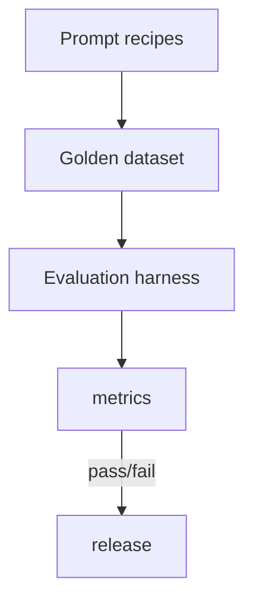

## Summary
Prompt recipes are modular templates you can reuse across products and providers. Instead of rewriting prompts for every feature, define structured components—goal, constraints, style, evaluation cues—and compose them based on task complexity. This page curates battle-tested recipes, highlights when to use each, and shows how to manage them in code so teams stay consistent.

### You’ll learn
- A mental model for combining goals, constraints, examples, and evaluation signals in a prompt.
- Recipes for instruction following, few-shot classification, reasoning chains, critique/repair loops, and retrieval-augmented outputs.
- How to parameterize recipes in Node.js and Python with schema validation.
- How to evaluate prompt quality with rubrics, golden datasets, and model-based critics.
- How to keep recipes versioned, discoverable, and shareable across teams.

## Anatomy of a prompt recipe
| Component | Purpose | Notes |
| --- | --- | --- |
| **Goal** | State the task and success criteria explicitly. | Use bullet lists or numbered acceptance criteria. |
| **Context** | Provide relevant facts, documents, or user profile. | Keep within context window; summarize long docs. |
| **Instructions** | Spell out policies, format rules, tone, and guardrails. | Use imperative voice and highlight “must” statements. |
| **Examples** | Demonstrate desired behavior or show counterexamples. | Use few-shot examples sparingly; remove stale data. |
| **Output spec** | Define schema, markdown headings, or JSON keys. | Link to `/docs/concepts/structured-outputs.md` for schema tactics. |
| **Quality check** | Ask the model to self-verify or cite sources. | Include refusal conditions and evaluation hints. |

## Recipe library
### Instruction-following baseline
Use when you need quick compliance with format and tone.

```
You are an assistant that produces {{deliverable}}.
Goal: {{goal}}
Audience: {{audience}}
Tone: {{tone}}

Requirements:
{{rules}}

Respond in {{output_format}}.
If you lack information, say "I need more details." Do not fabricate.
```

### Few-shot classification
```
System: Classify the user's input into one of {{labels}}.

Definitions:
{{label_definitions}}

Examples:
{{few_shot_examples}}

Now classify:
Input: {{user_input}}
Label:
```
- Maintain at least three representative examples per class.
- Rotate examples when the model overfits or data drifts.【F:docs/concepts/prompting-styles.md†L46-L102】

### Chain-of-thought reasoning
```
You are a reasoning assistant. Think step by step before answering.

Task: {{problem_statement}}
Constraints:
- Use only the facts provided.
- Stop once you derive the final answer.

Reasoning:
1.

Final answer:
```
- Stream the reasoning to a separate channel or redact before showing users.
- Pair with evaluator prompts to detect unsupported leaps.【F:docs/concepts/genai-vs-agentic.md†L86-L114】

### Critique and repair loop
Use two passes: the first draft plus a critic that spots issues.

```
Draft prompt → produce initial output.

Critique prompt → Review the draft for policy violations, factual gaps, tone mismatches.
Return JSON: { "status": "pass|fail", "issues": [], "revision_instructions": [] }

Repair prompt → Apply critique instructions and produce final output.
```
- Automate the critic with cheaper models (`gpt-4o-mini`, `claude-3-haiku`) and escalate to premium models for final repair when needed.【F:docs/concepts/safety-basics.md†L70-L113】

### Retrieval-augmented response
```
You are answering using the provided documents only.
If the answer is absent, say "I cannot find that yet."

Question: {{query}}

Context:
{{retrieval_chunks}}

Output format:
{
  "answer": "",
  "citations": [""],
  "confidence": 0-1,
  "follow_up_questions": []
}
```
- Keep each chunk under 200 tokens and include source IDs for citation mapping.【F:docs/examples/it-knowledge-bot.md†L88-L152】

## Managing recipes in code (Node.js)
```ts
import fs from "node:fs";
import path from "node:path";
import { fileURLToPath } from "node:url";
import { z } from "zod";

const baseRecipeSchema = z.object({
  name: z.string(),
  description: z.string(),
  template: z.string(),
  variables: z.array(z.string()),
  version: z.string(),
});

const recipeDir = path.join(
  path.dirname(fileURLToPath(import.meta.url)),
  "recipes"
);

const instructionRecipe = baseRecipeSchema.parse({
  name: "instruction_baseline",
  description: "Concise instruction-following prompt",
  template: fs.readFileSync(path.join(recipeDir, "instruction.txt"), "utf8"),
  variables: ["deliverable", "goal", "audience", "tone", "output_format", "rules"],
  version: "1.0.0",
});

export function renderRecipe(recipe: z.infer<typeof baseRecipeSchema>, values: Record<string, unknown>) {
  const missing = recipe.variables.filter((variable) => !(variable in values));
  if (missing.length) throw new Error(`Missing variables: ${missing.join(", ")}`);

  return recipe.template.replace(/\{\{(\w+)\}\}/g, (_, key: string) => {
    const value = values[key];
    if (Array.isArray(value)) {
      return value
        .map((entry) => (typeof entry === "string" ? `- ${entry}` : `- ${JSON.stringify(entry)}`))
        .join("\n");
    }
    return String(value ?? "");
  });
}
```
- Store templates in version-controlled files for discoverability.
- Validate values with Zod or Pydantic before substitution.

## Managing recipes in code (Python)
```python
from dataclasses import dataclass
from pathlib import Path
from typing import Dict, List

from pydantic import BaseModel, Field

class RecipeConfig(BaseModel):
    name: str
    description: str
    template_path: Path
    variables: List[str]
    version: str = Field(pattern=r"\d+\.\d+\.\d+")

@dataclass
class PromptRecipe:
    config: RecipeConfig

    def render(self, values: Dict[str, str]) -> str:
        missing = [var for var in self.config.variables if var not in values]
        if missing:
            raise ValueError(f"Missing variables: {missing}")
        template = self.config.template_path.read_text(encoding="utf8")
        prompt = template
        for key, val in values.items():
            if isinstance(val, list):
                prompt = prompt.replace(f"${{{key}}}", "\n".join(val))
            else:
                prompt = prompt.replace(f"${{{key}}}", str(val))
        return prompt

config = RecipeConfig(
    name="retrieval_answer",
    description="Grounded answer with citations",
    template_path=Path("./recipes/retrieval.txt"),
    variables=["query", "chunks"],
)
recipe = PromptRecipe(config=config)
```
- Share recipe metadata across services via a manifest (JSON/YAML) so front-end and back-end teams stay aligned.

## Evaluation playbook

- **Golden dataset:** Collect real user prompts, expected formats, and rubric scores. Store in Git for reproducibility.
- **Automated grading:** Pair each recipe with evaluator prompts or deterministic validators (e.g., JSON schema, profanity filters).
- **Telemetry review:** Track which recipe version produced each response; alert when quality metrics drop.
- **Drift audits:** Re-run the dataset whenever models or recipes change and compare token usage and accuracy.

## Governance tips
- Version recipes semantically (`major.minor.patch`) and log updates in CHANGELOG.md.
- Document owners per recipe and schedule quarterly reviews (align with `/docs/concepts/ethics-responsible-ai.md`).
- Encourage product teams to propose new recipes through pull requests reviewed by prompt specialists.
- Store references to downstream tasks (tools, evals) in the recipe metadata for traceability.

## References
- OpenAI. “Prompt engineering.” (2024). <https://platform.openai.com/docs/guides/prompt-engineering>
- Anthropic. “Prompt library.” (2024). <https://docs.anthropic.com/en/prompt-library>
- Microsoft Learn. “Prompt engineering for developers.” (2024). <https://learn.microsoft.com/azure/ai-services/openai/concepts/prompt-engineering>

## Cross-links
- Prompt specification template: [/docs/patterns/specs/prompt-spec-template.md](/docs/patterns/specs/prompt-spec-template.md)
- Safety checklist for prompts: [/docs/concepts/safety-basics.md](/docs/concepts/safety-basics.md)
- Tool calling integration: [/docs/patterns/tools/function-calling.md](/docs/patterns/tools/function-calling.md)
- Content drafter example using critique recipe: [/docs/examples/content-drafter.md](/docs/examples/content-drafter.md)
