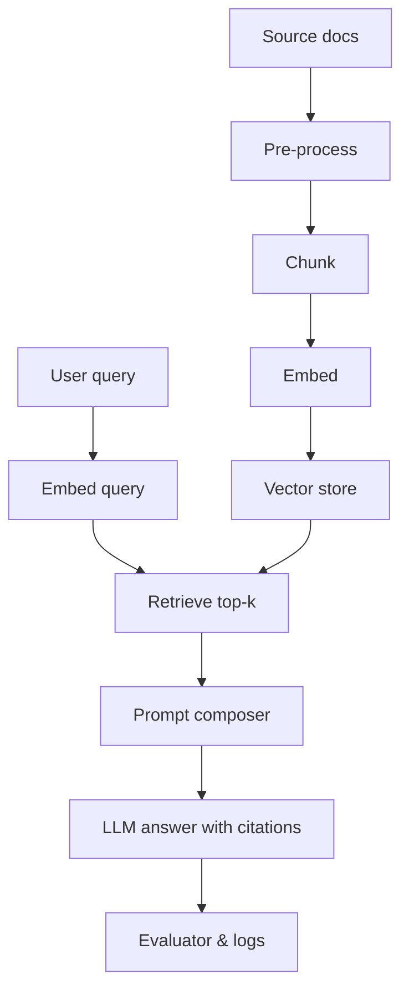

## Why RAG matters

Retrieval-augmented generation (RAG) keeps answers grounded in trusted knowledge without expensive fine-tuning. You index proprietary content, fetch relevant chunks at request time, and let the model compose a response with citations. This pattern limits hallucinations, preserves data ownership, and enables rapid updates when source documents change.【F:docs/patterns/rag/basics.md†L47-L92】

### You’ll learn

- How to design an ingestion pipeline with chunking, embeddings, and metadata
- Techniques to compose prompts with citations and guardrails
- Reference code for ingestion and retrieval with OpenAI and vector stores
- Metrics to monitor relevance, latency, and grounding quality
- Operational tips for backfilling content and handling invalid queries

## Core pipeline



1. **Pre-process:** Normalize PDFs, HTML, Markdown. Strip boilerplate, expand abbreviations, extract metadata (titles, section headings).
2. **Chunk:** Split documents into overlapping passages sized for the target model (200–400 tokens for chat; longer for legal). Use heuristics like heading-aware segmentation or dynamic splitting based on semantic similarity.
3. **Embed:** Convert each chunk into a vector using an embedding model (OpenAI `text-embedding-3-large`, Azure OpenAI `text-embedding-3-large`, Cohere Embed v3). Store `vector`, `chunk_text`, `source`, `timestamp`, `hash`.
4. **Retrieve:** At query time, embed the question and use vector search (or hybrid search) to fetch top `k` chunks.
5. **Compose prompt:** Merge the user query, instructions, and retrieved snippets with citation markers.
6. **Answer and evaluate:** Call the LLM, log metadata, and optionally run automated evaluators (faithfulness, citation correctness).

## Chunking playbook

| Decision | Default | When to change |
| --- | --- | --- |
| Chunk length | 200–350 tokens | Long-form analysis (500–800) for legal/technical docs |
| Overlap | 10–20% | Increase to 30% when content spans paragraphs without headings |
| Strategy | Heading-aware splitting | Use semantic sentence clustering when headings are absent |
| Normalization | Lowercase, strip HTML | Preserve casing for code snippets and product names |

Record a `content_hash` per chunk so you can detect updates and re-embed selectively rather than reprocessing all documents.

## Prompt composition template

```text
You answer strictly from company knowledge. If the answer is not present, reply "unknown".

Question: {{query}}

Context:
{{#each snippets}}
[{{this.rank}}] Source: {{this.source}} ({{this.url}})
"""
{{this.content}}
"""
{{/each}}

Instructions:
- Cite sources inline like [1], [2].
- Do not repeat context verbatim; synthesize.
- Surface caveats or outdated timestamps when present.
```

Add guardrails such as allowed topics, restricted audiences, and disclaimers for stale content.

## Example ingestion script (Node.js)

```ts
import OpenAI from "openai";
import { upsert } from "./vector-store";
import { chunkDocument } from "./chunking";

const client = new OpenAI({ apiKey: process.env.OPENAI_API_KEY! });

export async function ingest(doc: SourceDocument) {
  const chunks = chunkDocument(doc, { maxTokens: 320, overlap: 50 });

  for (const chunk of chunks) {
    const embedding = await client.embeddings.create({
      model: "text-embedding-3-large",
      input: chunk.content
    });

    await upsert({
      id: `${doc.id}::${chunk.index}`,
      vector: embedding.data[0].embedding,
      metadata: {
        source: doc.source,
        title: doc.title,
        url: doc.url,
        chunk_index: chunk.index,
        content: chunk.content,
        hash: chunk.hash,
        updated_at: doc.updatedAt.toISOString()
      }
    });
  }
}
```

## Example retrieval + answer (Python)

```python
from openai import OpenAI
from vector_store import search

client = OpenAI()

def answer(question: str, k: int = 6):
    q_embed = client.embeddings.create(
        model="text-embedding-3-small",
        input=question
    )
    hits = search(q_embed.data[0].embedding, top_k=k)

    prompt = build_prompt(question, hits)

    response = client.responses.create(
        model="gpt-4o-mini",
        input=prompt,
        temperature=0.2,
        max_output_tokens=600
    )

    return {
        "answer": response.output_text,
        "citations": [hit.metadata for hit in hits]
    }
```

## Monitoring checklist

- **Retrieval quality:** Sample logs weekly. Check for irrelevant or redundant snippets. Track retrieval precision (percentage of snippets judged relevant by humans or evals).
- **Grounded accuracy:** Run `/docs/evaluations/grounded-qa-evals.md` nightly to ensure the LLM respects citations.
- **Latency:** Measure embeddings + vector search + LLM response separately. Cache embeddings for repeated queries.
- **Token cost:** Log prompt and completion tokens per request. Consider summarizing long contexts or using adaptive `k`.
- **Freshness:** Store document timestamps and warn users when content is older than a configurable threshold.

## Handling edge cases

- **Empty retrieval:** When no snippet passes the score threshold, return a safe fallback and surface an escalation path.
- **Conflicting sources:** Present both viewpoints and cite them; flag for human curation.
- **Sensitive data:** Apply redaction before indexing (PII, secrets). Use access control lists to filter results by user role.
- **Non-English queries:** Translate queries and snippets to a common language, or embed with multilingual models (e.g., `text-embedding-3-large` supports >20 languages).

## Operational runbook

1. Automate nightly rebuilds for sources that change frequently (release notes, policies).
2. Version prompts and chunking parameters; store them alongside the index metadata.
3. Provide a feedback loop in the UI so users can flag incorrect answers and trigger re-ingestion or prompt tweaks.
4. Use A/B experiments when adjusting retrieval parameters (`k`, similarity threshold) to quantify impact on accuracy and latency.
5. Document data lineage: source URL, ingestion timestamp, processing pipeline version.

## References

- Microsoft Learn. “Design your retrieval-augmented generation system.” 2024. <https://learn.microsoft.com/azure/ai-services/openai/concepts/retrieval>
- Pinecone. “The definitive guide to Retrieval Augmented Generation (RAG).” 2023. <https://www.pinecone.io/learn/series/rag/>
- OpenAI. “Text embeddings best practices.” 2024. <https://platform.openai.com/docs/guides/embeddings>
