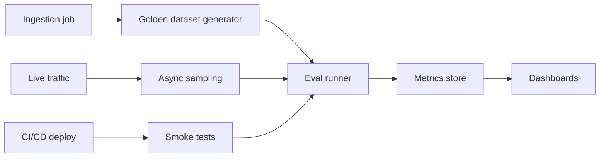

## Why instrument RAG with eval hooks?

RAG systems depend on multiple moving parts: ingestion, retrieval, prompting, and the LLM itself. Automated evaluations catch regressions when any piece drifts—new documents, model upgrades, or vector store outages. Wire eval hooks directly into the pipeline so every deployment and nightly job produces measurable quality signals, not just anecdotal user feedback.【F:docs/patterns/rag/evals-hook.md†L57-L120】

## Core metrics to track

| Metric | Definition | Trigger |
| --- | --- | --- |
| Faithfulness | % of responses fully supported by retrieved evidence | Run per release + nightly |
| Citation accuracy | % of cited snippets that contain the asserted fact | Nightly |
| Retrieval recall@k | Fraction of golden answers whose sources appear in top `k` | Ingestion jobs |
| Answer usefulness | Human rubric (helpful / partially helpful / not helpful) | Weekly sampling |
| Latency | P50/P95 for retrieval + generation | Continuous monitoring |

## Hook points in the pipeline



1. **Ingestion hooks:** When new documents are ingested, automatically regenerate embeddings for golden questions that reference them.
2. **Pre-deploy hooks:** Run smoke tests during CI to ensure retrieval returns the expected doc IDs before shipping prompts or code changes.
3. **Post-deploy sampling:** Sample a percentage of production traffic (1–5%) and evaluate asynchronously using background workers.

## Building a golden dataset

- Start with 50–200 question-answer pairs curated by subject-matter experts. Include expected citations (document IDs + excerpt ranges).
- Store them in version control with metadata: `topic`, `difficulty`, `last_verified_at`.
- Tag edge cases (multi-hop, ambiguous terms, tabular data) so you can filter and analyze performance per segment.
- Refresh quarterly; retire outdated entries to avoid penalizing correct behavior.

## Automated faithfulness checks

Use evaluator models to judge whether the answer sticks to retrieved evidence.

```python
from openai import OpenAI

client = OpenAI()

FAITHFULNESS_PROMPT = """
You are scoring an answer. If every claim is supported by the provided context, return 1. Otherwise return 0 and list unsupported statements.
Return JSON {"score": 0 or 1, "issues": ["..."]}.
"""

def score_faithfulness(answer: str, context: list[str]):
    response = client.responses.create(
        model="gpt-4.1-mini",
        input=[
            {"role": "system", "content": FAITHFULNESS_PROMPT},
            {"role": "user", "content": json.dumps({"answer": answer, "context": context})}
        ],
        response_format={"type": "json_object"},
        max_output_tokens=200,
        temperature=0
    )
    return json.loads(response.output_text)
```

Run this evaluator over golden answers daily; alert when the pass rate dips below threshold.

## Citation validation

- Parse inline markers `[1]`, `[2]`, etc.
- Map them to retrieved chunks using metadata.
- Check that each cited chunk contains overlapping key terms (token overlap > 0.3) or that evaluator models confirm support.
- Flag missing citations or extra chunks that were never referenced.

## Dashboards and alerting

- Store metrics in your observability stack (BigQuery, Snowflake, Prometheus). Include labels for model version, prompt ID, retriever version, and vector store index.
- Visualize trend lines for faithfulness, recall, latency, and cost. Add deployment markers to correlate dips with releases.
- Alert via PagerDuty/Slack when critical thresholds breach (e.g., faithfulness < 0.9 for 3 runs).

## Integrating human review

Automated scores are necessary but insufficient for high-risk workflows. Layer humans in:

1. Route low-confidence answers (`faithfulness=0`) to a review queue.
2. Provide the answer, citations, retrieved context, and evaluator findings.
3. Capture reviewer labels and comments; feed them back into the golden dataset.
4. Track reviewer agreement rate to calibrate rubric clarity.

## Implementation tips

- **Budgeting:** Evaluate in batch jobs during off-peak hours to minimize cost spikes.
- **Versioning:** Embed version info in prompts (e.g., `Prompt-Version: 2025-02-17`) so you can slice metrics by configuration.
- **Feature flags:** Run new retrieval parameters in shadow mode while still scoring them against goldens.
- **Security:** Redact PII before storing evaluator prompts, especially when using third-party providers.

## Tooling landscape

- **LangSmith eval traces:** Integrates with LangChain pipelines to record prompts, retrieved docs, and evaluator outputs.【F:docs/patterns/rag/evals-hook.md†L122-L150】
- **Arize Phoenix:** Provides dashboards for LLM observability with RAG-specific metrics (context relevance, hallucination scores).
- **WhyLabs Observatory:** Offers automated drift detection on embeddings and retrieval results.
- **Custom notebooks:** Use pandas + SQL for bespoke analyses; export CSVs for leadership reporting.

## References

- LangSmith. “Evaluate RAG applications.” 2024. <https://docs.langchain.com/docs/evaluation/rag>
- Arize AI. “Phoenix for RAG Evaluation.” 2024. <https://docs.arize.com/phoenix/tutorials/rag-evaluation>
- Microsoft Learn. “Monitor retrieval-augmented generation systems.” 2024. <https://learn.microsoft.com/azure/ai-services/openai/how-to/monitoring>
