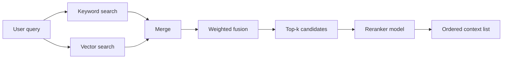

## Why hybrid retrieval?

Sparse (keyword) and dense (vector) search excel at different tasks. Keyword methods surface exact phrase matches and handle rare entities; dense vectors capture semantic similarity but may miss precise wording. Hybrid ranking combines both signals and optionally adds a reranker model to produce higher-quality contexts for the LLM, reducing hallucinations and shortening prompts.【F:docs/patterns/rag/hybrid-ranking.md†L41-L115】

## Architecture overview



1. **Keyword search:** BM25 or Azure Cognitive Search to capture exact terms and filtering on metadata.
2. **Vector search:** Dense embeddings (OpenAI, Cohere, Mistral) for semantic matching.
3. **Weighted fusion:** Normalize scores (min-max or z-score) and combine with weights tuned per corpus.
4. **Reranking:** Optional stage using a cross-encoder (Cohere Rerank v3, Azure AI Search semantic reranker, Hugging Face models) to re-evaluate top ~50 candidates.
5. **Final selection:** Pick the best `k` snippets for prompting.

## Fusion strategies

| Strategy | Formula | Pros | Cons |
| --- | --- | --- | --- |
| Weighted sum | `score = α * sparse + (1-α) * dense` | Simple, works with any backend | Requires manual tuning |
| Reciprocal rank fusion (RRF) | `score = Σ 1/(k + rank)` | Robust to noisy scores, no tuning | Ties require tie-breakers |
| Learning-to-rank | Train model on labeled clicks | Maximizes relevance with good labels | Needs dataset + maintenance |

Start with weighted sum (α ≈ 0.3 keyword, 0.7 dense). Increase sparse weight when users rely on SKU codes, IDs, or regulatory terms.

## Implementing weighted fusion (TypeScript)

```ts
import { normalizeScores } from "./score-utils";

export function hybridMerge(keywordHits, vectorHits, alpha = 0.3) {
  const combined = new Map();

  const keywordNorm = normalizeScores(keywordHits);
  const vectorNorm = normalizeScores(vectorHits);

  function upsert(hit, weight) {
    const existing = combined.get(hit.id) ?? { ...hit, score: 0 };
    existing.score += weight;
    existing.sources = existing.sources ?? [];
    existing.sources.push(hit.source);
    combined.set(hit.id, existing);
  }

  keywordNorm.forEach((hit) => upsert(hit, alpha * hit.score));
  vectorNorm.forEach((hit) => upsert(hit, (1 - alpha) * hit.score));

  return Array.from(combined.values())
    .sort((a, b) => b.score - a.score)
    .slice(0, 50);
}
```

`normalizeScores` should map raw scores to 0–1 (e.g., `(score - min)/(max - min)` or softmax). Always log individual scores for debugging.

## Adding a reranker

Rerankers read the *query + candidate text* pair jointly and output a relevance score, outperforming standalone embeddings.

```python
from cohere import Client

co = Client(os.environ["COHERE_API_KEY"])

def rerank(query: str, candidates: list[dict], top_n: int = 6):
    results = co.rerank(
        model="rerank-english-v3.0",
        query=query,
        documents=[c["content"] for c in candidates],
        top_n=top_n,
    )
    ordered = []
    for item in results:
        candidate = candidates[item.index]
        candidate["rerank_score"] = item.relevance_score
        ordered.append(candidate)
    return ordered
```

Use reranking on the top 20–50 merged candidates to keep latency manageable. Cross-encoders are slower but provide sharper decisions, especially for multi-sentence passages or when context must match compliance phrases exactly.

## Filtering and policies

- Apply metadata filters before fusion (e.g., locale, customer tier). Let keyword search narrow down docs quickly.
- Maintain allow/deny lists per user role to exclude confidential documents.
- Drop snippets below a minimum combined score to avoid filler context. Track the drop rate.

## Evaluation

- **Offline labels:** Build a labeled set of queries with relevant document IDs. Compute recall@k, MRR, and nDCG before/after hybridization.
- **Live metrics:** Monitor click-through rate on citations or knowledge base links. Track clarifications where the user reports missing info.
- **A/B tests:** Compare baseline dense-only retrieval with hybrid + rerank to quantify answer accuracy, latency, and token usage.
- **Explainability:** Log per-stage scores so analysts can debug misroutes.

## Latency and cost tuning

- Cache keyword hits for popular queries.
- Run vector search and keyword search in parallel with async calls.
- Use lightweight rerankers (MiniLM) for real-time UIs; switch to heavier models for offline summaries.
- Batch reranker requests when processing multiple queries (e.g., analytics dashboards).

## Operational checklist

1. Version control the weights (`alpha`, thresholds) and reranker models. Store them with the index manifest.
2. Recompute normalization parameters when the corpus shifts significantly.
3. Alert when either search backend degrades (timeouts, high error rate) and temporarily fall back to the other mode.
4. Keep human-in-the-loop: allow editors to pin authoritative documents or blacklist outdated ones.

## References

- Azure Cognitive Search. “Hybrid search.” 2024. <https://learn.microsoft.com/azure/search/search-hybrid>
- Cohere. “Rerank for Retrieval Augmented Generation.” 2024. <https://docs.cohere.com/docs/rerank>
- Weaviate. “Hybrid search explained.” 2024. <https://weaviate.io/developers/weaviate/search/hybrid>
