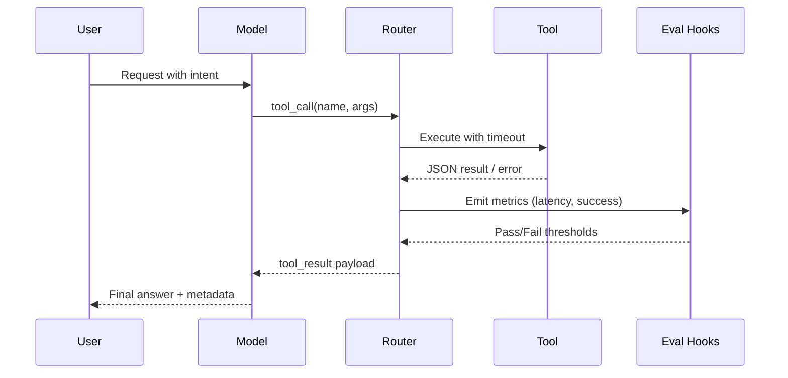

## Summary
Tool calling lets an LLM decide when to invoke deterministic logic such as database lookups, ticket creation, or analytics queries. A consistent pattern across providers helps you avoid brittle JSON, runaway retries, and silent failures. This guide covers schema design, execution loops, observability, and provider-specific nuances so your agents behave predictably in production.

### You’ll learn
- When to reach for tool calling instead of embedding logic directly in prompts.
- How to design JSON schemas that keep arguments validated across SDKs.
- How to implement a Node.js or Python control loop with timeouts, retries, and streaming responses.
- How to log, evaluate, and budget tool calls to prevent runaway costs.
- How to adapt the pattern to OpenAI Responses, Anthropic Messages, and other APIs.

## When tool calling pays off
- **Structured side effects:** You need the model to trigger precise actions (create tickets, fetch records) that require validated parameters.
- **Dynamic workflows:** The user request determines which integration to invoke, and hard-coding a flow would be brittle.
- **Human-in-the-loop review:** You want intermediate steps surfaced for auditing before finalizing an answer.
- **Cost control:** You want to reuse cheaper models for reasoning while delegating heavyweight logic to deterministic services.

Stay with single-shot prompting when outputs can remain purely narrative and no external state changes are needed.

## Design checklist
| Layer | Questions | Guardrails |
| --- | --- | --- |
| **Schema** | Are parameters typed with ranges/enums? Are defaults explicit? | Publish JSON Schema, reject unknown fields, include prompt ID references. |
| **Execution** | How long can each tool run? What retries are safe? | Use per-tool timeouts, enforce idempotency keys, classify errors. |
| **Observability** | What telemetry shows tool arguments and results? | Log sanitized payloads, include correlation IDs, emit cost metrics. |
| **Governance** | Who approves new tools? How are secrets handled? | Store configs in version control, review with security, rotate credentials. |

## Schema patterns
- **Start with JSON Schema.** Providers expect either `parameters` (OpenAI) or `input_schema` (Anthropic). Mirror the same schema server-side for validation before execution.【F:docs/patterns/specs/tool-spec-template.md†L1-L86】
- **Enforce required vs optional fields.** Use `required` arrays and enumerations for constrained values. Reject payloads missing mandatory data before calling external APIs.
- **Annotate for observability.** Include `request_id`, `source`, or `customer_id` fields so logs and analytics align with the user session.
- **Plan for versioning.** Use semantic version strings in tool metadata so you can evolve schemas without breaking older prompts.

## Control loop (Node.js)
```ts
import OpenAI from "openai";
import { z } from "zod";

const client = new OpenAI({ apiKey: process.env.OPENAI_API_KEY! });

const createTicketSchema = z.object({
  title: z.string().min(4),
  body: z.string().min(10),
  priority: z.enum(["low", "medium", "high"]).default("medium"),
  correlation_id: z.string().uuid(),
});

const createTicketTool = {
  type: "function" as const,
  function: {
    name: "create_ticket",
    description: "Create a support ticket in ServiceNow",
    parameters: {
      type: "object",
      properties: {
        title: { type: "string", minLength: 4 },
        body: { type: "string", minLength: 10 },
        priority: {
          type: "string",
          enum: ["low", "medium", "high"],
          default: "medium",
        },
        correlation_id: { type: "string", format: "uuid" },
      },
      required: ["title", "body", "correlation_id"],
      additionalProperties: false,
    },
  },
};

async function serviceNowCreate(ticket: z.infer<typeof createTicketSchema>) {
  const response = await fetch("https://example.service-now.com/api/tickets", {
    method: "POST",
    headers: {
      "Content-Type": "application/json",
      Authorization: `Bearer ${process.env.SERVICEDESK_TOKEN}`,
    },
    body: JSON.stringify({
      short_description: ticket.title,
      description: ticket.body,
      priority: ticket.priority,
      correlation_id: ticket.correlation_id,
    }),
  });

  if (!response.ok) {
    throw new Error(`servicenow_error:${response.status}`);
  }

  return response.json();
}

async function withTimeout<T>(operation: () => Promise<T>, ms: number) {
  let timeout: NodeJS.Timeout;
  const timeoutPromise = new Promise<never>((_, reject) => {
    timeout = setTimeout(() => reject(new Error("tool_timeout")), ms);
  });
  try {
    return await Promise.race([operation(), timeoutPromise]);
  } finally {
    clearTimeout(timeout);
  }
}

export async function handleRequest(messages) {
  const tools = [createTicketTool];

  const first = await client.responses.create({
    model: "gpt-4o-mini",
    input: messages,
    tools,
    max_output_tokens: 800,
  });

  const call = first.output[0]?.content?.find?.(
    (item) => item.type === "tool_call"
  );
  if (!call) return first.output_text;

  let rawArgs;
  try {
    rawArgs =
      typeof call.function.arguments === "string"
        ? JSON.parse(call.function.arguments)
        : call.function.arguments;
  } catch (error) {
    console.error("Bad tool arguments", error);
    return "Tool arguments could not be parsed.";
  }

  const parsed = createTicketSchema.safeParse(rawArgs);
  if (!parsed.success) {
    return "Ticket parameters invalid — escalated to human reviewer.";
  }

  const result = await withTimeout(() => serviceNowCreate(parsed.data), 5000);

  const second = await client.responses.create({
    model: "gpt-4o-mini",
    input: [
      ...messages,
      {
        role: "tool",
        name: "create_ticket",
        content: JSON.stringify(result),
      },
    ],
    tools,
    max_output_tokens: 400,
  });

  return {
    answer: second.output_text,
    usage: {
      first: first.usage,
      second: second.usage,
    },
  };
}
```
This pattern works across OpenAI’s Chat Completions and Responses APIs; Responses allows streaming tool events, while Chat Completions requires polling the returned tool calls.【F:docs/concepts/structured-outputs.md†L62-L104】

## Control loop (Python, Anthropic Messages)
```python
import json
import os
from anthropic import Anthropic
from pydantic import BaseModel, Field, ValidationError

client = Anthropic(api_key=os.environ["ANTHROPIC_API_KEY"])

class LookupPayload(BaseModel):
    account_id: str = Field(..., min_length=3)
    fields: list[str] = Field(default_factory=lambda: ["status", "plan"])

TOOLS = [
    {
        "name": "crm_lookup",
        "description": "Fetch CRM account details by ID",
        "input_schema": LookupPayload.model_json_schema(),
    }
]

def run_crm_lookup(payload: LookupPayload) -> dict:
    # Read-only call with explicit timeout
    return crm_client.get_account(payload.account_id, payload.fields, timeout=3)


def chat(messages: list[dict]):
    stream = client.messages.stream(
        model="claude-3-haiku-20240307",
        max_output_tokens=400,
        tools=TOOLS,
        messages=messages,
    )

    for event in stream:
        if event.type == "message_delta" and event.delta.get("stop_reason"):
            return event.delta
        if event.type == "message_delta" or event.type == "content_block_delta":
            continue
        if event.type == "tool_call":
            try:
                payload = LookupPayload.model_validate_json(event.input_json)
            except ValidationError as exc:
                stream.send(
                    {
                        "type": "tool_result",
                        "tool_call_id": event.id,
                        "output": json.dumps({
                            "error": "invalid_arguments",
                            "details": exc.errors(),
                        }),
                    }
                )
                continue

            result = run_crm_lookup(payload)
            stream.send(
                {
                    "type": "tool_result",
                    "tool_call_id": event.id,
                    "output": json.dumps(result),
                }
            )
```
Anthropic streams tool call events in real time, allowing you to reject or modify arguments before executing actions.【F:docs/concepts/genai-vs-agentic.md†L66-L110】

## Error handling & retries
- **Retry only idempotent actions.** Define idempotency keys (`correlation_id`) to prevent duplicate side effects when the LLM resubmits tool calls.【F:docs/patterns/specs/tool-spec-template.md†L34-L70】
- **Downgrade to user prompts after failures.** If a tool call fails twice, instruct the model to ask the user for clarification instead of looping.
- **Propagate structured errors.** Wrap upstream exceptions into normalized JSON (e.g., `{ "error": "timeout", "retryable": true }`). Models trained on examples learn to handle them gracefully.
- **Budget calls.** Track the number of tool calls per session and abort when thresholds are exceeded to avoid cost spikes.

## Observability and evaluation

- **Structured logs:** Capture `{ tool_name, duration_ms, success, prompt_id }` for every execution to feed dashboards and alerts.
- **Golden prompts:** Maintain regression tests where known tool calls should be produced; fail CI when outputs drift.
- **Offline evals:** Replay production transcripts with synthetic tool responses to measure how models recover from partial failures.【F:docs/patterns/observability-context.md†L65-L122】

## References
- OpenAI. “Function calling and tool use.” (2024). <https://platform.openai.com/docs/guides/function-calling>
- Anthropic. “Messages API: Tool use and streaming.” (2024). <https://docs.anthropic.com/en/docs/build-with-claude/tool-use>
- Microsoft Learn. “Design reliable function-calling pipelines.” (2024). <https://learn.microsoft.com/azure/ai-services/openai/how-to/function-calling>

## Cross-links
- Prompt specs for tool definitions: [/docs/patterns/specs/tool-spec-template.md](/docs/patterns/specs/tool-spec-template.md)
- Planner–executor orchestration: [/docs/patterns/agentic/planner-executor.md](/docs/patterns/agentic/planner-executor.md)
- Observability checklist: [/docs/patterns/observability-context.md](/docs/patterns/observability-context.md)
- Structured output tactics: [/docs/concepts/structured-outputs.md](/docs/concepts/structured-outputs.md)
