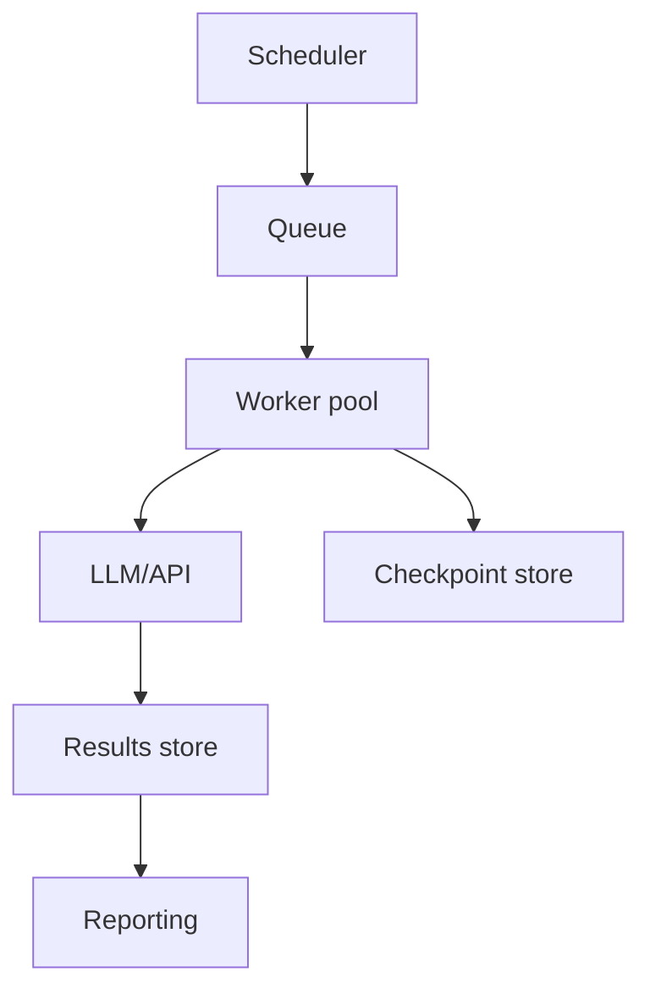

## When to use batch workflows

Batch processing suits backfills, nightly summaries, dataset labeling, and evaluation runs where latency is flexible but reliability and cost tracking are critical. Compared with synchronous APIs, batches can amortize setup overhead, leverage discounted provider pricing, and run in controlled windows.

## Architectural building blocks



- **Scheduler:** Cron, Airflow, or managed workflows (AWS Step Functions, Azure Data Factory) trigger jobs.
- **Queue:** Message broker (SQS, Pub/Sub, RabbitMQ) or database table storing work items with status.
- **Worker pool:** Horizontally scalable workers with idempotent processing logic.
- **Checkpoint store:** Database that records last processed ID, attempt count, token usage.
- **Results store:** Warehouse (BigQuery, Snowflake) or object storage for outputs, logs, and metrics.

## Job specification template

```yaml
job:
  id: nightly-support-summaries
  schedule: "0 2 * * *"
  batch_size: 50
  max_attempts: 3
  timeout_ms: 120000
  token_budget: 150000
  notification_channel: "#ai-batch-alerts"
```

Include dataset snapshot pointers (e.g., `input_manifest_s3_uri`) so runs are reproducible.

## Worker pseudocode

```ts
for await (const item of queue.fetch(batchSize)) {
  try {
    const result = await withBudget(item.token_budget, () => runTask(item));
    await persistResult(item.id, result);
    metrics.increment("batch.success");
  } catch (err) {
    const attempt = item.attempt + 1;
    if (isRetryable(err) && attempt < MAX_ATTEMPTS) {
      queue.requeue({ ...item, attempt });
      metrics.increment("batch.retry");
    } else {
      await markFailed(item, err);
      metrics.increment("batch.failure");
    }
  } finally {
    if (shouldCheckpoint()) await saveCheckpoint(item);
  }
}
```

- Implement `isRetryable` to inspect error codes (HTTP 429, 5xx) and skip validation failures.
- Wrap LLM calls with exponential backoff and jitter.

## Resumability strategies

- **Checkpoint by primary key:** Track last processed record ID; resume from next ID on restart.
- **Manifest-based runs:** Materialize inputs (IDs, payload hashes) to a manifest file and record completion status per entry.
- **State snapshots:** For complex workflows, store serialized state (e.g., partial reflection attempts) so retries continue where they left off.

Ensure checkpoints are transactional to avoid double-processing if a worker crashes after completing an item.

## Cost and performance management

- Estimate cost before execution using historical token averages; halt runs when projected spend exceeds budget.
- Use provider batch APIs (OpenAI Batch, Anthropic Workflows) when available to reduce per-request overhead.
- Auto-scale workers based on queue depth and throttle when hitting provider rate limits.
- Separate high-priority and best-effort jobs into different queues.

## Monitoring and alerting

- Emit metrics: processed count, success/failure ratio, retries, average latency, tokens used.
- Log structured records per item with `job_id`, `attempt`, `token_usage`, `error_code`.
- Alert when failure rate >5%, retries exceed budget, or runtime surpasses SLA.
- Provide run dashboards with sparkline of cost vs. time and heatmaps of error codes.

## Governance checklist

1. Version the job spec and store alongside code.
2. Require change review for schedule modifications or budget increases.
3. Record data lineage: input dataset version, output location, schema.
4. Conduct post-run reviews for failures or significant cost variance.

## References

- Apache Airflow. “Best practices for reliable DAGs.” 2024. <https://airflow.apache.org/docs/apache-airflow/stable/best-practices.html>
- AWS Step Functions. “Optimizing batch workflows.” 2024. <https://docs.aws.amazon.com/step-functions/latest/dg/bp-optimizing.html>
- OpenAI. “Batch API.” 2024. <https://platform.openai.com/docs/guides/batch>
