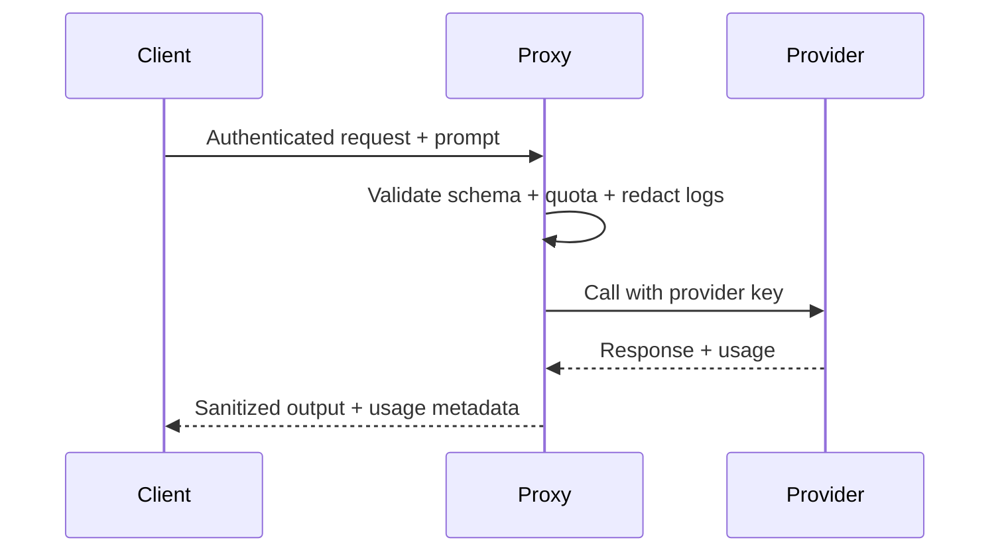

## Summary

Provider credentials unlock access to powerful models—and to runaway spend or data leakage if they are mishandled. Treat AI keys like production database credentials: keep them server-side, enforce strict quotas, redact prompts and outputs in logs, and rotate aggressively. This guide outlines a reference threat model, proxy design, and incident playbook you can adapt to any AI vendor.

### You’ll learn

- How to map the main risks around provider keys and align mitigations.
- How to load and rotate secrets from managed vaults in Node.js and Python.
- How to design a quota-enforcing proxy that keeps keys off untrusted clients.
- How to log provider activity without exposing sensitive prompts or responses.
- How to build a rotation and incident response playbook for credential leaks.

## Map the threat model first

Start with a written threat model so everyone knows what you are defending against. Revisit it whenever you add tools, extend prompts, or onboard a new vendor.

| Risk | Impact | Mitigation |
| --- | --- | --- |
| Key leakage through source control or client-side code | Attackers can run expensive jobs or exfiltrate data | Keep keys in secrets managers, lint CI for accidental commits, and block client-side access. |
| Prompt/response logging of sensitive data | Privacy incidents, regulatory exposure | Redact user content; log metadata only; apply data retention policies. |
| Overuse or abuse (internal or external) | Cost spikes, throttling, downstream outages | Enforce quotas per tenant via proxy middleware, monitor token usage, and alert on anomalies. |
| Supply-chain compromise of SDKs | Execution of malicious code | Pin dependencies, verify integrity, and sandbox provider calls. |
| Stale credentials after employee departure | Unauthorized access | Rotate keys on schedule and during offboarding; maintain ownership registry. |

See the [safety basics checklist](/docs/concepts/safety-basics.md) for broader content and misuse mitigations.

## Keep keys in managed vaults

Managed secrets services provide encryption at rest, rotation workflows, and audit logs. Favor them over `.env` files on disk.

```ts title="Node.js — load from AWS Secrets Manager"
import { SecretsManagerClient, GetSecretValueCommand } from "@aws-sdk/client-secrets-manager";

const client = new SecretsManagerClient({ region: process.env.AWS_REGION });

export async function loadProviderSecrets() {
  const command = new GetSecretValueCommand({ SecretId: "prod/openai" });
  const secret = await client.send(command);
  if (!secret.SecretString) throw new Error("Missing provider secret");

  const parsed = JSON.parse(secret.SecretString);
  return {
    openaiApiKey: parsed.OPENAI_API_KEY,
    anthropicApiKey: parsed.ANTHROPIC_API_KEY,
  };
}
```

```python title="Python — retrieve from Azure Key Vault"
from azure.identity import DefaultAzureCredential
from azure.keyvault.secrets import SecretClient

credential = DefaultAzureCredential()
client = SecretClient(vault_url="https://my-vault.vault.azure.net/", credential=credential)

openai_api_key = client.get_secret("openai-api-key").value
anthropic_api_key = client.get_secret("anthropic-api-key").value
```

Validate configuration at startup as shown in [/docs/operations/env-and-healthcheck.md](/docs/operations/env-and-healthcheck.md), and require short-lived access tokens where possible. Managed services such as Azure Key Vault and AWS Secrets Manager ship rotation workflows and RBAC you can reuse.【F:docs/providers/security-best-practices.md†L103-L115】

## Enforce access through a proxy

Even trusted client apps should never hold raw provider keys. Expose a server-side proxy that authenticates callers, validates payloads, and applies quotas before the request reaches the vendor.



Key proxy responsibilities:

- **Authentication:** Use JWTs or mTLS to confirm tenant identity before forwarding.
- **Schema validation:** Reject prompts with oversized attachments or disallowed parameters (temperature, tools, etc.).
- **Quota enforcement:** Track token usage per customer and throttle when budgets exceed thresholds, complementing the controls in [/docs/patterns/cost-controls.md](/docs/patterns/cost-controls.md).
- **Audit logging:** Record request IDs, hashed prompts, and token counts—not raw content—feeding the observability patterns in [/docs/patterns/observability-context.md](/docs/patterns/observability-context.md).

A minimal Express handler might look like this:

```ts
import express from "express";
import rateLimit from "express-rate-limit";
import OpenAI from "openai";
import { validateRequest } from "./validation.js";
import { recordUsage } from "./usage.js";

const router = express.Router();
const client = new OpenAI({ apiKey: process.env.OPENAI_API_KEY });

router.post(
  "/responses",
  rateLimit({ windowMs: 60_000, max: 120 }),
  async (req, res, next) => {
    try {
      const payload = validateRequest(req.body);
      const response = await client.responses.create(payload);

      await recordUsage({
        tenantId: req.user.tenantId,
        requestId: response.id,
        inputTokens: response.usage?.input_tokens ?? 0,
        outputTokens: response.usage?.output_tokens ?? 0,
      });

      res.status(200).json({
        message: response.output_text,
        usage: response.usage,
      });
    } catch (error) {
      next(error);
    }
  }
);

export default router;
```

Add per-tenant allowlists so only approved workflows can request advanced capabilities such as tool calls or file uploads.

## Log responsibly

Follow least-privilege logging: capture enough detail for operations without storing regulated data. Pair provider responses with correlation IDs so you can reconstruct a timeline without retaining the full prompt.

```python
import logging

logger = logging.getLogger("provider")


def log_call(*, request_id: str, model: str, usage: dict, status: str) -> None:
    logger.info(
        "provider_call",
        extra={
            "request_id": request_id,
            "model": model,
            "status": status,
            "input_tokens": usage.get("input_tokens", 0),
            "output_tokens": usage.get("output_tokens", 0),
        },
    )
```

Scrub prompts and outputs before logging. If you must retain sample content for evaluation, store it in an encrypted, access-controlled bucket with automatic expiry and add a moderation pass described in [/docs/concepts/safety-basics.md](/docs/concepts/safety-basics.md).

## Rotate keys and rehearse incidents

Document an explicit rotation cadence—e.g., every 60 days or immediately after personnel changes—and automate the workflow:

1. Create a new key in the provider console.
2. Update the secret in your vault; propagate through CI/CD.
3. Deploy updated services; verify health checks.
4. Revoke the old key and confirm it no longer appears in logs.
5. Notify stakeholders and update the ownership register.

When you detect leakage or misuse:

- **Contain:** Revoke the exposed key immediately and disable affected workloads.
- **Investigate:** Inspect logs for the blast radius—requests, IPs, and tenants involved.
- **Remediate:** Ship hotfixes (proxy rules, validation) and backfill missing alerts.
- **Review:** Capture lessons learned in the incident postmortem and update playbooks.

Run tabletop exercises twice per year so teams stay comfortable with the process.【F:docs/providers/security-best-practices.md†L157-L184】

## Implementation checklist

- [ ] Keys live only in managed vaults; no raw secrets in repos, CI logs, or client apps.
- [ ] Proxy enforces authentication, schema validation, quotas, and structured logging.
- [ ] Logs redact prompts/responses and store usage metadata with correlation IDs.
- [ ] Rotation playbook is automated and rehearsed; incidents escalate quickly.
- [ ] Observability dashboards track token usage, errors, and unusual traffic patterns.

## References

- OpenAI. “Security Best Practices.” Accessed March 20, 2025. <https://platform.openai.com/docs/guides/security>
- Microsoft Learn. “What is Azure Key Vault?” Accessed March 20, 2025. <https://learn.microsoft.com/azure/key-vault/general/overview>
- AWS. “What Is AWS Secrets Manager?” Accessed March 20, 2025. <https://docs.aws.amazon.com/secretsmanager/latest/userguide/intro.html>
- Google Cloud. “Secret Manager Documentation.” Accessed March 20, 2025. <https://cloud.google.com/secret-manager/docs>
