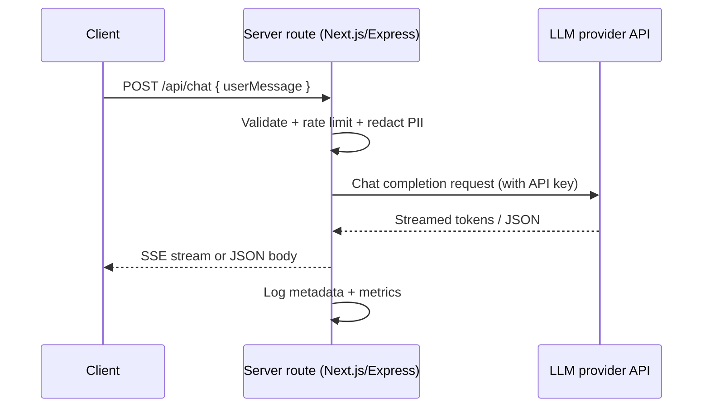

Server-only routes keep provider API keys out of the browser, centralize retries, and ensure every call is logged and governed. This guide shows how to stand up a resilient JavaScript/TypeScript endpoint that proxies user prompts to OpenAI (or any modern chat completion API).
You will build both a Next.js App Router handler and an Express route, add streaming support, and ship production-ready safeguards.

**You’ll learn**

- Why server routes are required for key management, quotas, and auditing.
- How to implement a typed POST handler with retries, timeouts, and structured responses.
- How to stream tokens to the client without exposing secrets.
- Which hardening steps (validation, logging, rate limiting) to apply before launch.
- How to test success and failure paths using automated checks.

## Architecture at a glance

The diagram below shows the recommended flow: clients send lightweight requests to your server route, which enriches them with secrets and calls the provider. Responses (streamed or buffered) flow back through your route so you can log metadata and enforce quotas.



## Choose your runtime and environment variables

1. Store provider keys (for example, `OPENAI_API_KEY`) in server-only environment files (`.env.local` for Next.js, `.env` for Express). Never inject them into client bundles.
2. Decide whether you will run the route in a Node.js runtime or on the Next.js Edge runtime. Edge offers lower latency, but long-running tool calls and SDKs that rely on Node APIs may require the Node runtime.
3. Add configuration for per-request timeouts (for example, 30 seconds) and backoff policies for 429/5xx responses.

## Next.js App Router implementation (recommended)

Create `app/api/chat/route.ts` and enable the Node runtime when you depend on the official OpenAI SDK.

```ts
import { NextResponse } from "next/server";
import OpenAI from "openai";

const client = new OpenAI({ apiKey: process.env.OPENAI_API_KEY });

export const runtime = "nodejs"; // or "edge" when using fetch + streaming

export async function POST(req: Request) {
  const controller = new AbortController();
  const timeout = setTimeout(() => controller.abort(), 30_000);

  try {
    const body = await req.json();
    const userMessage = typeof body?.userMessage === "string" ? body.userMessage.trim() : "";
    if (!userMessage) {
      return NextResponse.json({ error: "userMessage must be a non-empty string" }, { status: 400 });
    }

    let attempt = 0;
    let lastError: unknown;
    while (attempt++ < 3) {
      try {
        const completion = await client.chat.completions.create({
          model: "gpt-4o-mini",
          messages: [
            { role: "system", content: "You are a concise and friendly assistant." },
            { role: "user", content: userMessage }
          ],
          max_tokens: 300,
          timeout: 25_000
        }, { signal: controller.signal });

        const text = completion.choices?.[0]?.message?.content ?? "";
        return NextResponse.json({ text, usage: completion.usage }, { status: 200 });
      } catch (error) {
        lastError = error;
        // Retry on transient issues only
        if (error instanceof OpenAI.APIError && ![429, 500, 502, 503].includes(error.status ?? 0)) {
          throw error;
        }
        await new Promise((resolve) => setTimeout(resolve, 300 * attempt));
      }
    }

    return NextResponse.json({ error: "Upstream provider unavailable" }, { status: 502 });
  } catch (error) {
    const status = error instanceof DOMException && error.name === "AbortError" ? 504 : 500;
    return NextResponse.json({ error: status === 504 ? "Request timed out" : "Unexpected server error" }, { status });
  } finally {
    clearTimeout(timeout);
  }
}
```

### Stream tokens from the App Router

When you need fast first-token latency, switch to the Edge runtime and use the streaming helpers exposed by the OpenAI SDK. This example streams Server-Sent Events (SSE) to the client while still keeping the API key on the server.

```ts
import { StreamingTextResponse, experimental_StreamData } from "ai"; // nextjs-ai package
import OpenAI from "openai";

export const runtime = "edge";

export async function POST(req: Request) {
  const { userMessage } = await req.json();
  if (typeof userMessage !== "string" || !userMessage.trim()) {
    return new Response(JSON.stringify({ error: "Invalid userMessage" }), {
      status: 400,
      headers: { "Content-Type": "application/json" }
    });
  }

  const client = new OpenAI({ apiKey: process.env.OPENAI_API_KEY });
  const response = await client.chat.completions.create({
    model: "gpt-4o-mini",
    stream: true,
    messages: [
      { role: "system", content: "You are a concise and friendly assistant." },
      { role: "user", content: userMessage }
    ]
  });

  const stream = OpenAI.toReadableStream(response);
  const data = new experimental_StreamData();
  data.append({ timestamp: Date.now() });

  return new StreamingTextResponse(stream, { data });
}
```

On the client, consume the SSE stream with the `fetch` API or utilities such as `ai/react`. If you only need JSON responses, stick with the Node runtime example above.

## Express alternative

If you prefer a lighter server, build an Express route with identical validation and retry logic. Add middleware for rate limiting (for example, `express-rate-limit`) and structured logging (`pino`, `winston`).

```ts
import express from "express";
import OpenAI from "openai";

const app = express();
app.use(express.json());

const client = new OpenAI({ apiKey: process.env.OPENAI_API_KEY });

app.post("/api/chat", async (req, res) => {
  const userMessage = typeof req.body?.userMessage === "string" ? req.body.userMessage.trim() : "";
  if (!userMessage) {
    return res.status(400).json({ error: "userMessage must be a non-empty string" });
  }

  let attempt = 0;
  while (attempt++ < 3) {
    try {
      const completion = await client.chat.completions.create({
        model: "gpt-4o-mini",
        messages: [
          { role: "system", content: "You are a concise and friendly assistant." },
          { role: "user", content: userMessage }
        ],
        max_tokens: 300
      });

      return res.json({
        text: completion.choices?.[0]?.message?.content ?? "",
        usage: completion.usage
      });
    } catch (error) {
      if (!(error instanceof OpenAI.APIError) || ![429, 500, 502, 503].includes(error.status ?? 0)) {
        console.error("Non-retriable error", error);
        return res.status(500).json({ error: "Unexpected provider error" });
      }
      await new Promise((resolve) => setTimeout(resolve, 300 * attempt));
    }
  }

  return res.status(502).json({ error: "Provider unavailable after retries" });
});

app.listen(3000, () => {
  console.log("Server running on http://localhost:3000");
});
```

To stream responses from Express, wrap the OpenAI SDK’s readable stream in an SSE helper such as `eventsource-parser` and flush chunks as they arrive.

## Harden the endpoint before launch

- **Validate inputs and enforce quotas.** Combine schema validation (for example, `zod`) with per-user and per-IP quotas. Reject prompts that exceed your max token budget before calling the provider.
- **Log metadata, not secrets.** Capture request IDs, user IDs, model names, latency, and cost estimates. Avoid storing raw prompts or responses unless users consent.
- **Set circuit breakers.** Abort requests that exceed timeouts, and surface friendly 504 messages to clients when the provider is slow.
- **Protect against replay and CSRF.** Require authentication for internal tools and attach CSRF tokens if the route is consumed by browsers.
- **Plan for auditing.** Emit structured logs to observability tools (Datadog, OpenTelemetry) and sample successful/failed responses for QA.

## Test and monitor

1. Use unit tests to assert validation behavior (missing `userMessage`, empty strings, oversize payloads).
2. Add integration tests that stub the OpenAI client and verify retry behavior and timeouts. With Next.js, use `@testing-library/jest-dom` or `vitest` plus `msw` to mock provider responses.
3. Run manual smoke tests:
   - `curl -X POST http://localhost:3000/api/chat -H 'Content-Type: application/json' -d '{"userMessage":"Hello"}'`
   - Force a 429 by reducing rate limits and confirm the route backs off.
4. Monitor production latency, error rate, and cost per request. Alert on sustained 5xx or unusual spikes in token usage.

## References

- OpenAI Platform docs — [Chat completions API](https://platform.openai.com/docs/guides/text-generation)
- Vercel — [Next.js App Router route handlers](https://nextjs.org/docs/app/building-your-application/routing/route-handlers)
- MDN Web Docs — [Server-Sent Events](https://developer.mozilla.org/en-US/docs/Web/API/Server-sent_events/Using_server-sent_events)
- Express.js — [Production best practices: security](https://expressjs.com/en/advanced/best-practice-security.html)
