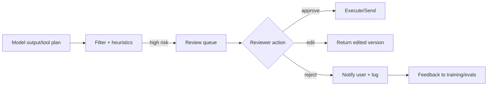

## Keep humans in control of high-impact decisions

Human-in-the-loop (HITL) workflows let reviewers approve, edit, or reject AI outputs before they reach customers or trigger irreversible actions. This page outlines where to insert gates, how to design the reviewer experience, and how to measure effectiveness.

### You’ll learn
- How to decide which scenarios require human approval
- How to build review queues with clear context and accountability
- How to integrate reviewer feedback into evaluation loops
- Metrics for tracking throughput, quality, and incident rates
- References to industry guidance on human oversight

## Identify gate-worthy scenarios

Prioritize HITL for:

- **Irreversible actions:** Money movement, system changes, legal communications.
- **Regulated content:** Healthcare, finance, HR decisions subject to compliance rules.
- **Ambiguous or high-risk prompts:** Detected via `/docs/safety/output-filters.md` or evaluator disagreement.
- **Low confidence signals:** Model self-reported uncertainty, low rubric scores from `/docs/evaluations/rubric-prompts.md`.

Document criteria in your safety policy so engineers know when to queue outputs.

## Design the review flow

### Reviewer experience

- Show concise context: original prompt, retrieved documents, model reasoning, tool outputs.
- Provide decision buttons (approve, edit, reject) with required justification notes.
- Surface policy checklists or quick links to `/docs/safety/overview.md` for reference.
- Capture reviewer identity and timestamp for audit trails.

### Tooling options

- Lightweight: spreadsheets or Airtable with API integrations.
- Custom web apps built on Next.js or internal admin frameworks.
- Specialized moderation platforms with SLA tracking.

## Feed reviewer feedback downstream

- Store reviewer decisions with tags (reason codes) to enrich evaluation datasets.
- Incorporate edits into prompt improvements or retrieval updates.
- When reviewers reject outputs, create issues or backlog items to address root causes (e.g., missing guardrails).

## Measure effectiveness

Track:

- Approval rate and edit rate per queue.
- Median review time and backlog size.
- Incidents that slipped past reviewers (should trend toward zero).
- Reviewer workload distribution to avoid burnout.

Use dashboards and weekly reviews to keep stakeholders aligned.

## References

- Microsoft. “Responsible AI standard: human oversight.” 2023. <https://www.microsoft.com/ai/responsible-ai>
- NIST. “AI Risk Management Framework.” 2023. <https://www.nist.gov/itl/ai-risk-management-framework>
- Anthropic. “Human feedback workflows.” 2024. <https://docs.anthropic.com/en/docs/safety/human-feedback>
