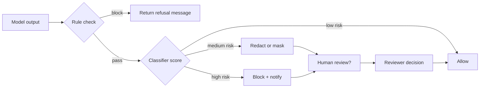

## Build a layered filtering pipeline

Even the best prompts produce occasional unsafe outputs. Filters provide a backstop by detecting disallowed content, redacting sensitive data, and routing risky responses to humans. This guide covers architecture patterns, decision policies, and implementation tips.

### You’ll learn
- How to design multi-stage filter pipelines with rules and ML classifiers
- How to tune thresholds and actions (allow, redact, block, escalate)
- How to log filter outcomes for audits and continuous improvement
- How to integrate filters with evaluation suites and human review queues
- References for provider moderation APIs and policy guidance

## Design the decision flow



### Stage 1: Rules engine

- Match deterministic patterns: profanity lists, PII regexes (credit cards, SSNs), forbidden tool names.
- Normalize text (lowercase, unicode) to reduce bypass attempts.
- Keep rules version-controlled with clear owners.

### Stage 2: Classifier or moderation API

- Use provider moderation endpoints (OpenAI Moderation, Azure Content Safety) or fine-tuned classifiers.
- Record raw scores and categories (hate, violence, self-harm) for auditing.
- Tune thresholds based on false positive tolerance.

### Stage 3: Post-processing

- Redact sensitive fields (`****-****-1234`), replace with generic messages, or attach disclaimers.
- Queue borderline cases for human review as described in `/docs/safety/human-in-the-loop.md`.

## Implementation tips

- **Streaming support:** Buffer partial tokens until the filter decides to allow or block. Provide loading indicators to users.
- **Structured outputs:** Validate JSON against schemas to prevent hidden payloads. See `/docs/concepts/structured-outputs.md`.
- **Performance:** Run lightweight rules locally, batch classifier requests where possible, and monitor latency.
- **Localization:** Maintain language-specific rule sets and classifiers if you support multiple locales.

## Logging and analytics

Log filter outcomes with minimal data:

```json
{
  "request_id": "abc-123",
  "model": "gpt-4o-mini",
  "rule_hits": ["pii_email"],
  "classifier": { "category": "self-harm", "score": 0.86 },
  "action": "block",
  "timestamp": "2025-03-16T02:15:00Z"
}
```

Aggregate metrics weekly:

- Block vs. allow rate per feature
- Top rule hits and classifier categories
- Average reviewer turnaround time
- False positive feedback from humans

Use these metrics to update rules, adjust thresholds, and refine prompts.

## References

- OpenAI. “Moderation overview.” 2024. <https://platform.openai.com/docs/guides/moderation>
- Microsoft. “Azure AI Content Safety overview.” 2024. <https://learn.microsoft.com/azure/ai-services/content-safety/overview>
- Google Cloud. “Moderate generative AI outputs.” 2024. <https://cloud.google.com/vertex-ai/docs/generative-ai/operations/moderation>
