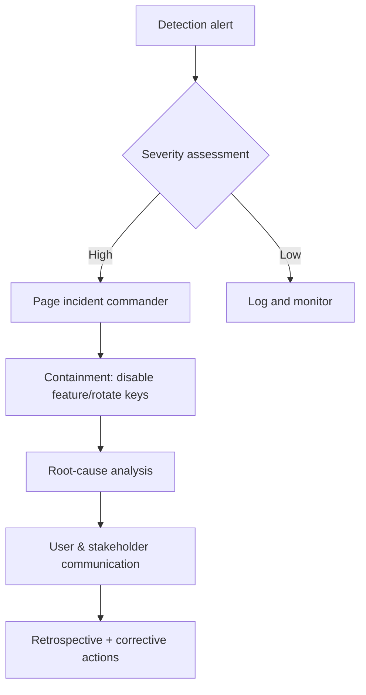

## Build a shared safety playbook

Responsible AI programs align policy, engineering, legal, and operations teams on what GenAI systems may and may not do. This overview defines safety pillars, governance roles, monitoring practices, and escalation paths that help you launch features responsibly.

### You’ll learn
- How to frame safety objectives and risk categories across products
- Governance roles and rituals that keep policies current
- Technical controls for prevention, detection, and response
- How to handle incidents, audits, and user communications
- References from major providers and regulators

## Anchor to safety pillars

Structure your program around three pillars:

1. **Prevent** — Define scope, approved content, and least-privilege access to tools and data. Use system prompts, input validation, and role-based access control to eliminate obvious misuse.
2. **Detect** — Monitor prompts, outputs, and tool calls for policy violations. Layer output filters and anomaly detection to catch issues early.
3. **Respond** — Establish human review, incident response, and user notification procedures for inevitable edge cases.

Tie each pillar to measurable KPIs (e.g., rate of blocked prompts, time to resolve incidents) and review quarterly with leadership.

## Define governance roles

| Role | Responsibilities | Cadence |
| --- | --- | --- |
| Policy owner | Maintains safety taxonomy, approves new capabilities, coordinates legal review | Quarterly + ad-hoc for changes |
| Product/engineering lead | Implements guardrails, logs safety metrics, ensures deployments follow checklists | Sprint reviews |
| Safety reviewer | Conducts red teaming, audits outputs, leads incident retrospectives | Monthly |
| Data protection officer | Confirms data retention and privacy compliance | Quarterly |

Document these responsibilities in a RACI chart and include them in onboarding for new team members.

## Implement layered technical controls

### Prevention

- Scope prompts with `/docs/safety/prompt-safety.md` templates that state approved domains, audiences, and refusal language.
- Enforce least-privilege tool access by requiring explicit approvals before models can invoke high-risk actions.
- Strip or mask sensitive data fields at ingestion; log only metadata by default.

### Detection

- Run `/docs/safety/output-filters.md` on every response, combining rules and classifiers.
- Track anomaly signals (rapid request spikes, repeated tool failures, sudden sentiment shifts).
- Instrument feature flags for safety experiments so you can isolate regressions quickly.

### Response

- Queue uncertain or policy-relevant outputs for reviewers following `/docs/safety/human-in-the-loop.md`.
- Maintain incident runbooks: severity levels, who to page, communication templates, and rollback procedures.
- Capture decisions and follow-up actions in a central knowledge base for audits.

## Conduct regular reviews

- **Red teaming:** Schedule scenario-based stress tests at least quarterly. Document attempts, model responses, and mitigation backlog items.
- **Policy refresh:** Revisit safety taxonomy whenever regulations or provider policies change. Update prompts, filters, and training accordingly.
- **Audit logs:** Verify that logging meets privacy regulations (GDPR, CCPA) and provider terms of service.

## Incident response workflow

Practice tabletop exercises so teams know their responsibilities before real incidents occur.

## Communicate transparently

- Publish user-facing safety statements summarizing allowed use cases, data handling, and escalation contacts.
- Provide clear refusal messages with alternative channels (e.g., “Contact compliance@company.com for policy approval.”).
- Share safety metrics and improvements with internal stakeholders to maintain trust.

## References

- OpenAI. “Safety and usage policies.” 2024. <https://platform.openai.com/docs/guides/safety-best-practices>
- Anthropic. “Responsible deployment guidance.” 2024. <https://docs.anthropic.com/en/docs/safety/responsible-deployment>
- Microsoft. “Responsible AI standard.” 2023. <https://www.microsoft.com/ai/responsible-ai>
- NIST. “AI Risk Management Framework.” 2023. <https://www.nist.gov/itl/ai-risk-management-framework>
