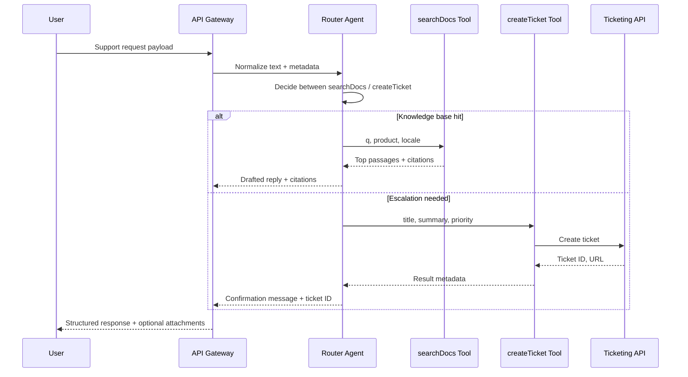

## Summary
A helpdesk agent pairs natural-language triage with deterministic tools so customers get fast answers without exposing backend complexity. In this tutorial you will assemble a router agent that chooses between documentation search and ticket escalation, enforce guardrails around tool usage, and wire in an evaluation loop that keeps the workflow measurable. By the end, you can plug the agent into an existing support portal or chat widget with confidence that each step is observable and testable.

### You’ll learn
- How to model a helpdesk workflow as a planner/executor loop with clear tool contracts.
- How to implement tool calling for search and ticket creation in both Node.js and Python.
- How to log decisions, enforce budgets, and redact sensitive customer data.
- How to run lightweight evaluations that track tool success, tone, and escalation accuracy.
- How to extend the agent with retrieval, analytics, and handoff patterns.

## Architecture overview



The agent makes a single decision per request to keep latency and cost predictable. You can add more tools (billing lookup, status updater) later, but start with the two high-impact paths: answering known questions and escalating unresolved ones.

## Prerequisites

- Support knowledge base exported to Markdown or HTML and indexed with embeddings (see `/docs/patterns/rag/basics.md`).
- Ticketing API credentials (e.g., Zendesk, Freshdesk, ServiceNow) scoped to create and update tickets.
- Environment variables set locally or in your secrets manager:
  - `OPENAI_API_KEY` (or provider equivalent)
  - `HELPDESK_SEARCH_API` endpoint and key
  - `HELPDESK_TICKETING_API` endpoint, key, and optional queue identifiers
- Logging sink (e.g., OpenTelemetry collector, Datadog) with sampling configured as described in `/docs/patterns/observability-context.md`.

## Step 1: Define deterministic tools

Craft JSON schemas that describe exactly what the model may invoke. The stricter the schema, the easier it is to validate inputs and prevent malformed tickets.

```ts
// tools.ts
import type { ResponsesAPI } from "openai";

export const tools: ResponsesAPI.Tool[] = [
  {
    type: "function",
    function: {
      name: "searchDocs",
      description: "Search the knowledge base for an answer. Return concise passages.",
      parameters: {
        type: "object",
        properties: {
          q: { type: "string", description: "Natural-language query" },
          product: { type: "string" },
          locale: { type: "string", enum: ["en", "es", "fr"] }
        },
        required: ["q"],
        additionalProperties: false
      }
    }
  },
  {
    type: "function",
    function: {
      name: "createTicket",
      description: "Escalate to human support with a structured summary.",
      parameters: {
        type: "object",
        properties: {
          title: { type: "string", minLength: 10 },
          summary: { type: "string", description: "Markdown summary with bullet list" },
          priority: {
            type: "string",
            enum: ["low", "medium", "high"],
            description: "Map severity to ticket priority"
          }
        },
        required: ["title", "summary"],
        additionalProperties: false
      }
    }
  }
];
```

```python
# tools.py
from typing import List, Dict, Any

ToolsType = List[Dict[str, Any]]

tools: ToolsType = [
    {
        "type": "function",
        "function": {
            "name": "searchDocs",
            "description": "Search the knowledge base for an answer. Return concise passages.",
            "parameters": {
                "type": "object",
                "properties": {
                    "q": {"type": "string", "description": "Natural-language query"},
                    "product": {"type": "string"},
                    "locale": {"type": "string", "enum": ["en", "es", "fr"]},
                },
                "required": ["q"],
                "additionalProperties": False,
            },
        },
    },
    {
        "type": "function",
        "function": {
            "name": "createTicket",
            "description": "Escalate to human support with a structured summary.",
            "parameters": {
                "type": "object",
                "properties": {
                    "title": {"type": "string", "minLength": 10},
                    "summary": {"type": "string", "description": "Markdown summary with bullet list"},
                    "priority": {
                        "type": "string",
                        "enum": ["low", "medium", "high"],
                        "description": "Map severity to ticket priority",
                    },
                },
                "required": ["title", "summary"],
                "additionalProperties": False,
            },
        },
    },
]
```

Store the schema in code so both the agent and the tool implementation share a single source of truth.

## Step 2: Build the router agent endpoint

The router takes a sanitized customer request, calls the model with tool definitions, and enforces budgets. Always log the decision, tokens, and outcome for post-incident reviews.

```ts
// routes/helpdesk.ts
import crypto from "node:crypto";
import { Router } from "express";
import OpenAI from "openai";
import { tools } from "../lib/tools.js";
import { createTicket, searchDocs } from "../lib/helpdesk-services.js";

const router = Router();
const client = new OpenAI({ apiKey: process.env.OPENAI_API_KEY });
const MAX_OUTPUT_TOKENS = 400;
const MAX_TOOL_CALLS = 1;

router.post("/helpdesk", async (req, res) => {
  const { message, metadata } = req.body;
  const traceId = crypto.randomUUID();

  try {
    const response = await client.responses.create({
      model: "gpt-4o-mini",
      input: [
        {
          role: "system",
          content: "You are a support triage agent. Prefer knowledge-base answers; escalate only when necessary.",
        },
        { role: "user", content: message },
      ],
      tools,
      max_output_tokens: MAX_OUTPUT_TOKENS,
      metadata: { traceId, route: "helpdesk" },
    });

    const toolCalls = response.output.filter((item) => item.type === "tool_call");
    if (toolCalls.length === 0) {
      return res.status(200).json({
        reply: response.output_text,
        traceId,
        route: "direct_answer",
      });
    }

    if (toolCalls.length > MAX_TOOL_CALLS) {
      return res.status(429).json({ error: "too_many_tool_calls", traceId });
    }

    const toolCall = toolCalls[0];
    const { name, arguments: args } = toolCall as Extract<
      (typeof response.output)[number],
      { type: "tool_call" }
    >;

    let payload;
    if (name === "searchDocs") {
      payload = await searchDocs(args);
    } else if (name === "createTicket") {
      payload = await createTicket({ ...args, metadata });
    } else {
      return res.status(400).json({ error: "unsupported_tool", traceId });
    }

    return res.status(200).json({
      reply: response.output_text,
      tool: { name, payload },
      traceId,
    });
  } catch (error) {
    console.error({ traceId, route: "helpdesk", error });
    return res.status(502).json({ error: "helpdesk_failed", traceId });
  }
});

export default router;
```

```python
# api/routes/helpdesk.py
import uuid
from fastapi import APIRouter, HTTPException
from pydantic import BaseModel
from openai import OpenAI

from ..lib.tools import tools
from ..lib.helpdesk_services import search_docs, create_ticket

router = APIRouter()
client = OpenAI()
MAX_OUTPUT_TOKENS = 400


class HelpdeskRequest(BaseModel):
    message: str
    metadata: dict | None = None


@router.post("/helpdesk")
async def helpdesk_endpoint(payload: HelpdeskRequest):
    trace_id = str(uuid.uuid4())
    try:
        response = client.responses.create(
            model="gpt-4o-mini",
            input=[
                {
                    "role": "system",
                    "content": "You triage support requests. Answer from docs when possible; escalate otherwise.",
                },
                {"role": "user", "content": payload.message},
            ],
            tools=tools,
            max_output_tokens=MAX_OUTPUT_TOKENS,
            metadata={"traceId": trace_id, "route": "helpdesk"},
        )
    except Exception as exc:  # noqa: BLE001
        raise HTTPException(status_code=502, detail={"error": "model_error", "traceId": trace_id}) from exc

    tool_calls = [item for item in response.output if item["type"] == "tool_call"]
    if not tool_calls:
        return {"reply": response.output_text, "route": "direct_answer", "traceId": trace_id}

    if len(tool_calls) > 1:
        raise HTTPException(status_code=429, detail={"error": "too_many_tool_calls", "traceId": trace_id})

    call = tool_calls[0]
    name = call["name"]
    args = call["arguments"]

    if name == "searchDocs":
        payload_result = await search_docs(args)
    elif name == "createTicket":
        payload_result = await create_ticket({**args, "metadata": payload.metadata})
    else:
        raise HTTPException(status_code=400, detail={"error": "unsupported_tool", "traceId": trace_id})

    return {
        "reply": response.output_text,
        "tool": {"name": name, "payload": payload_result},
        "traceId": trace_id,
    }
```

Use middleware to redact secrets (customer email, tokens) before logging the request and response metadata.

## Step 3: Implement the tool handlers

Tool handlers translate the model’s intent into real API calls. Validate inputs before making network requests and propagate structured errors back to the agent.

```ts
// lib/helpdesk-services.ts
import { z } from "zod";
import fetch from "node-fetch";

const searchSchema = z.object({ q: z.string().min(3), product: z.string().optional(), locale: z.string().optional() });
const ticketSchema = z.object({
  title: z.string().min(10),
  summary: z.string().min(30),
  priority: z.enum(["low", "medium", "high"]).default("medium"),
  metadata: z.record(z.any()).optional(),
});

export async function searchDocs(args: unknown) {
  const { q, product, locale } = searchSchema.parse(args);
  const response = await fetch(`${process.env.HELPDESK_SEARCH_API}/search`, {
    method: "POST",
    headers: { "Content-Type": "application/json", Authorization: `Bearer ${process.env.HELPDESK_SEARCH_KEY}` },
    body: JSON.stringify({ q, product, locale, topK: 4 }),
    timeout: 3500,
  });
  if (!response.ok) throw new Error(`search_failed:${response.status}`);
  const data = await response.json();
  return data.results.map((hit: any) => ({
    excerpt: hit.snippet,
    url: hit.url,
    score: hit.score,
  }));
}

export async function createTicket(args: unknown) {
  const { title, summary, priority, metadata } = ticketSchema.parse(args);
  const response = await fetch(`${process.env.HELPDESK_TICKETING_API}/tickets`, {
    method: "POST",
    headers: { "Content-Type": "application/json", Authorization: `Bearer ${process.env.HELPDESK_TICKETING_KEY}` },
    body: JSON.stringify({ title, summary, priority, metadata }),
    timeout: 4000,
  });
  if (!response.ok) throw new Error(`ticket_failed:${response.status}`);
  return await response.json();
}
```

```python
# lib/helpdesk_services.py
from typing import Any

import os
import httpx
from pydantic import BaseModel, ValidationError, constr


class SearchArgs(BaseModel):
    q: constr(min_length=3)  # type: ignore[valid-type]
    product: str | None = None
    locale: str | None = None


class TicketArgs(BaseModel):
    title: constr(min_length=10)  # type: ignore[valid-type]
    summary: constr(min_length=30)  # type: ignore[valid-type]
    priority: str = "medium"
    metadata: dict[str, Any] | None = None


async def search_docs(args: dict[str, Any]) -> list[dict[str, Any]]:
    try:
        validated = SearchArgs.model_validate(args)
    except ValidationError as exc:
        raise ValueError("invalid_args") from exc

    async with httpx.AsyncClient(timeout=3.5) as client:
        response = await client.post(
            f"{os.environ['HELPDESK_SEARCH_API']}/search",
            headers={
                "Authorization": f"Bearer {os.environ['HELPDESK_SEARCH_KEY']}",
                "Content-Type": "application/json",
            },
            json={"q": validated.q, "product": validated.product, "locale": validated.locale, "topK": 4},
        )
    response.raise_for_status()
    data = response.json()
    return [
        {"excerpt": hit["snippet"], "url": hit["url"], "score": hit["score"]}
        for hit in data.get("results", [])
    ]


async def create_ticket(args: dict[str, Any]) -> dict[str, Any]:
    try:
        validated = TicketArgs.model_validate(args)
    except ValidationError as exc:
        raise ValueError("invalid_args") from exc

    async with httpx.AsyncClient(timeout=4.0) as client:
        response = await client.post(
            f"{os.environ['HELPDESK_TICKETING_API']}/tickets",
            headers={
                "Authorization": f"Bearer {os.environ['HELPDESK_TICKETING_KEY']}",
                "Content-Type": "application/json",
            },
            json=validated.model_dump(),
        )
    response.raise_for_status()
    return response.json()
```

Replace `process.env[...]` or `os.environ[...]` access with your preferred secrets manager abstraction.

## Step 4: Layer evaluations and analytics

A helpdesk agent needs two feedback loops: real-time alerts and offline evaluations.

- **Smoke tests:** Maintain 10–15 golden prompts with expected tool decisions. Run them after every prompt change using `/docs/evaluations/tool-use-evals.md` guidance.
- **Conversation sampling:** Randomly sample 5% of sessions. Human reviewers score tone, correctness, and escalation justification using rubric prompts.
- **Automated checks:** Parse tool responses to ensure `searchDocs` returns at least one passage and `createTicket` includes a valid ticket ID. Raise incidents when checks fail.
- **Dashboard metrics:** Track request volume, tool mix, deflection rate (answered without ticket), and average response latency. Combine with satisfaction survey scores to verify business impact.

## Step 5: Prepare for production

- **Access control:** Restrict tool APIs to the agent’s IP range or service account and rotate keys quarterly.
- **PII handling:** Hash email addresses before logging. Store raw customer data only in ticketing systems that already comply with your privacy program.
- **Fallbacks:** When the agent fails to produce a tool call or returns an error, send the user a human fallback message and trigger an alert.
- **Change management:** Version prompts in Git, annotate releases with evaluation results, and create a rollback plan when quality dips.

## Extensions

- **Add retrieval-grounded answers:** Inject the top passages returned by `searchDocs` directly into the model’s response with citation markers, following `/docs/patterns/rag/basics.md`.
- **Integrate analytics systems:** Send agent outcomes to your product analytics platform to measure deflection and ticket creation trends.
- **Introduce reflection:** For high-severity tickets, add a self-critique prompt that verifies tone, summarises user sentiment, and double-checks priority.

## References

- OpenAI. “Function calling and tool use.” 2024. <https://platform.openai.com/docs/guides/function-calling>
- Zendesk. “Ticketing API basics.” 2024. <https://developer.zendesk.com/documentation/ticketing/introduction/>
- Freshworks. “Support search API.” 2024. <https://developers.freshdesk.com/api/#search_tickets>
- Microsoft. “Responsible AI controls for support bots.” 2024. <https://learn.microsoft.com/azure/ai-services/openai/how-to/responsible-use-guidelines>
