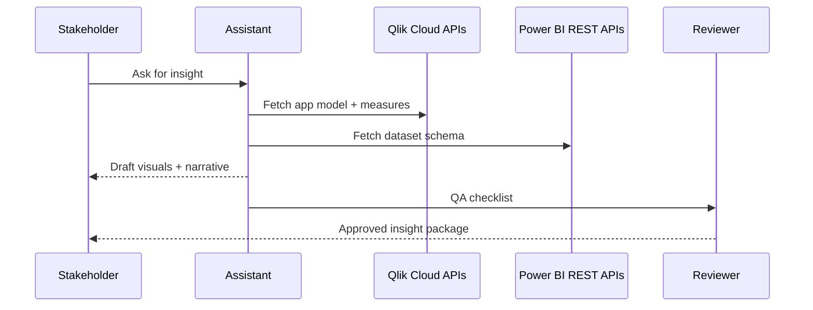

## Overview
This tutorial guides you through creating an analytics assistant that helps business stakeholders explore data in Qlik Cloud and Power BI. The assistant suggests charts, drafts narratives, and performs QA checks while respecting governance controls.

## You’ll learn
- Capture requirements and data constraints in a prompt spec tailored to business analysts.
- Connect the assistant to Qlik Cloud and Power BI metadata APIs for schema grounding.
- Generate chart configurations and DAX/Expression snippets with review gates.
- Produce natural-language narratives with citations and caveats.
- Validate outputs with automated tests and human review loops.

## Prerequisites
- Existing Qlik Cloud tenant and Power BI workspace with API credentials.
- Read-only service principals for metadata access (no dataset writes).
- Node.js 18+ and Python 3.10+.
- Familiarity with REST APIs, DAX basics, and Qlik expressions.

## Operating model



## Step 1 — Frame the prompt spec
Create `prompts/analytics-assistant.md`:

```markdown
## Intent
Help stakeholders choose visuals and narratives grounded in governed datasets.

## Inputs
- Business question and desired grain.
- Target platform (Qlik or Power BI).
- Allowed datasets, measures, and filters from metadata tools.

## Outputs
- Recommended chart type with configuration JSON.
- Supporting calculation (Qlik expression or DAX) with explanation.
- Narrative summary with cited metrics and caveats.

## Constraints
- Only use fields flagged as governed (no personal data).
- Include a QA checklist with at least three validation steps.
- Provide alternative visual if data volume exceeds 50k rows.

## Evaluation hooks
- Compare recommended charts against a golden set of scenarios.
- Log stakeholder feedback and incorporate into prompt tuning.
```

## Step 2 — Gather metadata from Qlik Cloud
1. Create an OAuth client in Qlik Cloud with `data:read` scopes.
2. Use the Qlik App Metadata API to list measures and dimensions:
   ```bash
   curl -X GET "https://your-tenant.us.qlikcloud.com/api/v1/apps/{appId}/data/metadata" \
     -H "Authorization: Bearer $QLIK_TOKEN"
   ```
3. Store the response in `metadata/qlik/{appId}.json` and strip fields not needed by the assistant.
4. Build a Python helper that surfaces this metadata via a tool call.

```python
# tools/analytics_assistant/qlik.py
import json
from pathlib import Path

from pydantic import BaseModel

class QlikField(BaseModel):
    name: str
    type: str
    tags: list[str]

class QlikMetadata(BaseModel):
    app_id: str
    measures: list[QlikField]
    dimensions: list[QlikField]


def load_app_metadata(app_id: str) -> QlikMetadata:
    data = json.loads(Path(f"metadata/qlik/{app_id}.json").read_text())
    return QlikMetadata.model_validate(data)
```

## Step 3 — Fetch Power BI dataset schemas
1. Register an Azure AD application with delegated permissions `Dataset.Read.All`.
2. Call the Power BI REST API to list tables and measures:
   ```bash
   curl -X GET "https://api.powerbi.com/v1.0/myorg/datasets/{datasetId}/tables" \
     -H "Authorization: Bearer $POWERBI_TOKEN"
   ```
3. Cache the schema in `metadata/powerbi/{datasetId}.json`.
4. Expose a Node.js tool for the LLM to request field definitions.

```ts
// tools/analytics-assistant/powerbi.ts
import { readFile } from "node:fs/promises";
import { z } from "zod";

const Table = z.object({
  name: z.string(),
  columns: z.array(z.object({ name: z.string(), dataType: z.string(), isHidden: z.boolean().optional() }))
});

export async function getDataset(datasetId: string) {
  const raw = await readFile(`metadata/powerbi/${datasetId}.json`, "utf-8");
  return Table.array().parse(JSON.parse(raw));
}
```

## Step 4 — Generate chart recommendations
Use the OpenAI Responses API to produce structured outputs.

```python
# tools/analytics_assistant/generate.py
from openai import OpenAI
from pydantic import BaseModel, Field

client = OpenAI()

class ChartPlan(BaseModel):
    platform: str
    chart_type: str
    config: dict
    calculation: str
    narrative: str
    qa_steps: list[str] = Field(min_items=3, max_items=6)
    citations: list[str]


def plan_insight(spec: str) -> ChartPlan:
    response = client.responses.create(
        model="gpt-4.1",
        input=[
            {"role": "system", "content": "You are an analytics assistant. Use provided metadata only."},
            {"role": "user", "content": spec}
        ],
        response_format={"type": "json_schema", "json_schema": ChartPlan.model_json_schema()},
        max_output_tokens=1000,
        temperature=0.4,
    )
    return ChartPlan.model_validate_json(response.output_text)
```

Provide a Node.js utility to render platform-specific config.

```ts
// tools/analytics-assistant/plan-insight.ts
import { OpenAI } from "openai";
import { z } from "zod";

const ChartPlan = z.object({
  platform: z.enum(["qlik", "powerbi"]),
  chart_type: z.string(),
  config: z.record(z.any()),
  calculation: z.string(),
  narrative: z.string(),
  qa_steps: z.array(z.string()).min(3).max(6),
  citations: z.array(z.string())
});

const client = new OpenAI({ apiKey: process.env.OPENAI_API_KEY });

export async function planInsight(spec: string) {
  const response = await client.responses.create({
    model: "gpt-4.1",
    input: [
      { role: "system", content: "Return JSON with chart recommendations using provided metadata only." },
      { role: "user", content: spec }
    ],
    response_format: { type: "json_object" },
    max_output_tokens: 1000,
    temperature: 0.4
  });
  return ChartPlan.parse(JSON.parse(response.output_text));
}
```

```ts
// scripts/render-visual.ts
import { planInsight } from "../tools/analytics-assistant/plan-insight";
import { writeFile } from "node:fs/promises";

const spec = process.argv[2];
const plan = await planInsight(spec);
await writeFile(`out/${plan.platform}-${Date.now()}.json`, JSON.stringify(plan.config, null, 2));
console.log(plan.narrative);
console.log("QA checklist:\n- " + plan.qa_steps.join("\n- "));
```

## Step 5 — Establish QA gates
- Validate chart config JSON against platform schemas (`qlik-visualization-schema`, `powerbi-visuals-tools`).
- Run smoke queries (Qlik `hypercube` requests, Power BI `DAX evaluate`) to confirm calculations.
- Require human reviewers to confirm narrative accuracy and check for compliance language.
- Log QA outcomes in `logs/analytics-assistant.jsonl` to inform prompt tuning.

## Step 6 — Add evaluation harnesses
1. Create `evals/analytics-assistant.jsonl` with canonical questions, expected chart types, and metric checks.
2. Write tests to compare generated outputs to expectations.
   ```bash
   pytest tests/test_analytics_assistant.py
   node scripts/check-evals.js
   ```
3. Track precision of chart recommendations, narrative factuality, and reviewer satisfaction scores.

## Try it locally
1. Export metadata from one Qlik app and one Power BI dataset.
2. Fill out the prompt spec with a real stakeholder question.
3. Run `python tools/analytics_assistant/generate.py "@specs/qlik_retention.md"`.
4. Open the generated config in Qlik Cloud or Power BI Desktop to validate.

## References
- Qlik. “App Metadata Service.” https://qlik.dev/apis/qcs/app-metadata. Accessed 6 June 2024.
- Microsoft. “Power BI REST APIs reference.” https://learn.microsoft.com/power-bi/developer/rest-api/rest-overview. Accessed 6 June 2024.
- OpenAI. “Structured outputs.” https://platform.openai.com/docs/guides/structured-outputs. Accessed 6 June 2024.
