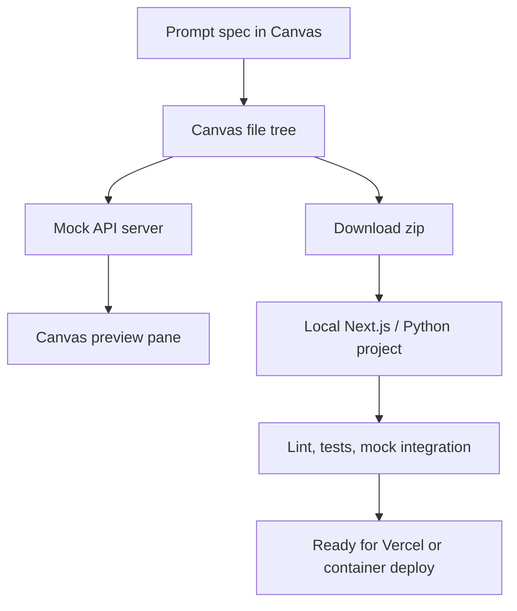

ChatGPT Canvas can scaffold a multi-file project with UI, mocked APIs, and tests before you ever open your local IDE. This tutorial walks through designing a small customer-feedback dashboard, validating it inside Canvas, and exporting it to both Next.js and Python stacks with confidence checks.

## You’ll learn
- Capture product requirements and guardrails in a Canvas-friendly project spec.
- Pair Canvas with mock APIs so you can demo flows without real provider keys.
- Export the workspace to a local Next.js or Python project and run automated checks.
- Harden the codebase with environment variables, retries, and deployment prep.

## Prerequisites
- ChatGPT Business workspace with **Canvas** available.
- Node.js 20+ and Python 3.10+ installed locally.
- Familiarity with Git, npm, and virtual environments.
- Optional: Mock service tooling such as MSW (JavaScript) or responses (Python).

## Project overview

We will build a “Feedback Pulse” mini app:

- Ingest customer feedback entries from a mocked provider endpoint.
- Display summary metrics and a sentiment timeline.
- Allow exporting filtered feedback to CSV.

The flow below maps how Canvas, mocks, and local tooling connect.



## Step 1: Draft the Canvas prompt spec

Paste the following into the Canvas **Brief** to anchor scope and policies.

```text
# Intent
Create a mini app that visualizes customer feedback with mocked data and no real credentials.

# Must have
- Dashboard route with summary cards, sentiment chart, and feedback table.
- Mock API layer that serves `/api/feedback` (GET) and `/api/feedback/export` (POST) responses.
- Download button that triggers CSV export via the mock.

# Constraints
- No external network calls besides the mock layer.
- Include unit tests for data formatting helpers.
- Provide environment variable stubs for future provider keys.
- Follow our workspace policy: never log raw customer PII.

# Risks & mitigations
- Risk: Mock drift vs. production → Mitigation: Document schema in `docs/api-contract.md`.
- Risk: PII leakage → Mitigation: Mask customer names in fixtures.

# Evaluation
- Run npm and pytest scripts inside Canvas and locally after export.
- Peer review before merging into the main repository.
```

Ask Canvas to restate deliverables. Highlight that the mock API should simulate latency and failure for resilience tests.

## Step 2: Generate the file plan

Instruct Canvas: “Create a file map for a Next.js App Router project plus a Python FastAPI mock backend.” Expect something like:

- `app/layout.tsx`, `app/page.tsx`, `app/api/feedback/route.ts`
- `lib/api.ts`, `lib/types.ts`
- `tests/components/feedback-table.test.tsx`
- `mock-server/main.py` (FastAPI) or `mock-server/server.ts` (Node)
- `docs/api-contract.md`

Review and adjust before generating code. Confirm that tests and docs are part of the plan.

## Step 3: Build with mocks inside Canvas

1. **Create mock data.** Ask Canvas to write `mock-server/server.ts` using MSW or Express with static JSON fixtures. Example request:
   - “Implement `/api/feedback` returning 50 records with id, submitted_at, sentiment, summary. Add a random delay (100–500 ms).”
2. **Hook UI to mock fetches.** In `lib/api.ts`, call `fetch('/api/feedback')` and handle loading + error states. Enforce a 5-second timeout.
3. **Render the dashboard.** Compose cards with total responses, average sentiment, and unresolved count. Use `@tanstack/react-table` or a lightweight table component.
4. **Add charting.** Ask Canvas to integrate `react-chartjs-2` with mock sentiment data. Provide fallback text when no data.
5. **Enable CSV export.** Create a POST route that returns a CSV string; trigger download using `URL.createObjectURL` in the client component.
6. **Write tests.** Generate Jest tests for helper functions (e.g., grouping sentiment). Add Playwright or Cypress stubs if available.

Remind Canvas to include `.env.example` with placeholder keys and a `README.md` describing how to run the mock server.

### Canvas sanity checklist

- Run `npm test` and `npm run lint` inside Canvas until they pass.
- Ask for a summary of accessibility considerations (keyboard navigation, color contrast).
- Request a manual QA checklist table to track future review sessions.

## Step 4: Export and set up locally

1. **Export** the Canvas project (Download zip) and extract it locally.
2. Initialize Git and install dependencies:

```bash
npm install
python -m venv .venv && source .venv/bin/activate
pip install -r mock-server/requirements.txt
```

3. Launch the mock server (choose one stack):

```bash
# Option A: Node mock
npm run mock

# Option B: Python mock
uvicorn mock_server.main:app --reload --port 5050
```

4. Update environment variables:
   - Copy `.env.example` to `.env.local`.
   - Set `NEXT_PUBLIC_API_BASE=http://localhost:5050` if using FastAPI mock.

5. Start the Next.js dev server and open http://localhost:3000 to verify charts and tables.

### FastAPI mock example

```python
from fastapi import FastAPI, HTTPException
from fastapi.responses import StreamingResponse
import csv
import io
import random

app = FastAPI()

@app.get("/api/feedback")
async def list_feedback():
    data = [
        {"id": idx, "submitted_at": f"2025-01-{idx+1:02d}", "sentiment": random.choice(["positive", "neutral", "negative"]), "summary": "Masked summary"}
        for idx in range(30)
    ]
    return {"items": data, "total": len(data)}

@app.post("/api/feedback/export")
async def export_feedback():
    buffer = io.StringIO()
    writer = csv.writer(buffer)
    writer.writerow(["id", "submitted_at", "sentiment", "summary"])
    for idx in range(10):
        writer.writerow([idx, f"2025-01-{idx+1:02d}", "neutral", "Masked summary"])
    buffer.seek(0)
    return StreamingResponse(buffer, media_type="text/csv", headers={"Content-Disposition": "attachment; filename=feedback.csv"})
```

Add automated tests (e.g., `pytest mock-server/tests`) to confirm the mock contract.

## Step 5: Harden for production

- **Error handling:** Wrap fetch calls with retry logic (e.g., `p-retry` in Node). Surface toast notifications when retries exhaust.
- **Observability:** Add simple logging middleware that records request IDs without logging PII.
- **Security:** Use HTTPS-only cookies for auth tokens once real APIs connect. Document required scopes in `docs/security.md`.
- **Performance:** Consider incremental static regeneration in Next.js for summary stats to reduce runtime latency.
- **Accessibility:** Validate with `npm run lint -- --fix --max-warnings=0` and run Lighthouse on the dashboard.

## Quality gates checklist

| Area | Tool | Passing criteria |
| --- | --- | --- |
| Type safety | `npm run typecheck` | No TypeScript errors. |
| Unit tests | `npm test` | 100% pass, coverage report archived. |
| Mock contract | `pytest mock-server/tests` or `npm run test:mock` | Contract assertions succeed. |
| Linting | `npm run lint` | 0 errors, warnings triaged. |
| Manual QA | Checklist exported from Canvas | All items marked complete. |

Store results in your repository (e.g., `qa-results/2025-02-15.md`).

## Deploy or hand off

- Prepare a Vercel deploy by adding environment variables in the dashboard and connecting the repo.
- For Python deployments, containerize the mock or replace with a production service once real APIs are ready.
- Attach the Canvas transcript, prompt spec, and QA results to your handoff ticket for traceability.

## References

- OpenAI. “Use Canvas in ChatGPT.” *OpenAI Help Center*. 2024. https://help.openai.com/en/articles/8856642-use-canvas-in-chatgpt.
- Vercel. “Deploy a Next.js App Router project.” *Vercel Documentation*. 2024. https://vercel.com/docs/frameworks/nextjs.
- Mozilla Developer Network. “Fetch API.” *MDN Web Docs*. 2024. https://developer.mozilla.org/en-US/docs/Web/API/Fetch_API.
