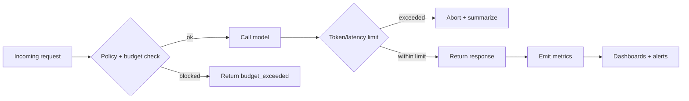

## Summary
Token usage and model latency can spiral quickly without guardrails. This tutorial shows how to add budgets, streaming, summarization, and alerting to an AI service so you can forecast spend and contain runaway prompts. You will build a shared budget service, instrument per-route caps, and wire dashboards and alerts that keep finance and engineering aligned.

### You’ll learn
- How to design per-tenant and global budgets that gate expensive AI routes.
- How to cap tokens and latency with middleware that short-circuits risky requests.
- How to add adaptive summarization and streaming to keep conversations under budget.
- How to expose cost metrics through dashboards and alerts for finance partners.
- How to run pre-deployment checks that detect regressions before they hit production.

## Guardrail framework

Break cost control into four layers:

1. **Pre-call governance:** Policy checks that block disallowed use cases and enforce tenant budgets.
2. **In-flight limits:** Request-time caps on tokens, streaming, and retry budgets.
3. **Post-call accounting:** Logging token usage, latency, and errors for analytics.
4. **Automated alerts:** Notifications when budgets or error thresholds breach defined SLOs.



## Step 1: Model budgets as data

Create a budget table (Postgres example) with per-tenant and per-route caps. Track both soft and hard limits so you can warn before cutting off traffic.

```sql
CREATE TABLE ai_budgets (
  tenant_id TEXT NOT NULL,
  route TEXT NOT NULL,
  window_start TIMESTAMPTZ NOT NULL,
  window_end TIMESTAMPTZ NOT NULL,
  token_limit INTEGER NOT NULL,
  hard_limit INTEGER NOT NULL,
  currency TEXT DEFAULT 'USD',
  spend_limit NUMERIC(12,2) DEFAULT 0,
  PRIMARY KEY (tenant_id, route, window_start)
);
```

Populate the table with rolling 30-day windows. A background job tallies usage and updates `spend_limit` with actual cost using provider price sheets.

Expose a lightweight service or stored procedure that returns remaining budget given `tenant_id`, `route`, and the current timestamp.

## Step 2: Enforce budgets in middleware

### Node.js (Express)

```ts
// middleware/budget-check.ts
import type { Request, Response, NextFunction } from "express";
import { getRemainingBudget } from "../services/budgets.js";

export async function enforceBudget(req: Request, res: Response, next: NextFunction) {
  const tenantId = req.headers["x-tenant-id"] as string;
  const route = req.path;

  const budget = await getRemainingBudget({ tenantId, route });
  if (!budget) {
    return res.status(403).json({ error: "budget_missing" });
  }

  if (budget.remainingTokens <= 0 || budget.remainingSpend <= 0) {
    return res.status(429).json({ error: "budget_exceeded", retry_after_hours: budget.resetHours });
  }

  res.locals.budget = budget;
  return next();
}
```

Attach the middleware to AI routes and decrement usage after the model call.

```ts
// routes/chat.ts
import express from "express";
import OpenAI from "openai";
import { enforceBudget } from "../middleware/budget-check.js";
import { recordUsage } from "../services/budgets.js";

const router = express.Router();
const client = new OpenAI({ apiKey: process.env.OPENAI_API_KEY });

router.post("/chat", enforceBudget, async (req, res) => {
  const { messages } = req.body;
  const budget = res.locals.budget;

  const maxOutputTokens = Math.min(600, budget.remainingTokens);

  const response = await client.responses.create({
    model: "gpt-4o-mini",
    input: messages,
    max_output_tokens: maxOutputTokens,
    temperature: 0.7,
  });

  await recordUsage({
    tenantId: budget.tenantId,
    route: "chat",
    inputTokens: response.usage?.input_tokens ?? 0,
    outputTokens: response.usage?.output_tokens ?? 0,
    costUsd: response.usage ? response.usage.total_cost_usd : 0,
  });

  return res.json({ reply: response.output_text, usage: response.usage });
});
```

### Python (FastAPI)

```python
# middleware/budget.py
from collections.abc import Awaitable, Callable
from typing import Any

from fastapi import Request, Response
from fastapi.responses import JSONResponse

from ..services.budgets import get_remaining_budget


async def enforce_budget(request: Request, call_next: Callable[[Request], Awaitable[Response]]) -> Response:
    tenant_id = request.headers.get("x-tenant-id")
    route = request.url.path

    budget = await get_remaining_budget(tenant_id=tenant_id, route=route)
    if budget is None:
        return JSONResponse(status_code=403, content={"error": "budget_missing"})

    if budget.remaining_tokens <= 0 or budget.remaining_spend <= 0:
        return JSONResponse(
            status_code=429,
            content={"error": "budget_exceeded", "retry_after_hours": budget.reset_hours},
        )

    request.state.budget = budget
    response = await call_next(request)
    return response
```

```python
# routes/chat.py
from fastapi import APIRouter, Depends, HTTPException, Request
from openai import OpenAI

from ..services.budgets import record_usage

router = APIRouter()
client = OpenAI()


@router.post("/chat")
async def chat_route(request: Request, messages: list[dict[str, str]]):
    budget = getattr(request.state, "budget", None)
    if budget is None:
        raise HTTPException(status_code=500, detail="budget_missing")

    max_output_tokens = min(600, budget.remaining_tokens)

    response = client.responses.create(
        model="gpt-4o-mini",
        input=messages,
        max_output_tokens=max_output_tokens,
        temperature=0.7,
    )

    await record_usage(
        tenant_id=budget.tenant_id,
        route="chat",
        input_tokens=response.usage.input_tokens,
        output_tokens=response.usage.output_tokens,
        cost_usd=response.usage.total_cost_usd,
    )

    return {"reply": response.output_text, "usage": response.usage}
```

Wrap the FastAPI app with the middleware using `app.middleware("http")(enforce_budget)`.

## Step 3: Cap tokens and latency

- **Token ceiling:** Use `max_output_tokens` plus prompt truncation to stay within the budget. Summarize earlier turns with `/docs/tutorials/agentic-helpdesk.md`-style tool calls when conversation history grows.
- **Latency guard:** Abort requests that exceed 8 seconds using `AbortController` (Node) or `asyncio.wait_for` (Python). Send a partial summary and encourage the user to retry.
- **Retry policy:** Retries double cost. Limit to one retry with exponential backoff for transient 429s. Log the retry reason.

## Step 4: Stream and summarize to stay on budget

Streaming gives the perception of faster responses while you enforce strict output limits.

```ts
// routes/chat-stream.ts
import { Router } from "express";
import OpenAI from "openai";
import { enforceBudget } from "../middleware/budget-check.js";

const router = Router();
const client = new OpenAI({ apiKey: process.env.OPENAI_API_KEY });

router.post("/chat-stream", enforceBudget, async (req, res) => {
  const controller = new AbortController();
  const timeout = setTimeout(() => controller.abort(), 8000);

  const stream = await client.responses.stream({
    model: "gpt-4o-mini",
    input: req.body.messages,
    max_output_tokens: 400,
    stream: true,
    signal: controller.signal,
  });

  res.setHeader("Content-Type", "text/event-stream");
  stream.on("data", (chunk) => res.write(`data: ${chunk}\n\n`));
  stream.on("end", () => {
    clearTimeout(timeout);
    res.write("event: done\n\n");
    res.end();
  });
  stream.on("error", (error) => {
    clearTimeout(timeout);
    res.write(`event: error\ndata: ${JSON.stringify(error.message)}\n\n`);
    res.end();
  });
});
```

Add a summarization job that trims long histories when token usage crosses a threshold.

```python
# services/summarize.py
from openai import OpenAI

client = OpenAI()


def compress_history(messages: list[dict[str, str]], keep_last: int = 6) -> list[dict[str, str]]:
    if len(messages) <= keep_last:
        return messages

    history = messages[:-keep_last]
    summary_prompt = [
        {"role": "system", "content": "Summarize prior conversation in <= 120 tokens."},
        {"role": "user", "content": "\n".join(msg["content"] for msg in history)},
    ]
    summary = client.responses.create(model="gpt-4o-mini", input=summary_prompt, max_output_tokens=150)
    return messages[-keep_last:] + [{"role": "system", "content": f"Conversation summary: {summary.output_text}"}]
```

Call `compress_history` before each request when `total_tokens > threshold`. Deduct summary tokens from the same budget to avoid hidden costs.

## Step 5: Instrument dashboards and alerts

- **Metrics pipeline:** Emit counters and histograms for `input_tokens`, `output_tokens`, `cost_usd`, `latency_ms`, and `budget_remaining`. Use OpenTelemetry or StatsD exporters.
- **Dashboards:** Plot daily cost vs. budget, deflection rate (streaming vs. batch), and top spenders. Share with finance weekly.
- **Alerts:**
  - Budget remaining < 20% → send PagerDuty notification to the owning team.
  - Latency P95 > SLO for 3 consecutive intervals → create Jira issue.
  - Token spikes > 3× baseline → trigger anomaly detection and freeze optional features.
- **Reporting:** Export monthly summaries to your FP&A tooling. Include provider price changes and unit cost trends.

## Step 6: Pre-release checklist

Before shipping new prompts or features:

1. Run regression tests for cost using synthetic traffic. Compare tokens per request against a baseline and block merges if they increase more than 10%.
2. Recompute budgets to account for expected usage. Update the `ai_budgets` table via migration or admin console.
3. Confirm alerts and dashboards point to the new routes. Add runbooks for on-call engineers.
4. Communicate changes to finance and support teams so they know when to expect spend changes.

## References

- OpenAI. “Monitor usage and costs.” 2024. <https://platform.openai.com/docs/guides/production-best-practices/monitor-usage-and-costs>
- AWS. “Implementing budgets for serverless applications.” 2023. <https://docs.aws.amazon.com/wellarchitected/latest/serverless-applications-lens/cost-optimization.html>
- Google Cloud. “Designing streaming responses.” 2024. <https://cloud.google.com/architecture/designing-streaming-ai-responses>
- Microsoft. “Azure OpenAI cost management best practices.” 2024. <https://learn.microsoft.com/azure/ai-services/openai/how-to/manage-costs>
