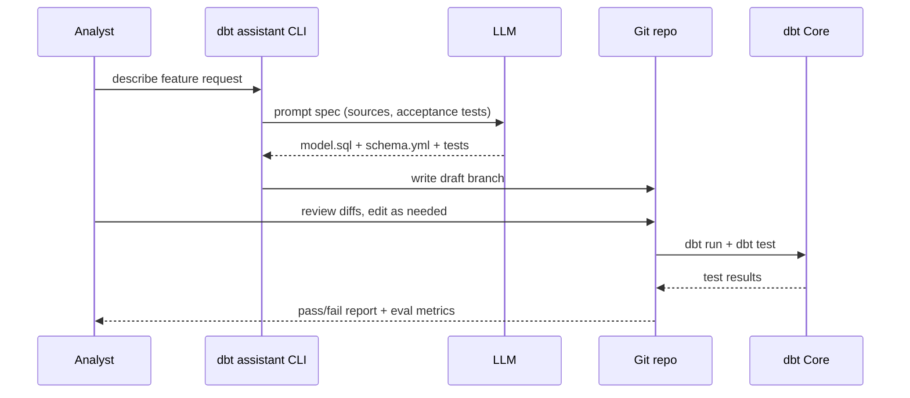

## Overview
This tutorial shows how to pair dbt with a large language model (LLM) assistant that drafts models, tests, and documentation while keeping humans in control. You will wire the assistant into a safe review loop, validate outputs with dbt, and capture feedback to improve prompts.

## You’ll learn
- Map business requests into a dbt prompt spec and review checklist.
- Scaffold models, schema YAML, and tests with Python and Node.js automation.
- Enforce tool constraints so the LLM writes runnable SQL only against approved sources.
- Capture human review notes and run `dbt test` before merging any artifacts.
- Add lightweight evaluation datasets to continuously score assistant suggestions.

## Prerequisites
- dbt Core 1.6+ installed locally with a warehouse profile configured.
- Familiarity with Jinja templating and dbt project structure (`models/`, `tests/`, `macros/`).
- An OpenAI API key (or compatible provider) stored in `OPENAI_API_KEY`.
- Git for change review and a code editor with SQL linting (VS Code recommended).

## Architecture at a glance



## Step 1 — Capture requirements with a prompt spec
1. Create a prompt spec template that every request will fill out:
   ```markdown
   ## Intent
   - Business question:
   - Grain and time frame:

   ## Inputs
   - Trusted sources (dbt refs only):
   - Dimensions/measures:

   ## Outputs
   - Model name and description:
   - Required tests and documentation notes:

   ## Constraints
   - Only use existing sources or refs listed above.
   - Prefer incremental strategies when grain > 1M rows.
   - Flag assumptions and potential data quality risks.

   ## Risks and review hooks
   - Columns requiring PII handling:
   - Additional checks or sample queries:
   ```
2. Store the template in `prompts/spec.md` and require analysts to fill it out in pull requests.
3. Link the spec to your analytics intake board so feature requests stay traceable.

## Step 2 — Bootstrap the assistant project
1. Initialize a utility package next to your dbt project:
   ```bash
   mkdir -p tools/dbt-assistant && cd tools/dbt-assistant
   python -m venv .venv && source .venv/bin/activate
   pip install --upgrade pip
   pip install openai pydantic ruamel.yaml rich typer sqlfluff
   npm init -y && npm install openai@4 zod yaml fs-extra
   ```
2. Create `.env` with your API key:
   ```bash
   echo "OPENAI_API_KEY=sk-..." > .env
   ```
3. Add a shared schema definition for generated files (`assistant_contract.json`) that captures model name, SQL body, YAML metadata, and requested tests.

## Step 3 — Define tool contracts
Document callable tools to keep the LLM grounded.

```markdown
### Tool: list_models
- **Intent:** Enumerate approved `ref()` targets.
- **Inputs:** none.
- **Outputs:** JSON array of strings.
- **Timeout:** 3s
- **Errors:** `E_TIMEOUT`, `E_EMPTY` when project parse fails.

### Tool: fetch_source_columns
- **Intent:** Return column metadata for a specific source.
- **Inputs:** `{ "source_name": string, "table_name": string }`
- **Outputs:** JSON array of `{ name, data_type, tests }`.
- **Timeout:** 5s
- **Errors:** `E_NOT_FOUND` if the source is not whitelisted.
```

Expose these tools via your CLI. In Python, use the Responses API with JSON mode so the model must return structured data.

```python
# tools/dbt-assistant/app.py
import json
import os
from pathlib import Path

from openai import OpenAI
from pydantic import BaseModel, Field

client = OpenAI()

class Generation(BaseModel):
    model_name: str = Field(pattern=r"^[a-z0-9_]+$")
    sql: str
    schema_yaml: str
    tests: list[str]
    review_notes: list[str]

PROMPT_SYSTEM = Path("prompts/system.txt").read_text()


def generate(spec: str) -> Generation:
    response = client.responses.create(
        model="gpt-4.1",
        reasoning={"effort": "medium"},
        input=[
            {"role": "system", "content": PROMPT_SYSTEM},
            {"role": "user", "content": spec},
        ],
        tools=[
            {
                "type": "function",
                "function": {
                    "name": "list_models",
                    "description": "Return approved ref() targets",
                    "parameters": {"type": "object", "properties": {}},
                },
            }
        ],
        response_format={"type": "json_schema", "json_schema": Generation.model_json_schema()},
        max_output_tokens=1200,
        temperature=0.3,
        timeout=20,
    )
    payload = response.output[0].content[0].text
    return Generation.model_validate_json(payload)
```

A matching Node.js script can orchestrate multi-file writes and Git integration.

```ts
// tools/dbt-assistant/index.ts
import { writeFile } from "node:fs/promises";
import { join } from "node:path";
import { config } from "dotenv";
import { OpenAI } from "openai";
import { z } from "zod";

config();

const Generation = z.object({
  model_name: z.string().regex(/^[a-z0-9_]+$/),
  sql: z.string(),
  schema_yaml: z.string(),
  tests: z.array(z.string()).max(10),
  review_notes: z.array(z.string())
});

const client = new OpenAI({ apiKey: process.env.OPENAI_API_KEY });

export async function draftArtifacts(spec: string) {
  const response = await client.responses.create({
    model: "gpt-4.1",
    input: [
      { role: "system", content: "You write dbt models. Return valid SQL and YAML only." },
      { role: "user", content: spec }
    ],
    response_format: { type: "json_object" },
    max_output_tokens: 1200,
    timeout: 20
  });

  const parsed = Generation.parse(JSON.parse(response.output_text));
  const modelPath = join(process.cwd(), "models", `${parsed.model_name}.sql`);
  const yamlPath = join(process.cwd(), "models", `${parsed.model_name}.yml`);
  await writeFile(modelPath, parsed.sql);
  await writeFile(yamlPath, parsed.schema_yaml);
  await writeFile(
    join(process.cwd(), "notes", `${parsed.model_name}.md`),
    parsed.review_notes.join("\n- ")
  );
  return parsed.tests;
}
```

## Step 4 — Run quality gates automatically
1. After generation, run formatting and linting:
   ```bash
   sqlfluff fix models/new_model.sql
   sqlfluff lint models/new_model.sql
   ```
2. Execute dbt compile to catch adapter issues before review:
   ```bash
   dbt compile --select new_model
   ```
3. Require human review of the diff. Incorporate the assistant’s `review_notes` file into the PR description so reviewers know what to check.
4. Execute acceptance tests locally before merging:
   ```bash
   dbt run --select new_model
   dbt test --select new_model
   ```

## Step 5 — Add evaluation datasets
1. Create a `data/evals/feature_regressions.csv` fixture with known inputs and expected outputs.
2. Write a lightweight pytest that calls the assistant with the fixture spec and diff-checks generated SQL against a golden file.
3. Schedule the test in CI so prompt regressions are caught immediately.

```python
# tests/test_generation_regression.py
import subprocess
from pathlib import Path

def test_staging_orders_generation(tmp_path):
    spec = Path("prompts/cases/staging_orders.md").read_text()
    result = subprocess.run([
        "python", "tools/dbt-assistant/app.py", spec
    ], capture_output=True, text=True, check=True)
    generated_sql = (tmp_path / "models/staging_orders.sql").read_text()
    expected_sql = Path("tests/goldens/staging_orders.sql").read_text()
    assert generated_sql.strip() == expected_sql.strip()
```

## Step 6 — Operationalize feedback
- Capture reviewer edits in a `feedback.log` to refine prompts weekly.
- Track metrics like “LLM-generated models merged without edits” and “tests added per request.”
- Hold monthly calibration sessions where analytics engineers walk through tricky specs and align on guardrails.

## Try it locally
1. Fill out a prompt spec for a new staging model.
2. Run `python tools/dbt-assistant/app.py prompts/specs/staging_orders.md` to draft artifacts.
3. Inspect the diff, adjust filters or joins, then run `dbt test`.
4. Commit only after tests pass and reviewer sign-off.

## References
- dbt Labs. “dbt Core overview.” https://docs.getdbt.com/docs/introduction. Accessed 6 June 2024.
- dbt Labs. “Testing in dbt.” https://docs.getdbt.com/docs/build/tests. Accessed 6 June 2024.
- OpenAI. “Responses API.” https://platform.openai.com/docs/guides/responses. Accessed 6 June 2024.
