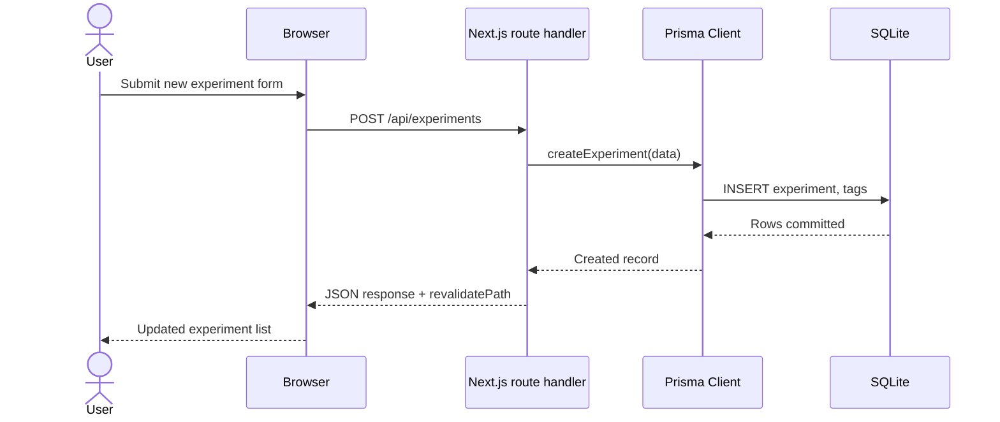

## Overview
Next.js App Router pairs well with Prisma and SQLite for rapid prototyping: you get file-based routes, server components, and a relational schema that is trivial to run locally. This tutorial scaffolds a productivity tracker that logs AI prompt experiments, shows how to manage Prisma migrations, and walks through a Vercel deployment that keeps secrets server-side.

## You’ll learn
- Scaffold a TypeScript-first Next.js project with ESLint, Tailwind CSS, and App Router conventions.
- Model a SQLite-backed schema with Prisma, seed initial data, and enable safe migrations.
- Build route handlers and server actions that wrap Prisma with structured validation and retries.
- Configure environment variables, migrations, and logging for Vercel deployment.
- Add quality gates—tests, linting, and health checks—before promoting to production.

## Prerequisites
- Node.js 20 LTS, pnpm (or npm) 9+, and Git installed locally.
- A free Vercel account with the Vercel CLI (`npm i -g vercel`).
- Basic familiarity with React Server Components, Prisma schema syntax, and environment variables.
- Optional: an OpenAI API key if you want to extend the tracker with live model calls.

## Project structure snapshot
The productivity tracker stores prompt experiments with a simple CRUD UI and a server-only analytics endpoint. The high-level flow looks like this:



## Step 1 — Create the project
1. Bootstrap the application with TypeScript, Tailwind, ESLint, and App Router:
   ```bash
   npx create-next-app@latest ai-experiment-tracker \
     --typescript \
     --tailwind \
     --eslint \
     --app \
     --src-dir \
     --import-alias "@/*"
   cd ai-experiment-tracker
   ```
2. Initialize a Git repo and install dependencies (pnpm shown, npm works too):
   ```bash
   git init
   pnpm install
   ```
3. Add useful dev tooling:
   ```bash
   pnpm add -D prisma @types/node tsx @vitest/coverage-v8 vitest supertest
   pnpm add @prisma/client zod @vercel/analytics
   ```

## Step 2 — Configure Prisma with SQLite
1. Initialize Prisma and create the SQLite database reference:
   ```bash
   npx prisma init --datasource-provider sqlite
   ```
   This generates `prisma/schema.prisma` and `.env` with `DATABASE_URL="file:./prisma/dev.db"`.
2. Define the schema for experiments and tags:
   ```prisma
   datasource db {
     provider = "sqlite"
     url      = env("DATABASE_URL")
   }

   generator client {
     provider = "prisma-client-js"
   }

   model Experiment {
     id           String   @id @default(cuid())
     title        String
     prompt       String
     model        String
     tokensIn     Int
     tokensOut    Int
     outcome      String
     createdAt    DateTime @default(now())
     updatedAt    DateTime @updatedAt
     tags         Tag[]    @relation("ExperimentTags")
   }

   model Tag {
     id           String        @id @default(cuid())
     label        String        @unique
     experiments  Experiment[]  @relation("ExperimentTags")
   }
   ```
3. Create the first migration and generate the client:
   ```bash
   npx prisma migrate dev --name init_schema
   npx prisma generate
   ```
4. Seed sample data in `prisma/seed.ts`:
   ```ts
   import { PrismaClient } from "@prisma/client";
   const prisma = new PrismaClient();

   async function main() {
     await prisma.experiment.create({
       data: {
         title: "Baseline GPT-4o prompt",
         prompt: "Summarize support tickets with action items",
         model: "gpt-4o-mini",
         tokensIn: 320,
         tokensOut: 210,
         outcome: "Good coverage, needs stricter action parsing",
         tags: {
           connectOrCreate: [
             {
               where: { label: "summarization" },
               create: { label: "summarization" }
             }
           ]
         }
       }
     });
   }

   main()
     .catch((error) => {
       console.error(error);
       process.exit(1);
     })
     .finally(() => prisma.$disconnect());
   ```
   Wire it to `package.json`:
   ```json
   {
     "prisma": {
       "seed": "tsx prisma/seed.ts"
     }
   }
   ```
   Then run:
   ```bash
   pnpm prisma db seed
   ```

## Step 3 — Build App Router features
1. **Prisma client helper** (`src/lib/db.ts`):
   ```ts
   import { PrismaClient } from "@prisma/client";

   const globalForPrisma = globalThis as unknown as { prisma: PrismaClient | undefined };

   export const prisma =
     globalForPrisma.prisma ??
     new PrismaClient({
       log: ["query", "error", "warn"],
     });

   if (process.env.NODE_ENV !== "production") globalForPrisma.prisma = prisma;
   ```
   The global guard prevents hot-reload leaks during local dev.
2. **Server actions** to create experiments (`src/app/(dashboard)/actions.ts`):
   ```ts
   "use server";

   import { revalidatePath } from "next/cache";
   import { z } from "zod";
   import { prisma } from "@/lib/db";

   const ExperimentInput = z.object({
     title: z.string().min(3),
     prompt: z.string().min(10),
     model: z.string().min(2),
     tokensIn: z.number().int().nonnegative(),
     tokensOut: z.number().int().nonnegative(),
     outcome: z.string().min(5),
     tags: z.array(z.string()).max(5)
   });

   export async function createExperiment(formData: FormData) {
     const parsed = ExperimentInput.safeParse(Object.fromEntries(formData));
     if (!parsed.success) {
       return { ok: false, error: parsed.error.flatten().fieldErrors };
     }

     const { tags, ...rest } = parsed.data;

     await prisma.$transaction(async (tx) => {
       await tx.experiment.create({
         data: {
           ...rest,
           tags: {
             connectOrCreate: tags.map((label) => ({
               where: { label },
               create: { label }
             }))
           }
         }
       });
     });

     revalidatePath("/");
     return { ok: true };
   }
   ```
3. **Route handler** for analytics (`src/app/api/metrics/route.ts`):
   ```ts
   import { NextResponse } from "next/server";
   import { prisma } from "@/lib/db";

   export async function GET() {
     const [count, tokenStats] = await prisma.$transaction([
       prisma.experiment.count(),
       prisma.experiment.aggregate({
         _sum: { tokensIn: true, tokensOut: true },
         _avg: { tokensOut: true }
       })
     ]);

     return NextResponse.json({ count, tokenStats });
   }
   ```
4. **Page component** (`src/app/page.tsx`):
   ```tsx
   import { createExperiment } from "./(dashboard)/actions";
   import { prisma } from "@/lib/db";

   export default async function Home() {
     const experiments = await prisma.experiment.findMany({
       orderBy: { createdAt: "desc" },
       include: { tags: true }
     });

     return (
       <main className="mx-auto max-w-4xl space-y-8 p-8">
         <section className="rounded border border-slate-200 bg-white p-6 shadow">
           <h1 className="text-2xl font-semibold">AI experiment log</h1>
           <form action={createExperiment} className="mt-4 grid gap-4">
             {/* form fields for title, prompt, model, tokens, outcome, tags */}
           </form>
         </section>
         <section className="space-y-4">
           {experiments.map((exp) => (
             <article key={exp.id} className="rounded border border-slate-200 bg-slate-50 p-4">
               <h2 className="text-xl font-medium">{exp.title}</h2>
               <p className="text-sm text-slate-600">{exp.prompt}</p>
               <div className="flex gap-4 text-sm">
                 <span>Model: {exp.model}</span>
                 <span>Tokens in/out: {exp.tokensIn}/{exp.tokensOut}</span>
               </div>
             </article>
           ))}
         </section>
       </main>
     );
   }
   ```
   Keep form fields accessible (labels, error summaries) and store tags in a hidden input list derived from multi-select UI components.

## Step 4 — Testing and quality gates
1. **Unit tests** with Vitest + Supertest for API routes (`src/app/api/metrics/route.test.ts`):
   ```ts
   import request from "supertest";
   import { describe, expect, it } from "vitest";
   import handler from "./route";

   describe("GET /api/metrics", () => {
     it("returns aggregate stats", async () => {
       const res = await request(handler).get("/api/metrics");
       expect(res.status).toBe(200);
       expect(res.body).toHaveProperty("count");
     });
   });
   ```
   For server actions, wrap logic in testable modules and unit-test the Prisma transaction separately.
2. **Static checks** via `package.json` scripts:
   ```json
   {
     "scripts": {
       "lint": "next lint",
       "typecheck": "tsc --noEmit",
       "test": "vitest run",
       "dev": "next dev",
       "build": "next build",
       "start": "next start"
     }
   }
   ```
   Run them before pushing:
   ```bash
   pnpm lint
   pnpm typecheck
   pnpm test
   pnpm build
   ```
3. **Observability hooks**: enable `@vercel/analytics` inside `_app` or layout to capture page views; stream Prisma logs to the console in staging but disable in production for noise reduction.

## Step 5 — Prepare for Vercel deployment
1. **Environment variables**: keep `.env.local` out of Git. In Vercel dashboard, create a project and add:
   - `DATABASE_URL`: `file:./prisma/dev.db` for local; for production use `postgresql://...` if you upgrade later.
   - `NEXT_PUBLIC_APP_ENV`: `production` or `preview` to toggle features.
2. **Build command**: Vercel autodetects Next.js. Confirm settings:
   - Build command: `pnpm next build`
   - Install command: `pnpm install --frozen-lockfile`
   - Output directory: `.vercel/output` (managed by Next.js)
3. **Prisma in serverless**: add `prisma generate` to the Vercel build step by including a `vercel-build` script:
   ```json
   {
     "scripts": {
       "vercel-build": "prisma generate && next build"
     }
   }
   ```
4. **Upload the SQLite file**: SQLite is great locally but not shared between serverless instances. For production, either:
   - Enable [Vercel Postgres](https://vercel.com/docs/storage/vercel-postgres) and change `provider = "postgresql"`, or
   - Use [Turso](https://turso.tech/) or [Neon](https://neon.tech/) for managed storage.
   Until you migrate, treat deployments as stateless demo environments.
5. **Deploy**:
   ```bash
   vercel login
   vercel link
   vercel env pull .env.local
   vercel --prod
   ```
   After the first deploy, run `vercel pull` whenever env vars change.

## Step 6 — Release management and upgrades
- **Migration workflow**: run `pnpm prisma migrate dev` locally, inspect SQL with `pnpm prisma migrate diff`, and commit both Prisma schema and migration SQL. Use `vercel deploy --prebuilt` to ship tested builds.
- **Backups**: even for SQLite, copy `prisma/dev.db` to cloud storage before destructive changes. Automate nightly exports for real production databases.
- **Rollbacks**: keep a `scripts/rollback.ts` that reads the previous migration and applies `prisma migrate resolve --rolled-back`. Document manual steps in `docs/runbooks/vercel-rollback.md`.
- **Observability**: integrate with Vercel’s logging dashboard or forward logs to Datadog. Tag experiments with release IDs to correlate regressions.
- **Security**: add `next-safe-action` or similar libraries to restrict server actions, and run `pnpm dlx @vercel/edge-config-cli` to manage feature flags without redeploys.

## Extend the tutorial
- Connect OpenAI or Anthropic APIs via server actions to capture real completion metrics.
- Swap SQLite for Vercel Postgres once collaboration grows; Prisma makes the provider change minimal.
- Add authentication with NextAuth.js (Auth.js) and restrict analytics routes to signed-in users.
- Instrument quality metrics (latency, success rate) using a simple cron job hitting `/api/metrics`.

## References
- Next.js. “App Router: Data Fetching.” 2024. <https://nextjs.org/docs/app/building-your-application/data-fetching>
- Prisma. “Next.js + Prisma: Building a Next.js App.” 2024. <https://www.prisma.io/docs/guides/frameworks/nextjs>
- Vercel. “Deploy a Next.js App.” 2024. <https://vercel.com/docs/frameworks/nextjs>
- Prisma. “Using SQLite.” 2023. <https://www.prisma.io/docs/orm/overview/databases/sqlite>
